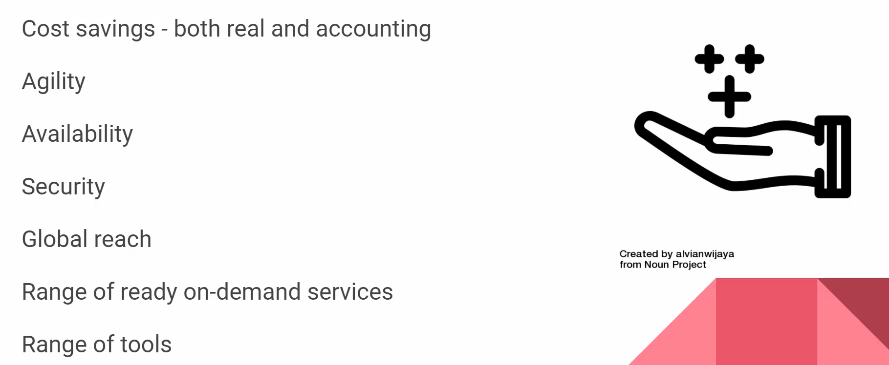

# Describe Cloud Concepts (20-25%)

## Table of contents
- [**Identify the benefits and considerations of using cloud services**](#identify-the-benefits-and-considerations-of-using-cloud-services)
  - [Identify the benefits of cloud computing, such as High Availability, Scalability, Elasticity, Agility, and Disaster Recovery](#identify-the-benefits-of-cloud-computing-such-as-high-availability-scalability-elasticity-agility-and-disaster-recovery)
  - [**What are some cloud computing advantages?**](#what-are-some-cloud-computing-advantages)
  - [Identify the differences between Capital Expenditure (CapEx) and Operational](#identify-the-differences-between-capital-expenditure-capex-and-operational)
  - [Describe the consumption-based model](#describe-the-consumption-based-model)
- [**Describe the differences between categories of cloud services**](#describe-the-differences-between-categories-of-cloud-services)
  - [Describe Infrastructure-as-a-Service (IaaS)](#describe-infrastructure-as-a-service-iaas)
  - [Describe Platform-as-a-Service (PaaS)](#describe-platform-as-a-service-paas)
  - [Describe Software-as-a-Service (SaaS)](#describe-software-as-a-service-saas)
  - [Describe the shared responsibility model](#describe-the-shared-responsibility-model)
  - [Describe serverless computing](#describe-serverless-computing)
- [**Describe the differences between types of cloud computing**](#describe-the-differences-between-types-of-cloud-computing)
  - [Define Cloud Computing](#define-cloud-computing)
  - [Describe Public cloud](#describe-public-cloud)
  - [Private Cloud](#private-cloud)
  - [Hybrid Cloud](#hybrid-cloud)
  - [Compare Public, Private, Hybrid](#compare-public-private-hybrid)
- [How does Azure work?](#how-does-azure-work)

## **Identify the benefits and considerations of using cloud services**

[#5 Understanding Cloud Concepts](https://www.notion.so/5-Understanding-Cloud-Concepts-ad61133cc79d47c1850ffeb197e25550) 

### Identify the benefits of cloud computing, such as High Availability, Scalability, Elasticity, Agility, and Disaster Recovery

- Cost savings and scaling

    

    - Economies of scale → Microsoft is buying stuff in bulk and can provide resources in cheap
    - TCO → Total cost of ownership → low
    - You can take actions to reduce your cost → Auto scaling
- High availability

    

    - 99.99% → SLA
- Scalability

    

- Elasticity

    

- Agility

    

- Disaster Recovery

    

### **What are some cloud computing advantages?**

There are several advantages that a cloud environment has over a physical environment that Tailwind Traders can use following its migration to Azure.

- **High availability**: Depending on the service-level agreement (SLA) that you choose, your cloud-based apps can provide a continuous user experience with no apparent downtime, even when things go wrong.
- **Scalability**: Apps in the cloud can scale *vertically* and *horizontally*:
    - Scale vertically to increase compute capacity by adding RAM or CPUs to a virtual machine.
    - Scaling horizontally increases compute capacity by adding instances of resources, such as adding VMs to the configuration.
- **Elasticity**: You can configure cloud-based apps to take advantage of autoscaling, so your apps always have the resources they need.
- **Agility**: Deploy and configure cloud-based resources quickly as your app requirements change.
- **Geo-distribution**: You can deploy apps and data to regional datacenters around the globe, thereby ensuring that your customers always have the best performance in their region.
- **Disaster recovery**: By taking advantage of cloud-based backup services, data replication, and geo-distribution, you can deploy your apps with the confidence that comes from knowing that your data is safe in the event of disaster.

### Identify the differences between Capital Expenditure (CapEx) and Operational
Expenditure (OpEx)

- CapEx → Capital Expenditure

    

- OpEx → Operational Expenditure

    

There are two different types of expenses that you should consider:

- **Capital Expenditure (CapEx)** is the up-front spending of money on physical infrastructure, and then deducting that up-front expense over time. The up-front cost from CapEx has a value that reduces over time.
- **Operational Expenditure (OpEx)** is spending money on services or products now, and being billed for them now. You can deduct this expense in the same year you spend it. There is no up-front cost, as you pay for a service or product as you use it.

In other words, when Tailwind Traders owns its infrastructure, it buys equipment that goes onto its balance sheets as assets. Because a capital investment was made, accountants categorize this transaction as a CapEx. Over time, to account for the assets' limited useful lifespan, assets are **depreciated or amortized.**

Cloud services, on the other hand, are categorized as an OpEx, because of their consumption model. There's no asset for Tailwind Traders to amortize, and its cloud service provider (Azure) manages the costs that are associated with the purchase and lifespan of the physical equipment. As a result, OpEx has a direct impact on net profit, taxable income, and the associated expenses on the balance sheet.

To summarize, CapEx requires significant up-front financial costs, as well as ongoing maintenance and support expenditures. By contrast, OpEx is a consumption-based model, so Tailwind Traders is only responsible for the cost of the computing resources that it uses.

### Describe the consumption-based model

- Pricing based on consumption metrics

    

Cloud service providers operate on a *consumption-based model*, which means that end users only pay for the resources that they use. Whatever they use is what they pay for.

A consumption-based model has many benefits, including:

- No upfront costs.
- No need to purchase and manage costly infrastructure that users might not use to its fullest.
- The ability to pay for additional resources when they are needed.
- The ability to stop paying for resources that are no longer needed.

## **Describe the differences between categories of cloud services**

[#5 Understanding Cloud Concepts](https://www.notion.so/5-Understanding-Cloud-Concepts-ad61133cc79d47c1850ffeb197e25550) 

### Describe Infrastructure-as-a-Service (IaaS)

- Services included

    

    IaaS is the most flexible category of cloud services. It aims to give you complete control over the hardware that runs your application. Instead of buying hardware, with IaaS, you rent it.

    ### **Advantages**

    **No CapEx**. Users have no up-front costs.

    **Agility**. Applications can be made accessible quickly, and deprovisioned whenever needed.

    **Management**. The shared responsibility model applies; the user manages and maintains the services they have provisioned, and the cloud provider manages and maintains the cloud infrastructure.

    **Consumption-based model**. Organizations pay only for what they use and operate under an Operational Expenditure (OpEx) model.

    **Skills**. No deep technical skills are required to deploy, use, and gain the benefits of a public cloud. Organizations can use the skills and expertise of the cloud provider to ensure workloads are secure, safe, and highly available.

    **Cloud benefits**. Organizations can use the skills and expertise of the cloud provider to ensure workloads are made secure and highly available.

    **Flexibility**. IaaS is the most flexible cloud service because you have control to configure and manage the hardware running your application.

### Describe Platform-as-a-Service (PaaS)

- Services included → Web Apps, Web Services

    

    - No choice over the hardware

    PaaS provides the same benefits and considerations as IaaS, but there are some additional benefits to be aware of.

    ### **Advantages**

    **No CapEx**. Users have no up-front costs.

    **Agility**. PaaS is more agile than IaaS, and users don't need to configure servers for running applications.

    **Consumption-based model**. Users pay only for what they use, and operate under an OpEx model.

    **Skills**. No deep technical skills are required to deploy, use, and gain the benefits of PaaS.

    **Cloud benefits**. Users can take advantage of the skills and expertise of the cloud provider to ensure that their workloads are made secure and highly available. In addition, users can gain access to more cutting-edge development tools. They can then apply these tools across an application's lifecycle.

    **Productivity**. Users can focus on application development only, because the cloud provider handles all platform management. Working with distributed teams as services is easier because the platform is accessed over the internet. You can make the platform available globally more easily.

    ### **Disadvantage**

    **Platform limitations**. There can be some limitations to a cloud platform that might affect how an application runs. When you're evaluating which PaaS platform is best suited for a workload, be sure to consider any limitations in this area.

### Describe Software-as-a-Service (SaaS)

- Just configuring an existing product

    

    SaaS is software that's centrally hosted and managed for you and your users or customers. Usually one version of the application is used for all customers, and it's licensed through a monthly or annual subscription.

    SaaS provides the same benefits as IaaS, but again there are some additional benefits to be aware of too.

    ### **Advantages**

    **No CapEx**. Users have no up-front costs.

    **Agility**. Users can provide staff with access to the latest software quickly and easily.

    **Pay-as-you-go pricing model**. Users pay for the software they use on a subscription model, typically monthly or yearly, regardless of how much they use the software.

    **Skills**. No deep technical skills are required to deploy, use, and gain the benefits of SaaS.

    **Flexibility**. Users can access the same application data from anywhere.

    ### **Disadvantage**

    **Software limitations**. There can be some limitations to a software application that might affect how users work. Because you're using as-is software, you don't have direct control of features. When you're evaluating which SaaS platform is best suited for a workload, be sure to consider any business needs and software limitations.

### Describe the shared responsibility model

### Describe serverless computing

- Even less access to the server than PaaS
    - PaaS → have to choose an App Service Plan
    - PaaS → scaling is your responsibility
- Serverless
    - not need to choose the right plan
    - not worrying about scaling
    - you might pay $0 if you don't use the service
- Serverless Offers

    

- Overlapping with PaaS, serverless computing enables developers to build applications faster by eliminating the need for them to manage infrastructure. With serverless applications, the cloud service provider automatically provisions, scales, and manages the infrastructure required to run the code. Serverless architectures are highly scalable and event-driven. They use resources only when a specific function or trigger occurs.
- In understanding the definition of serverless computing, it's important to note that servers are still running the code. The serverless name comes from the fact that the tasks associated with infrastructure provisioning and management are invisible to the developer. This approach enables developers to increase their focus on the business logic and deliver more value to the core of the business. Serverless computing helps teams increase their productivity and bring products to market faster. It allows organizations to better optimize resources and stay focused on innovation.

## **Describe the differences between types of cloud computing**

### Define Cloud Computing

- It's the delivery of computing services over the internet, which is otherwise known as the cloud. These services include servers, storage, databases, networking, software, analytics, and intelligence. Cloud computing offers faster innovation, flexible resources, and economies of scale.

### Describe Public cloud

- Leasing + renting → services
- Services are offered over the public internet and available to anyone who wants to purchase them. Cloud resources, such as servers and storage, are owned and operated by a third-party cloud service provider, and delivered over the internet.

### Private Cloud

- Azure Stack
- A private cloud consists of computing resources used exclusively by users from one business or organization. A private cloud can be physically located at your organization's on-site (on-premises) datacenter, or it can be hosted by a third-party service provider.

### Hybrid Cloud

A hybrid cloud is a computing environment that combines a public cloud and a private cloud by allowing data and applications to be shared between them.

### Compare Public, Private, Hybrid

Several factors are demonstrated when you are considering where to deploy a database server in a hybrid cloud environment: as your resources move from on-premises to off-premises, your costs are reduced, and your administration requirements decrease.

## How does Azure work?

- User resource request is taken by Azure portal using API
    - This is provided to orchestrator that packs that API request into a package
        - Which is then passed on the fabric controller for resource allocation
            - Then user can connect to that resource remotely

