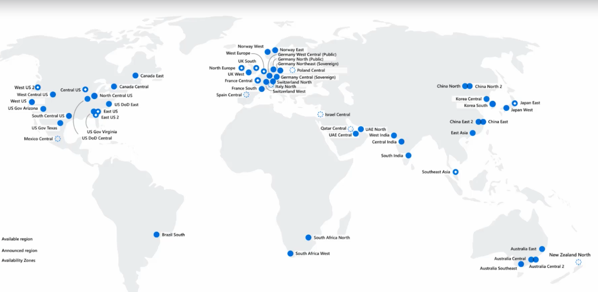

# Describe Core Azure Services (15-20%)

## Table of Contents
  - [**Describe the core Azure architectural components**](#describe-the-core-azure-architectural-components)
    - [Describe the benefits and usage of Regions and Region Pairs](#describe-the-benefits-and-usage-of-regions-and-region-pairs)
    - [**What is a region pair?**](#what-is-a-region-pair)
    - [Describe the benefits and usage of Availability Zone](#describe-the-benefits-and-usage-of-availability-zone)
    - [**Use availability zones in your apps**](#use-availability-zones-in-your-apps)
    - [Describe the benefits and usage of Resource Groups](#describe-the-benefits-and-usage-of-resource-groups)
    - [**Logical grouping**](#logical-grouping)
    - [**Life cycle**](#life-cycle)
    - [**Authorization**](#authorization)
    - [Describe the benefits and usage of Subscriptions](#describe-the-benefits-and-usage-of-subscriptions)
    - [Describe the benefits and usage of Management Groups](#describe-the-benefits-and-usage-of-management-groups)
    - [Describe the benefits and usage of Azure Resource Manager](#describe-the-benefits-and-usage-of-azure-resource-manager)
    - [Explain Azure resources](#explain-azure-resources)
  - [**Describe core resources available in Azure**](#describe-core-resources-available-in-azure)
    - [Describe the benefits and usage of Compute Services](#describe-the-benefits-and-usage-of-compute-services)
    - [Describe the benefits and usage of Networking Services](#describe-the-benefits-and-usage-of-networking-services)
    - [**Communicate between Azure resources**](#communicate-between-azure-resources)
    - [**Communicate with on-premises resources**](#communicate-with-on-premises-resources)
    - [**Route network traffic**](#route-network-traffic)
    - [**Filter network traffic**](#filter-network-traffic)
  - [**Connect virtual networks**](#connect-virtual-networks)
    - [Azure VPN Gateway fundamentals](#azure-vpn-gateway-fundamentals)
    - [**Policy-based VPNs**](#policy-based-vpns)
    - [**Route-based VPNs**](#route-based-vpns)
    - [**Deploy VPN gateways**](#deploy-vpn-gateways)
    - [**Required Azure resources**](#required-azure-resources)
    - [**Required on-premises resources**](#required-on-premises-resources)
    - [**High-availability scenarios**](#high-availability-scenarios)
    - [**Active/standby**](#activestandby)
    - [**Active/active**](#activeactive)
    - [**ExpressRoute failover**](#expressroute-failover)
    - [**Zone-redundant gateways**](#zone-redundant-gateways)
    - [Describe the benefits and usage of Storage Services](#describe-the-benefits-and-usage-of-storage-services)
    - [Disk storage fundamentals](#disk-storage-fundamentals)
    - [Azure Blob storage fundamentals](#azure-blob-storage-fundamentals)
    - [Azure Files fundamentals](#azure-files-fundamentals)
    - [Describe the benefits and usage of Database Services](#describe-the-benefits-and-usage-of-database-services)
    - [Describe the benefits and usage of Azure Marketplace](#describe-the-benefits-and-usage-of-azure-marketplace)
  - [Azure Services](#azure-services)
    - [**Compute**](#compute)
    - [**Networking**](#networking)
    - [**Storage**](#storage)
    - [**Mobile**](#mobile)
    - [**Databases**](#databases)
    - [**Web**](#web)
    - [**IoT**](#iot)
    - [**Big data**](#big-data)
    - [**AI**](#ai)
    - [**DevOps**](#devops)
  - [**What is the Azure free account?**](#what-is-the-azure-free-account)

## **Describe the core Azure architectural components**

### Describe the benefits and usage of Regions and Region Pairs

- A region is a geographical area on the planet that contains at least one but potentially multiple datacenters that are nearby and networked together with a low-latency network. Azure intelligently assigns and controls the resources within each region to ensure workloads are appropriately balanced.
- Regions - 60+

    

    - Chinese region → even though on map but not available for public → need some agreement
- Region pairs

    

    - Example pairs

        

        - Highest speed - low latency → paired regions
        - Beneficial to put backups into paired regions than other regions

    ### **Why are regions important?**

    Azure has more global regions than any other cloud provider. These regions give you the flexibility to bring applications closer to your users no matter where they are. **Global regions provide better scalability and redundancy.** They also preserve data residency for your services.

    ### **Special Azure regions**

    Azure has specialized regions that you might want to use when you build out your applications for compliance or legal purposes. A few examples include:

    - **US DoD Central, US Gov Virginia, US Gov Iowa and more:** These regions are physical and logical network-isolated instances of Azure for U.S. government agencies and partners. These datacenters are operated by screened U.S. personnel and include additional compliance certifications.
    - **China East, China North, and more:** These regions are available through a unique partnership between Microsoft and **21Vianet**, whereby Microsoft doesn't directly maintain the datacenters.

    Regions are what you use to identify the location for your resources. There are two other terms you should also be aware of: *geographies* and *availability zones*.

    - Availability zones are created by using one or more datacenters. There's a minimum of three zones within a single region. It's possible that a large disaster could cause an outage big enough to affect even two datacenters. **That's why Azure also creates region pairs.**

### **What is a region pair?**

Each Azure region is always paired with another region within the same geography (such as US, Europe, or Asia) at least 300 miles away. **This approach allows for the replication of resources (such as VM storage) across a geography that helps reduce the likelihood of interruptions because of events such as natural disasters, civil unrest, power outages, or physical network outages that affect both regions at once.** If a region in a pair was affected by a natural disaster, for instance, services would automatically failover to the other region in its region pair.

Examples of region pairs in Azure are West US paired with East US and SouthEast Asia paired with East Asia.

Because the pair of regions is directly connected and far enough apart to be isolated from regional disasters, you can use them to provide reliable services and data redundancy. **Some services offer automatic geo-redundant storage by using region pairs.**

Additional advantages of region pairs:

- If an extensive Azure outage occurs, one region out of every pair is prioritized to make sure at least one is restored as quickly as possible for applications hosted in that region pair.
- Planned Azure updates are rolled out to paired regions one region at a time to minimize downtime and risk of application outage.
- Data continues to reside within the same geography as its pair (except for Brazil South) for tax- and law-enforcement jurisdiction purposes.

**Having a broadly distributed set of datacenters allows Azure to provide a high guarantee of availability.**

### Describe the benefits and usage of Availability Zone

[#2 Azure Core Services - Azure Virtual Machines](https://www.notion.so/2-Azure-Core-Services-Azure-Virtual-Machines-a9ade338a1fa49c783411889d63d641e) 

- Within regions → Availability Zones

    

    - When you use them → you are increasing the availability
    - Each zone is isolated from each other → one outage will not affect other
- Availability zones are **physically separate datacenters within an Azure region.** Each availability zone is made up of one or more datacenters equipped with independent power, cooling, and networking. An availability zone is set up to be an isolation boundary. If one zone goes down, the other continues working. Availability zones are connected through high-speed, private fiber-optic networks.

### **Use availability zones in your apps**

You can use availability zones to run mission-critical applications and **build high-availability into your application architecture by co-locating your compute, storage, networking, and data resources within a zone and replicating in other zones.** Keep in mind that there could be a cost to duplicating your services and transferring data between zones.

Availability zones are primarily for VMs, managed disks, load balancers, and SQL databases. Azure services that support availability zones fall into two categories:

- **Zonal services**: You pin the resource to a specific zone (for example, VMs, managed disks, IP addresses).
- **Zone-redundant services**: The platform replicates automatically across zones (for example, zone-redundant storage, SQL Database).

### Describe the benefits and usage of Resource Groups

- Folder structure for resources

    

    - **Resources**: Resources are instances of services that you create, like virtual machines, storage, or SQL databases.
    - **Resource groups**: Resources are combined into resource groups, which act as a logical container into which Azure resources like web apps, databases, and storage accounts are deployed and managed.
    - **Subscriptions**: A subscription groups together user accounts and the resources that have been created by those user accounts. For each subscription, there are limits or quotas on the amount of resources that you can create and use. Organizations can use subscriptions to manage costs and the resources that are created by users, teams, or projects.
    - **Management groups**: These groups help you manage access, policy, and compliance for multiple subscriptions. All subscriptions in a management group automatically inherit the conditions applied to the management group.
- A container that holds related resources for an Azure solution. The resource group includes resources that you want to manage as a group. You decide which resources belong in a resource group based on what makes the most sense for your organization.

### **Logical grouping**

Resource groups exist to help manage and organize your Azure resources. By placing resources of similar usage, type, or location in a resource group, you can provide order and organization to resources you create in Azure. Logical grouping is the aspect that you're most interested in here, because there's a lot of disorder among our resources.

### **Life cycle**

If you delete a resource group, all resources contained within it are also deleted. Organizing resources by life cycle can be useful in nonproduction environments, where you might try an experiment and then dispose of it. Resource groups make it easy to remove a set of resources all at once.

### **Authorization**

Resource groups are also a scope for applying role-based access control (RBAC) permissions. By applying RBAC permissions to a resource group, you can ease administration and limit access to allow only what's needed.

### Describe the benefits and usage of Subscriptions

- Subscription → billing unit → Credit Card on which payment is charged
- Users have access to one or more subscriptions → with different roles
- All resources consumed by a subscription → billed to owner
- Can be used to organize resources → into completely distinct accounts

    

- Using Azure requires an Azure subscription.
- A subscription provides you with authenticated and authorized access to Azure products and services. It also allows you to provision resources.
- An Azure subscription is a logical unit of Azure services that links to an Azure account, which is an identity in Azure Active Directory (Azure AD) or in a directory that Azure AD trusts.

- An account can have one subscription or multiple subscriptions that have different billing models and to which you apply different access-management policies.
- You can use Azure subscriptions to define boundaries around Azure products, services, and resources. There are two types of subscription boundaries that you can use:
    - **Billing boundary**: This subscription type determines how an Azure account is billed for using Azure. You can create multiple subscriptions for different types of billing requirements. Azure generates separate billing reports and invoices for each subscription so that you can organize and manage costs.
    - **Access control boundary**: Azure applies access-management policies at the subscription level, and you can create separate subscriptions to reflect different organizational structures. An example is that within a business, you have different departments to which you apply distinct Azure subscription policies. This billing model allows you to manage and control access to the resources that users provision with specific subscriptions.

    ### **Create additional Azure subscriptions**

    You might want to create additional subscriptions for resource or billing management purposes. For example, you might choose to create additional subscriptions to separate:

    - **Environments:** When managing your resources, you can choose to create subscriptions to set up separate environments for development and testing, security, or to isolate data for compliance reasons. This design is particularly useful because resource access control occurs at the subscription level.
    - **Organizational structures:** You can create subscriptions to reflect different organizational structures. For example, you could limit a team to lower-cost resources, while allowing the IT department a full range. This design allows you to manage and control access to the resources that users provision within each subscription.
    - **Billing:** You might want to also create additional subscriptions for billing purposes. Because costs are first aggregated at the subscription level, you might want to create subscriptions to manage and track costs based on your needs. For instance, you might want to create one subscription for your production workloads and another subscription for your development and testing workloads.

    You might also need additional subscriptions because of:

    - **Subscription limits:** Subscriptions are bound to some hard limitations. For example, the maximum number of Azure ExpressRoute circuits per subscription is 10. Those limits should be considered as you create subscriptions on your account. If there's a need to go over those limits in particular scenarios, you might need additional subscriptions.

    ### **Customize billing to meet your needs**

    If you have multiple subscriptions, you can organize them into invoice sections. Each invoice section is a line item on the invoice that shows the charges incurred that month. For example, you might need a single invoice for your organization but want to organize charges by department, team, or project.

    Depending on your needs, you can set up multiple invoices within the same billing account. To do this, create additional billing profiles. Each billing profile has its own monthly invoice and payment method.

    The following diagram shows an overview of how billing is structured. If you've previously signed up for Azure or if your organization has an Enterprise Agreement, your billing might be set up differently.

    

### Describe the benefits and usage of Management Groups

[#8 Understanding security, privacy, compliance, and trust](https://www.notion.so/8-Understanding-security-privacy-compliance-and-trust-d1e3ca2f37664f5d924b2f07c99beb2b) 

- Management groups can have hierarchies

    

    - Now you can set policies for entire management group
    - Have some governance and compliance

    You organize subscriptions into containers called management groups and apply your governance conditions to the management groups. All subscriptions within a management group automatically inherit the conditions applied to the management group. Management groups give you enterprise-grade management at a large scale no matter what type of subscriptions you might have. **All subscriptions within a single management group must trust the same Azure AD tenant.**

    For example, you can apply policies to a management group that limits the regions available for VM creation. This policy would be applied to all management groups, subscriptions, and resources under that management group by only allowing VMs to be created in that region.

    ### **Hierarchy of management groups and subscriptions**

    You can build a flexible structure of management groups and subscriptions to organize your resources into a hierarchy for unified policy and access management. The following diagram shows an example of creating a hierarchy for governance by using management groups.

    

    **You can create a hierarchy that applies a policy**. For example, you could limit VM locations to the US West Region in a group called Production. This policy will inherit onto all the Enterprise Agreement subscriptions that are descendants of that management group and will apply to all VMs under those subscriptions. This security policy can't be altered by the resource or subscription owner, which allows for improved governance.

    **Another scenario where you would use management groups is to provide user access to multiple subscriptions.** By moving multiple subscriptions under that management group, you can create one role-based access control (RBAC) assignment on the management group, which will inherit that access to all the subscriptions. One assignment on the management group can enable users to have access to everything they need instead of scripting RBAC over different subscriptions.

    ### **Important facts about management groups**

    - 10,000 management groups can be supported in a single directory.
    - A management group tree can support up to six levels of depth. This limit doesn't include the root level or the subscription level.
    - Each management group and subscription can support only one parent.
    - Each management group can have many children.
    - All subscriptions and management groups are within a single hierarchy in each directory.

### Describe the benefits and usage of Azure Resource Manager

- Azure Resource Manager is the deployment and management service for Azure. It provides a management layer that enables you to create, update, and delete resources in your Azure account. You use management features like access control, locks, and tags to secure and organize your resources after deployment.
- Azure entire behind setup → Azure Resource Manager Model
    - When a user sends a request from any of the Azure tools, APIs, or SDKs, Resource Manager receives the request. It authenticates and authorizes the request. Resource Manager sends the request to the Azure service, which takes the requested action. Because all requests are handled through the same API, you see consistent results and capabilities in all the different tools.

    

    - Resource manager API → deal with all the resources inside Azure
    - Resource manager interface → responsible for all the resource creation and deployments

    ### **The benefits of using Resource Manager**

    With Resource Manager, you can:

    - Manage your infrastructure through declarative templates rather than scripts. **A Resource Manager template** is a JSON file that defines what you want to deploy to Azure.
    - Deploy, manage, and monitor all the resources for your solution as a group, rather than handling these resources individually.
    - **Redeploy your solution throughout the development life cycle** and have confidence your resources are deployed in a consistent state.
    - Define the dependencies between resources so they're deployed in the correct order.
    - **Apply access control** to all services because RBAC is natively integrated into the management platform.
    - **Apply tags** to resources to logically organize all the resources in your subscription.
    - **Clarify your organization's billing** by viewing costs for a group of resources that share the same tag.

### Explain Azure resources

- Azure service → instance

    

- A manageable item that's available through Azure. Virtual machines (VMs), storage accounts, web apps, databases, and virtual networks are examples of resources.

---

## **Describe core resources available in Azure**

### Describe the benefits and usage of Compute Services

Azure compute is an on-demand computing service for running cloud-based applications. It provides computing resources such as disks, processors, memory, networking, and operating systems. The resources are available on-demand and can typically be made available in minutes or even seconds. You pay only for the resources you use, and only for as long as you're using them.

Azure supports a wide range of computing solutions for development and testing, running applications, and extending your datacenter. The service supports Linux, Windows Server, SQL Server, Oracle, IBM, and SAP. Azure also has many services that can run virtual machines (VMs). Each service provides different options depending on your requirements. Some of the most prominent services are:

- Azure Virtual Machines
- Azure Container Instances
- Azure App Service
- Azure Functions (or *serverless computing*)

- Compute → executing code in the cloud

- **Virtual Machines (VM)**

    [#2 Azure Core Services - Azure Virtual Machines](https://www.notion.so/2-Azure-Core-Services-Azure-Virtual-Machines-a9ade338a1fa49c783411889d63d641e) 

    

    - Virtual Machine Types

    

    Virtual machines are software emulations of physical computers. They include a virtual processor, memory, storage, and networking resources. VMs host an operating system, and you can install and run software just like a physical computer. When using a remote desktop client, you can use and control the VM as if you were sitting in front of it.

    With [Azure Virtual Machines](https://azure.microsoft.com/services/virtual-machines/), you can create and use VMs in the cloud. Virtual Machines provides infrastructure as a service (IaaS) and can be used in different ways. When you need total control over an operating system and environment, VMs are an ideal choice. Just like a physical computer, you can customize all the software running on the VM. This ability is helpful when you're running custom software or custom hosting configurations.

    You can create and provision a VM in minutes when you select a preconfigured VM image. Selecting an image is one of the most important decisions you'll make when you create a VM. An image is a template used to create a VM. These templates already include an OS and often other software, like development tools or web hosting environments.

    ### **Examples of when to use VMs**

    - **During testing and development.** VMs provide a quick and easy way to create different OS and application configurations. Test and development personnel can then easily delete the VMs when they no longer need them.
    - **When running applications in the cloud.** The ability to run certain applications in the public cloud as opposed to creating a traditional infrastructure to run them can provide substantial economic benefits. For example, an application might need to handle fluctuations in demand. Shutting down VMs when you don't need them or quickly starting them up to meet a sudden increase in demand means you pay only for the resources you use.
    - **When extending your datacenter to the cloud.** An organization can extend the capabilities of its own on-premises network by creating a virtual network in Azure and adding VMs to that virtual network. Applications like SharePoint can then run on an Azure VM instead of running locally. This arrangement makes it easier or less expensive to deploy than in an on-premises environment.
    - **During disaster recovery.** As with running certain types of applications in the cloud and extending an on-premises network to the cloud, you can get significant cost savings by using an IaaS-based approach to disaster recovery. If a primary datacenter fails, you can create VMs running on Azure to run your critical applications and then shut them down when the primary datacenter becomes operational again.

    ## **Move to the cloud with VMs**

    VMs are also an excellent choice when you move from a physical server to the cloud (also known as lift and shift). You can create an image of the physical server and host it within a VM with little or no changes. Just like a physical on-premises server, you must maintain the VM. You update the installed OS and the software it runs.

    ## **Virtual machine scale sets**

    [Virtual machine scale sets](https://azure.microsoft.com/services/virtual-machine-scale-sets) are an Azure compute resource that you can use to deploy and manage a set of identical VMs. With all VMs configured the same, virtual machine scale sets are designed to support true autoscale. No pre-provisioning of VMs is required. For this reason, it's easier to build large-scale services targeting big compute, big data, and containerized workloads. As demand goes up, more VM instances can be added. As demand goes down, VM instances can be removed. The process can be manual, automated, or a combination of both.

    ### **What is Azure Batch?**

    Azure Batch enables large-scale parallel and high-performance computing (HPC) batch jobs with the ability to scale to tens, hundreds, or thousands of VMs.

    When you're ready to run a job, Batch does the following:

    - Starts a pool of compute VMs for you.
    - Installs applications and staging data.
    - Runs jobs with as many tasks as you have.
    - Identifies failures.
    - Requeues work.
    - Scales down the pool as work completes.

    There might be situations in which you need raw computing power or supercomputer-level compute power. Azure provides these capabilities.

- **App Services (Web Apps)**

    With Azure App Service, you can quickly build, deploy, and scale enterprise-grade web, mobile, and API apps running on any platform. You can meet rigorous performance, scalability, security, and compliance requirements while using a fully managed platform to perform infrastructure maintenance. App Service is a platform as a service (PaaS) offering.

    [#6 More on Azure Core Services - Part 1](https://www.notion.so/6-More-on-Azure-Core-Services-Part-1-bb74c4b63fcc43b4ad2c24866e960481) 

    

    App Service enables you to build and host web apps, background jobs, mobile back-ends, and RESTful APIs in the programming language of your choice without managing infrastructure. It offers automatic scaling and high availability. App Service supports Windows and Linux and enables automated deployments from GitHub, Azure DevOps, or any Git repo to support a continuous deployment model.

    ## **Azure App Service costs**

    You pay for the Azure compute resources your app uses while it processes requests based on the App Service plan you choose. **The App Service plan determines how much hardware is devoted to your host.** For example, the plan determines whether it's dedicated or shared hardware and how much memory is reserved for it. There's even a *free* tier you can use to host small, low-traffic sites.

    ## **Types of app services**

    With App Service, you can host most common app service styles like:

    - Web apps
    - API apps
    - WebJobs
    - Mobile apps

    App Service handles most of the infrastructure decisions you deal with in hosting web-accessible apps:

    - Deployment and management are integrated into the platform.
    - Endpoints can be secured.
    - Sites can be scaled quickly to handle high traffic loads.
    - The built-in load balancing and traffic manager provide high availability.

    All of these app styles are hosted in the same infrastructure and share these benefits. This flexibility makes App Service the ideal choice to host web-oriented applications.

- **Containers**

    Container Instances and Azure Kubernetes Service are Azure compute resources that you can use to deploy and manage containers. Containers are lightweight, virtualized application environments. They're designed to be quickly created, scaled out, and stopped dynamically. You can run multiple instances of a containerized application on a single host machine.

    [#7 More on Azure Core Services - Part 2](https://www.notion.so/7-More-on-Azure-Core-Services-Part-2-65e198a65b014da09d0a9a2efec01d18) 

    

    Containers are managed through a container orchestrator, which can start, stop, and scale out application instances as needed. There are two ways to manage both Docker and Microsoft-based containers in Azure: Azure Container Instances and Azure Kubernetes Service (AKS).

    - Azure Container Instances offers the fastest and simplest way to run a container in Azure without having to manage any virtual machines or adopt any additional services. It's a platform as a service (PaaS) offering that allows you to upload your containers, which it runs for you./bu
    - The task of automating, managing, and interacting with a large number of containers is known as orchestration. Azure Kubernetes Service is a complete orchestration service for containers with distributed architectures and large volumes of containers. Orchestration is the task of automating and managing a large number of containers and how they interact.

    ## **Use containers in your solutions**

    Containers are often used to create solutions by using a *microservice architecture*. This architecture is where you break solutions into smaller, independent pieces. For example, you might split a website into a container hosting your front end, another hosting your back end, and a third for storage. This split allows you to separate portions of your app into logical sections that can be maintained, scaled, or updated independently.

    Imagine your website back-end has reached capacity but the front end and storage aren't being stressed. You could:

    - Scale the back end separately to improve performance.
    - Decide to use a different storage service.
    - Replace the storage container without affecting the rest of the application.

- **Windows Virtual Desktop**

    

    **Windows Virtual Desktop on Azure is a desktop and application virtualization service that runs on the cloud.** It enables your users to use a cloud-hosted version of Windows from any location. Windows Virtual Desktop works across devices like Windows, Mac, iOS, Android, and Linux. It works with apps that you can use to access remote desktops and apps. You can also use most modern browsers to access Windows Virtual Desktop-hosted experiences.

    ## **Why should you use Windows Virtual Desktop?**

    ### **Provide the best user experience**

    Users have the freedom to connect to Windows Virtual Desktop with any device over the internet. They use a Windows Virtual Desktop client to connect to their published Windows desktop and applications. This client could either be a native application on the device or the Windows Virtual Desktop HTML5 web client.

    You can make sure your session host virtual machines (VMs) run near apps and services that connect to your datacenter or the cloud. This way your users stay productive and don't encounter long load times.

    User sign-in to Windows Virtual Desktop is fast because user profiles are containerized by using FSLogix. At sign-in, the user profile container is dynamically attached to the computing environment. The user profile is immediately available and appears in the system exactly like a native user profile.

    You can provide individual ownership through personal (persistent) desktops. For example, you might want to provide personal remote desktops for members of an engineering team. Then they can add or remove programs without impacting other users on that remote desktop.

    ### **Enhance security**

    **Windows Virtual Desktop provides centralized security management for users' desktops with Azure Active Directory (Azure AD).** You can enable multifactor authentication to secure user sign-ins. You can also secure access to data by assigning granular role-based access controls (RBACs) to users.

    With Windows Virtual Desktop, the data and apps are separated from the local hardware. Windows Virtual Desktop runs them instead on a remote server. The risk of confidential data being left on a personal device is reduced.

    User sessions are isolated in both single and multi-session environments.

    Windows Virtual Desktop also improves security by using reverse connect technology. This connection type is more secure than the Remote Desktop Protocol. We don't open inbound ports to the session host VMs.

    ## **What are some key features of Windows Virtual Desktop?**

    ### **Simplified management**

    Windows Virtual Desktop is an Azure service, so it will be familiar to Azure administrators. You use Azure AD and RBACs to manage access to resources. With Azure, you also get tools to automate VM deployments, manage VM updates, and provide disaster recovery. As with other Azure services, Windows Virtual Desktop uses Azure Monitor for monitoring and alerts. This standardization lets admins identify issues through a single interface.

    ### **Performance management**

    Windows Virtual Desktop gives you options to load balance users on your VM host pools. *Host pools* are collections of VMs with the same configuration assigned to multiple users. For the best performance, you can configure load balancing to occur as users sign in (breadth mode). With breadth mode, users are sequentially allocated across the host pool for your workload. To save costs, you can configure your VMs for depth mode load balancing where users are fully allocated on one VM before moving to the next. Windows Virtual Desktop provides tools to automatically provision additional VMs when incoming demand exceeds a specified threshold.

    ### **Multi-session Windows 10 deployment**

    Windows Virtual Desktop lets you use Windows 10 Enterprise multi-session, the only Windows client-based operating system that enables multiple concurrent users on a single VM. Windows Virtual Desktop also provides a more consistent experience with broader application support compared to Windows Server-based operating systems.

    ## **How can you reduce costs with Windows Virtual Desktop?**

    ### **Bring your own licenses**

    Windows Virtual Desktop is available to you at no additional cost if you have an eligible Microsoft 365 license. Just pay for the Azure resources used by Windows Virtual Desktop.

    - Bring your eligible Windows or Microsoft 365 license to get Windows 10 Enterprise and Windows 7 Enterprise desktops and apps at no additional cost.
    - If you're an eligible Microsoft Remote Desktop Services Client Access License customer, Windows Server Remote Desktop Services desktops and apps are available at no additional cost.

    ### **Save on compute costs**

    Buy one-year or three-year Azure Reserved Virtual Machine Instances to save you up to 72 percent versus pay-as-you-go pricing. You can pay for a reservation up front or monthly. Reservations provide a billing discount and don't affect the runtime state of your resources.

- **Azure Functions**

    Functions are ideal when you're concerned only about the code running your service and not the underlying platform or infrastructure. They're commonly used when you need to perform work in response to an event (often via a REST request), timer, or message from another Azure service, and when that work can be completed quickly, within seconds or less.

### Describe the benefits and usage of Networking Services

[#3 Azure Core Services - Networking](https://www.notion.so/3-Azure-Core-Services-Networking-aa5e08d5a2684dafb16d228ef85d12f4) 

*Azure virtual networks* enable Azure resources, such as VMs, web apps, and databases, to communicate with each other, with users on the internet, and with your on-premises client computers. You can think of an Azure network as a set of resources that links other Azure resources.

Azure virtual networks provide the following key networking capabilities:

- Isolation and segmentation
- Internet communications
- Communicate between Azure resources
- Communicate with on-premises resources
- Route network traffic
- Filter network traffic
- Connect virtual networks
- Types of Networking Services

    

    - Connectivity Services

        

        ExpressRoute lets you extend your on-premises networks into the Microsoft cloud over a private connection with the help of a connectivity provider. With ExpressRoute, you can establish connections to Microsoft cloud services, such as Microsoft Azure and Microsoft 365.

        **Connectivity can be from an any-to-any (IP VPN) network, a point-to-point Ethernet network, or a virtual cross-connection through a connectivity provider at a colocation facility.** ExpressRoute connections don't go over the public Internet. This allows ExpressRoute connections to offer more reliability, faster speeds, consistent latencies, and higher security than typical connections over the Internet. For information on how to connect your network to Microsoft using ExpressRoute, see ExpressRoute connectivity models.

        

        ## **Features and benefits of ExpressRoute**

        There are several benefits to using ExpressRoute as the connection service between Azure and on-premises networks.

        - Layer 3 connectivity between your on-premises network and the Microsoft Cloud through a connectivity provider. Connectivity can be from an any-to-any (IPVPN) network, a point-to-point Ethernet connection, or through a virtual cross-connection via an Ethernet exchange.
        - Connectivity to Microsoft cloud services across all regions in the geopolitical region.
        - Global connectivity to Microsoft services across all regions with the ExpressRoute premium add-on.
        - Dynamic routing between your network and Microsoft via BGP.
        - Built-in redundancy in every peering location for higher reliability.
        - Connection uptime SLA.
        - QoS support for Skype for Business.

        ## **ExpressRoute connectivity models**

        ExpressRoute supports three models that you can use to connect your on-premises network to the Microsoft cloud:

        - **CloudExchange colocation**
        - **Point-to-point Ethernet connection**
        - **Any-to-any connection**

        

    - **Protection Services**

        [#8 Understanding security, privacy, compliance, and trust](https://www.notion.so/8-Understanding-security-privacy-compliance-and-trust-d1e3ca2f37664f5d924b2f07c99beb2b) 

        

    - Delivery Services

        [#6 More on Azure Core Services - Part 1](https://www.notion.so/6-More-on-Azure-Core-Services-Part-1-bb74c4b63fcc43b4ad2c24866e960481) 

        

    - Monitoring Services

        [#7 More on Azure Core Services - Part 2](https://www.notion.so/7-More-on-Azure-Core-Services-Part-2-65e198a65b014da09d0a9a2efec01d18) 

        

### **Communicate between Azure resources**

You'll want to enable Azure resources to communicate securely with each other. You can do that in one of two ways:

- **Virtual networks**

    Virtual networks can connect not only VMs but other Azure resources, such as the App Service Environment for Power Apps, Azure Kubernetes Service, and Azure virtual machine scale sets.

- **Service endpoints**

    You can use service endpoints to connect to other Azure resource types, such as Azure SQL databases and storage accounts. This approach enables you to link multiple Azure resources to virtual networks to improve security and provide optimal routing between resources.

### **Communicate with on-premises resources**

Azure virtual networks enable you to link resources together in your on-premises environment and within your Azure subscription. In effect, you can create a network that spans both your local and cloud environments. There are three mechanisms for you to achieve this connectivity:

- **Point-to-site virtual private networks**

    The typical approach to a virtual private network (VPN) connection is from a computer outside your organization, back into your corporate network. In this case, the client computer initiates an encrypted VPN connection to connect that computer to the Azure virtual network.

- **Site-to-site virtual private networks**

    A site-to-site VPN links your on-premises VPN device or gateway to the Azure VPN gateway in a virtual network. In effect, the devices in Azure can appear as being on the local network. The connection is encrypted and works over the internet.

- **Azure ExpressRoute**

    For environments where you need greater bandwidth and even higher levels of security, Azure ExpressRoute is the best approach. ExpressRoute provides dedicated private connectivity to Azure that doesn't travel over the internet. (You'll learn more about ExpressRoute in a separate unit later in this module.)

### **Route network traffic**

By default, Azure routes traffic between subnets on any connected virtual networks, on-premises networks, and the internet. You also can control routing and override those settings, as follows:

- **Route tables**

    A route table allows you to define rules about how traffic should be directed. You can create custom route tables that control how packets are routed between subnets.

- **Border Gateway Protocol**

    Border Gateway Protocol (BGP) works with Azure VPN gateways or ExpressRoute to propagate on-premises BGP routes to Azure virtual networks.

### **Filter network traffic**

Azure virtual networks enable you to filter traffic between subnets by using the following approaches:

- **Network security groups**

    A network security group is an Azure resource that can contain multiple inbound and outbound security rules. You can define these rules to allow or block traffic, based on factors such as source and destination IP address, port, and protocol.

- **Network virtual appliances**

    A network virtual appliance is a specialized VM that can be compared to a hardened network appliance. A network virtual appliance carries out a particular network function, such as running a firewall or performing wide area network (WAN) optimization.

## **Connect virtual networks**

You can link virtual networks together by using virtual network *peering*. Peering enables resources in each virtual network to communicate with each other. These virtual networks can be in separate regions, which allows you to create a global interconnected network through Azure.

UDR is user-defined Routing. UDR is a significant update to Azure’s Virtual Networks as this allows network admins to control the routing tables between subnets within a VNet, as well as between VNets, thereby allowing for greater control over network traffic flow.

### Azure VPN Gateway fundamentals

A VPN gateway is a type of virtual network gateway. **Azure VPN Gateway** instances are deployed in Azure Virtual Network instances and enable the following connectivity:

- Connect on-premises datacenters to virtual networks through a *site-to-site* connection.
- Connect individual devices to virtual networks through a *point-to-site* connection.
- Connect virtual networks to other virtual networks through a *network-to-network* connection.

All transferred data is encrypted in a private tunnel as it crosses the internet. You can deploy only one VPN gateway in each virtual network, but you can use one gateway to connect to multiple locations, which includes other virtual networks or on-premises datacenters.

**When you deploy a VPN gateway, you specify the VPN type: either *policy-based* or *route-based*.** The main difference between these two types of VPNs is how traffic to be encrypted is specified. In Azure, both types of VPN gateways use a pre-shared key as the only method of authentication. Both types also rely on Internet Key Exchange (IKE) in either version 1 or version 2 and Internet Protocol Security (IPSec). IKE is used to set up a security association (an agreement of the encryption) between two endpoints. This association is then passed to the IPSec suite, which encrypts and decrypts data packets encapsulated in the VPN tunnel.

### **Policy-based VPNs**

Policy-based VPN gateways specify statically the IP address of packets that should be encrypted through each tunnel. This type of device evaluates every data packet against those sets of IP addresses to choose the tunnel where that packet is going to be sent through.

### **Route-based VPNs**

If defining which IP addresses are behind each tunnel is too cumbersome, route-based gateways can be used. With route-based gateways, IPSec tunnels are modeled as a network interface or virtual tunnel interface. IP routing (either static routes or dynamic routing protocols) decides which one of these tunnel interfaces to use when sending each packet. Route-based VPNs are the preferred connection method for on-premises devices. They're more resilient to topology changes such as the creation of new subnets.

### **Deploy VPN gateways**

Before you can deploy a VPN gateway, you'll need some Azure and on-premises resources.

### **Required Azure resources**

You'll need these Azure resources before you can deploy an operational VPN gateway:

- **Virtual network**. Deploy a virtual network with enough address space for the additional subnet that you'll need for the VPN gateway. The address space for this virtual network must not overlap with the on-premises network that you'll be connecting to. You can deploy only one VPN gateway within a virtual network.
- **GatewaySubnet**. Deploy a subnet called `GatewaySubnet` for the VPN gateway. Use at least a **/27** address mask to make sure you have enough IP addresses in the subnet for future growth. You can't use this subnet for any other services.
- **Public IP address**. Create a Basic-SKU dynamic public IP address if you're using a non-zone-aware gateway. This address provides a public-routable IP address as the target for your on-premises VPN device. This IP address is dynamic, but it won't change unless you delete and re-create the VPN gateway.
- **Local network gateway**. Create a local network gateway to define the on-premises network's configuration, such as where the VPN gateway will connect and what it will connect to. This configuration includes the on-premises VPN device's public IPv4 address and the on-premises routable networks. This information is used by the VPN gateway to route packets that are destined for on-premises networks through the IPSec tunnel.
- **Virtual network gateway**. Create the virtual network gateway to route traffic between the virtual network and the on-premises datacenter or other virtual networks. The virtual network gateway can be either a VPN or ExpressRoute gateway, but this unit only deals with VPN virtual network gateways. (You'll learn more about ExpressRoute in a separate unit later in this module.)
- **Connection**. Create a connection resource to create a logical connection between the VPN gateway and the local network gateway.
    - The connection is made to the on-premises VPN device's IPv4 address as defined by the local network gateway.
    - The connection is made from the virtual network gateway and its associated public IP address.

    You can create multiple connections.

The following diagram shows this combination of resources and their relationships to help you better understand what's required to deploy a VPN gateway.

### **Required on-premises resources**

To connect your datacenter to a VPN gateway, you'll need these on-premises resources:

- A VPN device that supports policy-based or route-based VPN gateways
- A public-facing (internet-routable) IPv4 address

### **High-availability scenarios**

There are several ways to ensure you have a fault-tolerant configuration.

### **Active/standby**

By default, VPN gateways are deployed as two instances in an active/standby configuration, even if you only see one VPN gateway resource in Azure. When planned maintenance or unplanned disruption affects the active instance, the standby instance automatically assumes responsibility for connections without any user intervention. Connections are interrupted during this failover, but they're typically restored within a few seconds for planned maintenance and within 90 seconds for unplanned disruptions.

### **Active/active**

With the introduction of support for the BGP routing protocol, you can also deploy VPN gateways in an active/active configuration. In this configuration, you assign a unique public IP address to each instance. You then create separate tunnels from the on-premises device to each IP address. You can extend the high availability by deploying an additional VPN device on-premises.

### **ExpressRoute failover**

Another high-availability option is to configure a VPN gateway as a secure failover path for ExpressRoute connections. ExpressRoute circuits have resiliency built in. But they aren't immune to physical problems that affect the cables delivering connectivity or outages that affect the complete ExpressRoute location. In high-availability scenarios, where there's risk associated with an outage of an ExpressRoute circuit, you can also provision a VPN gateway that uses the internet as an alternative method of connectivity. In this way, you can ensure there's always a connection to the virtual networks.

### **Zone-redundant gateways**

In regions that support availability zones, VPN gateways and ExpressRoute gateways can be deployed in a zone-redundant configuration. This configuration brings resiliency, scalability, and higher availability to virtual network gateways. Deploying gateways in Azure availability zones physically and logically separates gateways within a region while protecting your on-premises network connectivity to Azure from zone-level failures. These gateways require different gateway SKUs and use Standard public IP addresses instead of Basic public IP addresses.

### Describe the benefits and usage of Storage Services

[#4 Azure Core Services - Azure Storage](https://www.notion.so/4-Azure-Core-Services-Azure-Storage-10515fc4a5af484aa7856dd01ecffe88) 

- Azure Storage Account

    Your storage account will contain all of your Azure Storage data objects, such as blobs, files, and disks.

    

- Other options

    

    - Location of the file → impact pricing
    - Replication also impact pricing

    Azure Storage offers different access tiers for your blob storage, helping you store object data in the most cost-effective manner. The available access tiers include:

    - **Hot access tier**: Optimized for storing data that is accessed frequently (for example, images for your website).
    - **Cool access tier**: Optimized for data that is infrequently accessed and stored for at least 30 days (for example, invoices for your customers).
    - **Archive access tier**: Appropriate for data that is rarely accessed and stored for at least 180 days, with flexible latency requirements (for example, long-term backups).

    The following considerations apply to the different access tiers:

    - Only the hot and cool access tiers can be set at the account level. The archive access tier isn't available at the account level.
    - Hot, cool, and archive tiers can be set at the blob level, during upload or after upload.
    - Data in the cool access tier can tolerate slightly lower availability, but still requires high durability, retrieval latency, and throughput characteristics similar to hot data. For cool data, a slightly lower availability service-level agreement (SLA) and higher access costs compared to hot data are acceptable trade-offs for lower storage costs.
    - Archive storage stores data offline and offers the lowest storage costs, but also the highest costs to rehydrate and access data.
- Disk Storage

    

A storage account provides a unique namespace for your Azure Storage data, that's accessible from anywhere in the world over HTTP or HTTPS. Data in this account is secure, highly available, durable, and massively scalable.

### Disk storage fundamentals

Disk Storage provides disks for Azure virtual machines. Applications and other services can access and use these disks as needed, similar to how they would in on-premises scenarios. Disk Storage allows data to be persistently stored and accessed from an attached virtual hard disk.

Disks come in many different sizes and performance levels, from solid-state drives (SSDs) to traditional spinning hard disk drives (HDDs), with varying performance tiers. You can use standard SSD and HDD disks for less critical workloads, premium SSD disks for mission-critical production applications, and ultra disks for data-intensive workloads such as SAP HANA, top tier databases, and transaction-heavy workloads. Azure has consistently delivered enterprise-grade durability for infrastructure as a service (Iaas) disks, with an industry-leading ZERO% annualized failure rate.

The following illustration shows an Azure virtual machine that uses separate disks to store different data.

### Azure Blob storage fundamentals

Azure Blob Storage is an object storage solution for the cloud. It can store massive amounts of data, such as text or binary data. Azure Blob Storage is unstructured, meaning that there are no restrictions on the kinds of data it can hold. Blob Storage can manage thousands of simultaneous uploads, massive amounts of video data, constantly growing log files, and can be reached from anywhere with an internet connection.

Blobs aren't limited to common file formats. A blob could contain gigabytes of binary data streamed from a scientific instrument, an encrypted message for another application, or data in a custom format for an app you're developing. One advantage of blob storage over disk storage is that it does not require developers to think about or manage disks; data is uploaded as blobs, and Azure takes care of the physical storage needs.

Blob Storage is ideal for:

- Serving images or documents directly to a browser.
- Storing files for distributed access.
- Streaming video and audio.
- Storing data for backup and restore, disaster recovery, and archiving.
- Storing data for analysis by an on-premises or Azure-hosted service.
- Storing up to 8 TB of data for virtual machines.

You store blobs in containers, which helps you organize your blobs depending on your business needs.

The following diagram illustrates how you might use Azure accounts, containers, and blobs.

### Azure Files fundamentals

Azure Files offers fully managed file shares in the cloud that are accessible via the industry standard Server Message Block and Network File System (preview) protocols. Azure file shares can be mounted concurrently by cloud or on-premises deployments of Windows, Linux, and macOS. **Applications running in Azure virtual machines or cloud services can mount a file storage share to access file data, just as a desktop application would mount a typical SMB share.** Any number of Azure virtual machines or roles can mount and access the file storage share simultaneously. Typical usage scenarios would be to share files anywhere in the world, diagnostic data, or application data sharing.

Use Azure Files for the following situations:

- Many on-premises applications use file shares. Azure Files makes it easier to migrate those applications that share data to Azure. If you mount the Azure file share to the same drive letter that the on-premises application uses, the part of your application that accesses the file share should work with minimal changes, if any.
- Store configuration files on a file share and access them from multiple VMs. Tools and utilities used by multiple developers in a group can be stored on a file share, ensuring that everybody can find them, and that they use the same version.
- Write data to a file share, and process or analyze the data later. For example, you might want to do this with diagnostic logs, metrics, and crash dumps.

The following illustration shows Azure Files being used to share data between two geographical locations. Azure Files ensures the data is encrypted at rest, and the SMB protocol ensures the data is encrypted in transit.

### Describe the benefits and usage of Database Services

[#4 Azure Core Services - Azure Storage](https://www.notion.so/4-Azure-Core-Services-Azure-Storage-10515fc4a5af484aa7856dd01ecffe88) 

- **Azure Cosmos DB**

    

    - Azure Cosmos DB is a globally distributed, multi-model database service. You can elastically and independently scale throughput and storage across any number of Azure regions worldwide. You can take advantage of fast, single-digit-millisecond data access by using any one of several popular APIs. Azure Cosmos DB provides comprehensive service level agreements for throughput, latency, availability, and consistency guarantees.
    - Azure Cosmos DB supports schema-less data, which lets you build highly responsive and "Always On" applications to support constantly changing data. You can use this feature to store data that's updated and maintained by users around the world.
    - Azure Cosmos DB is flexible. At the lowest level, Azure Cosmos DB stores data in atom-record-sequence (ARS) format. The data is then abstracted and projected as an API, which you specify when you're creating your database. **Your choices include SQL, MongoDB, Cassandra, Tables, and Gremlin.** This level of flexibility means that as you migrate your company's databases to Azure Cosmos DB, your developers can stick with the API that they're the most comfortable with.

- **Azure SQL Database**

    

    - Azure SQL Database is a relational database based on the latest stable version of the Microsoft SQL Server database engine. SQL Database is a high-performance, reliable, fully managed, and secure database. You can use it to build data-driven applications and websites in the programming language of your choice, without needing to manage infrastructure.

    ## **Features**

    - Azure SQL Database is a **platform as a service (PaaS) database engine**. It handles most of the database management functions, such as upgrading, patching, backups, and monitoring, without user involvement. **SQL Database provides 99.99 percent availability.** PaaS capabilities that are built into SQL Database enable you to focus on the domain-specific database administration and optimization activities that are critical for your business. SQL Database is a fully managed service that has built-in high availability, backups, and other common maintenance operations. Microsoft handles all updates to the SQL and operating system code. You don't have to manage the underlying infrastructure.
    - You can create a highly available and high-performance data storage layer for the applications and solutions in Azure. SQL Database can be the right choice for a variety of modern cloud applications because it enables you to process both relational data and non-relational structures, such as graphs, JSON, spatial, and XML.
    - You can use advanced query processing features, such as high-performance, in-memory technologies and intelligent query processing. In fact, the newest capabilities of SQL Server are released first to SQL Database, and then to SQL Server itself. You get the newest SQL Server capabilities, with no overhead for updates or upgrades, tested across millions of databases.

    ## **Migration**

    Tailwind Traders currently uses several on-premises servers running SQL Server, which provide data storage for your public-facing website (for example, customer data, order history, and product catalogs). In addition, your on-premises servers running SQL Server also provide data storage for your internal-only training portal website. Tailwind Traders uses the website for new employee training materials (such as study materials, certification details, and training transcripts). The following illustration shows the types of data that your company might store in the Azure SQL Database training portal website.

    

    You can migrate your existing SQL Server databases with minimal downtime by using the **Azure Database Migration Service.** The Microsoft Data Migration Assistant can generate assessment reports that provide recommendations to help guide you through required changes prior to performing a migration. After you assess and resolve any remediation required, you're ready to begin the migration process. The Azure Database Migration Service performs all of the required steps. You just change the connection string in your apps.

- **Azure database for MySQL**

    

    Azure Database for MySQL is a relational database service in the cloud, and it's based on the MySQL Community Edition database engine, versions 5.6, 5.7, and 8.0. 

    With it, you have a 99.99 percent availability service level agreement from Azure, powered by a global network of Microsoft-managed datacenters. 

    This helps keep your app running 24/7. With every Azure Database for MySQL server, you take advantage of built-in security, fault tolerance, and data protection that you would otherwise have to buy or design, build, and manage. 

    With Azure Database for MySQL, you can use **point-in-time restore** to recover a server to an earlier state, as far back as 35 days.

    **Azure Database for MySQL delivers:**

    - Built-in high availability with no additional cost.
    - Predictable performance and inclusive, pay-as-you-go pricing.
    - Scale as needed, within seconds.
    - Ability to protect sensitive data at-rest and in-motion.
    - Automatic backups.
    - Enterprise-grade security and compliance.

    These capabilities require almost no administration, and all are provided at no additional cost. They allow you to focus on rapid app development and accelerating your time-to-market, rather than having to manage virtual machines and infrastructure. 

    In addition, you can migrate your existing MySQL databases with minimal downtime by using the **Azure Database Migration Service**. After you have completed your migration, you can continue to develop your application with the open-source tools and platform of your choice. You don't have to learn new skills.

    

    **Azure Database for MySQL offers several service tiers, and each tier provides different performance and capabilities to support lightweight to heavyweight database workloads.** You can build your first app on a small database for a few dollars a month, and then adjust the scale to meet the needs of your solution. Dynamic scalability enables your database to transparently respond to rapidly changing resource requirements. You only pay for the resources you need, and only when you need them.

- **Azure database for PostgreSQL**

    

    Azure Database for PostgreSQL is a relational database service in the cloud. The server software is based on the community version of the open-source PostgreSQL database engine. Your familiarity with tools and expertise with PostgreSQL is applicable when you're using Azure Database for PostgreSQL.

    Moreover, Azure Database for PostgreSQL delivers the following benefits:

    - Built-in high availability compared to on-premises resources. There's no additional configuration, replication, or cost required to make sure your applications are always available.
    - Simple and flexible pricing. You have predictable performance based on a selected pricing tier choice that includes software patching, automatic backups, monitoring, and security.
    - Scale up or down as needed, within seconds. You can scale compute or storage independently as needed, to make sure you adapt your service to match usage.
    - Adjustable automatic backups and point-in-time-restore for up to 35 days.
    - Enterprise-grade security and compliance to protect sensitive data at-rest and in-motion. This security covers data encryption on disk and SSL encryption between client and server communication.

    Azure Database for PostgreSQL is available in two deployment options: **Single Server** and **Hyperscale (Citus)**.

    **Single Server**

    The Single Server deployment option delivers:

    - Built-in high availability with no additional cost (99.99 percent SLA).
    - Predictable performance and inclusive, pay-as-you-go pricing.
    - Vertical scale as needed, within seconds.
    - Monitoring and alerting to assess your server.
    - Enterprise-grade security and compliance.
    - Ability to protect sensitive data at-rest and in-motion.
    - Automatic backups and point-in-time-restore for up to 35 days.

    All those capabilities require almost no administration, and all are provided at no additional cost. You can focus on rapid application development and accelerating your time to market, rather than having to manage virtual machines and infrastructure. You can continue to develop your application with the open-source tools and platform of your choice, without having to learn new skills.

    **The Single Server deployment option offers three pricing tiers: Basic, General Purpose, and Memory Optimized.** Each tier offers different resource capabilities to support your database workloads. You can build your first app on a small database for a few dollars a month, and then adjust the scale to meet the needs of your solution. Dynamic scalability enables your database to transparently respond to rapidly changing resource requirements. You only pay for the resources you need, and only when you need them.

    **Hyperscale (Citus)**

    **The Hyperscale (Citus) option horizontally scales queries across multiple machines by using sharding.** Its query engine parallelizes incoming SQL queries across these servers for faster responses on large datasets. It serves applications that require greater scale and performance, generally workloads that are approaching, or already exceed, 100 GB of data.

    The Hyperscale (Citus) deployment option supports multi-tenant applications, real-time operational analytics, and high throughput transactional workloads. Applications built for PostgreSQL can run distributed queries on Hyperscale (Citus) with standard connection libraries and minimal changes.

- **Azure SQL Managed Instance**

    

    - Azure SQL Managed Instance is a scalable cloud data service that provides the broadest SQL Server database engine compatibility with all the benefits of a fully managed platform as a service. Depending on your scenario, Azure SQL Managed Instance might offer more options for your database needs.

    ## **Features**

    Like Azure SQL Database, Azure SQL Managed Instance is a platform as a service (PaaS) database engine, which means that your company will be able to take advantage of the best features of moving your data to the cloud in a fully-managed environment. 

    For example, your company will no longer need to purchase and manage expensive hardware, and you won't have to maintain the additional overhead of managing your on-premises infrastructure. 

    On the other hand, your company will benefit from the quick provisioning and service scaling features of Azure, together with automated patching and version upgrades. 

    In addition, you'll be able to rest assured that your data will always be there when you need it through built-in high availability features and a **99.99% uptime service level agreement (SLA)**. You'll also be able to protect your data with automated backups and a configurable backup retention period.

    Azure SQL Database and Azure SQL Managed Instance offer many of the same features; however, **Azure SQL Managed Instance provides several options that might not be available to Azure SQL Database.** 

    For example, Tailwind Traders currently uses several on-premises servers running SQL Server, and they would like to migrate their existing databases to a SQL database running in the cloud. **However, several of their databases use Cyrillic characters for collation**. In this scenario, Tailwind Traders should migrate their databases to an Azure SQL Managed Instance, since Azure SQL Database only uses the default `SQL_Latin1_General_CP1_CI_AS` server collation.

    ## **Migration**

    Azure SQL Managed Instance makes it easy to migrate your on-premises data on SQL Server to the cloud using the **Azure Database Migration Service (DMS) or native backup and restore**. After you have discovered all of the features that your company uses, you need to assess which on-premises SQL Server instances you can migrate to Azure SQL Managed Instance to see if you have any blocking issues. Once you have resolved any issues, you can migrate your data, then cutover from your on-premises SQL Server to your Azure SQL Managed Instance by changing the connection string in your applications.

    

### Describe the benefits and usage of Azure Marketplace

Azure Marketplace helps connect users with Microsoft partners, independent software vendors, and startups that are offering their solutions and services, which are optimized to run on Azure. Azure Marketplace customers can find, try, purchase, and provision applications and services from hundreds of leading service providers. All solutions and services are certified to run on Azure.

The solution catalog spans several industry categories such as open-source container platforms, virtual machine images, databases, application build and deployment software, developer tools, threat detection, and blockchain. Using Azure Marketplace, you can provision end-to-end solutions quickly and reliably, hosted in your own Azure environment. At the time of writing, there are more than 8,000 listings.

Azure Marketplace is designed for IT pros and cloud developers interested in commercial and IT software. Microsoft partners also use it as a launch point for all joint go-to-market activities.

## Azure Services

Let's take a closer look at the most commonly used categories:

- Compute
- Networking
- Storage
- Mobile
- Databases
- Web
- Internet of Things (IoT)
- Big data
- AI
- DevOps

### **Compute**

Compute services are often one of the primary reasons why companies move to the Azure platform. Azure provides a range of options for hosting applications and services. Here are some examples of compute services in Azure.

[Untitled](https://www.notion.so/442d08609e94412e875e2cdd0371a1e8)

### **Networking**

Linking compute resources and providing access to applications is the key function of Azure networking. Networking functionality in Azure includes a range of options to connect the outside world to services and features in the global Azure datacenters.

Here are some examples of networking services in Azure.

[Untitled](https://www.notion.so/2ba76f2966f3463d974968626e064d95)

### **Storage**

Azure provides four main types of storage services.

[Untitled](https://www.notion.so/5b6aee45bae14366ae3eda79a1b20266)

These services all share several common characteristics:

- **Durable** and highly available with redundancy and replication.
- **Secure** through automatic encryption and role-based access control.
- **Scalable** with virtually unlimited storage.
- **Managed**, handling maintenance and any critical problems for you.
- **Accessible** from anywhere in the world over HTTP or HTTPS.

### **Mobile**

With Azure, developers can create mobile back-end services for iOS, Android, and Windows apps quickly and easily. Features that used to take time and increase project risks, such as adding corporate sign-in and then connecting to on-premises resources such as SAP, Oracle, SQL Server, and SharePoint, are now simple to include.

Other features of this service include:

- Offline data synchronization.
- Connectivity to on-premises data.
- Broadcasting push notifications.
- Autoscaling to match business needs.

### **Databases**

Azure provides multiple database services to store a wide variety of data types and volumes. And with global connectivity, this data is available to users instantly.

[Untitled](https://www.notion.so/e9f1f795d9ff471e82b2bdab0ebee506)

### **Web**

Having a great web experience is critical in today's business world. Azure includes first-class support to build and host web apps and HTTP-based web services. The following Azure services are focused on web hosting.

[Untitled](https://www.notion.so/19ccc5303eb04c578a6e9f213ef4997d)

### **IoT**

People are able to access more information than ever before. Personal digital assistants led to smartphones, and now there are smart watches, smart thermostats, and even smart refrigerators. Personal computers used to be the norm. Now the internet allows any item that's online-capable to access valuable information. This ability for devices to garner and then relay information for data analysis is referred to as IoT.

Many services can assist and drive end-to-end solutions for IoT on Azure.

[Untitled](https://www.notion.so/d2b7e978cd504c969a58a56a2edf536b)

### **Big data**

Data comes in all formats and sizes. When we talk about big data, we're referring to *large* volumes of data. Data from weather systems, communications systems, genomic research, imaging platforms, and many other scenarios generate hundreds of gigabytes of data. This amount of data makes it hard to analyze and make decisions. It's often so large that traditional forms of processing and analysis are no longer appropriate.

Open-source cluster technologies have been developed to deal with these large data sets. Azure supports a broad range of technologies and services to provide big data and analytic solutions.

[Untitled](https://www.notion.so/f9851d2b13ae4c919283f30a5e3d2e60)

### **AI**

AI, in the context of cloud computing, is based around a broad range of services, the core of which is machine learning. Machine learning is a data science technique that allows computers to use existing data to forecast future behaviors, outcomes, and trends. Using machine learning, computers learn without being explicitly programmed.

Forecasts or predictions from machine learning can make apps and devices smarter. For example, when you shop online, machine learning helps recommend other products you might like based on what you've purchased. Or when your credit card is swiped, machine learning compares the transaction to a database of transactions and helps detect fraud. And when your robot vacuum cleaner vacuums a room, machine learning helps it decide whether the job is done.

Here are some of the most common AI and machine learning service types in Azure.

[Untitled](https://www.notion.so/d9adca42dbde493aa821e5e3f86b6a51)

A closely related set of products are the *cognitive services*. You can use these prebuilt APIs in your applications to solve complex problems.

[Untitled](https://www.notion.so/e9bce704230d468986c9172d4eb2d76d)

### **DevOps**

DevOps brings together people, processes, and technology by automating software delivery to provide continuous value to your users. With Azure DevOps, you can create *build* and *release* pipelines that provide continuous integration, delivery, and deployment for your applications. You can integrate repositories and application tests, perform application monitoring, and work with build artifacts. You can also work with and backlog items for tracking, automate infrastructure deployment, and integrate a range of third-party tools and services such as Jenkins and Chef. All of these functions and many more are closely integrated with Azure to allow for consistent, repeatable deployments for your applications to provide streamlined build and release processes.

[Untitled](https://www.notion.so/d852378173d74808bc307216a2231bec)

---

## **What is the Azure free account?**

The Azure free account includes:

- Free access to popular Azure products for 12 months.
- A credit to spend for the first 30 days.
- Access to more than 25 products that are always free.

The Azure free account is an excellent way for new users to get started and explore. To sign up, you need a phone number, a credit card, and a Microsoft or GitHub account. The credit card information is used for identity verification only. You won't be charged for any services until you upgrade to a paid subscription.