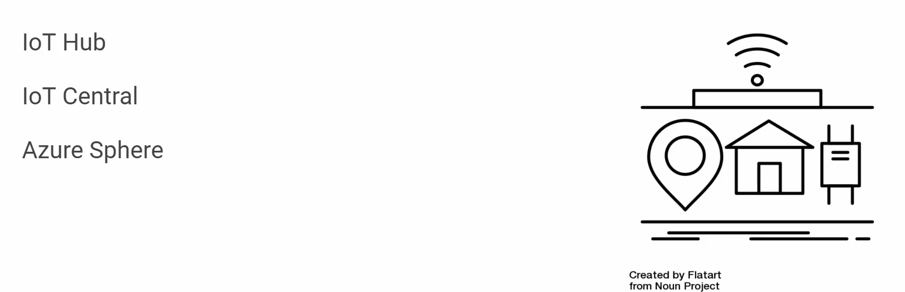

# Describe core solutions and management tools on Azure (10-15%)

## Table of contents
  - [**Describe core solutions available in Azure**](#describe-core-solutions-available-in-azure)
    - [Describe IoT Solutions](#describe-iot-solutions)
  - [**Azure IoT Hub**](#azure-iot-hub)
  - [**Azure IoT Central**](#azure-iot-central)
  - [**Azure Sphere**](#azure-sphere)
- [**Analyze the decision criteria**](#analyze-the-decision-criteria)
  - [**Is it critical to ensure that the device is not compromised?**](#is-it-critical-to-ensure-that-the-device-is-not-compromised)
  - [**Do I need a dashboard for reporting and management?**](#do-i-need-a-dashboard-for-reporting-and-management)
    - [Describe Big Data and Analytics Services](#describe-big-data-and-analytics-services)
    - [Describe AI Solutions](#describe-ai-solutions)
    - [Describe Serverless Computing](#describe-serverless-computing)
    - [Describe DevOps Solutions](#describe-devops-solutions)
  - [**Describe Azure management tools**](#describe-azure-management-tools)
    - [Describe Azure Tools](#describe-azure-tools)
    - [**The Azure portal**](#the-azure-portal)
    - [**The Azure mobile app**](#the-azure-mobile-app)
    - [**Azure PowerShell**](#azure-powershell)
    - [**The Azure CLI**](#the-azure-cli)
    - [Analyze the decision criteria](#analyze-the-decision-criteria-1)
    - [Describe the functionality and usage of Azure Advisor](#describe-the-functionality-and-usage-of-azure-advisor)
    - [Describe the functionality and usage of Azure Resource Manager (ARM) templates](#describe-the-functionality-and-usage-of-azure-resource-manager-arm-templates)
    - [Describe the functionality and usage of Azure Monitor](#describe-the-functionality-and-usage-of-azure-monitor)
    - [Describe the functionality and usage of Azure Service Health](#describe-the-functionality-and-usage-of-azure-service-health)
    - [Analyze the decision criteria](#analyze-the-decision-criteria-2)
    - [**Do you need to analyze how you're using Azure to reduce costs? Improve resilience? Harden your security?**](#do-you-need-to-analyze-how-youre-using-azure-to-reduce-costs-improve-resilience-harden-your-security)
    - [**Do you want to monitor Azure services or your usage of Azure?**](#do-you-want-to-monitor-azure-services-or-your-usage-of-azure)
    - [**Do you want to measure custom events alongside other usage metrics?**](#do-you-want-to-measure-custom-events-alongside-other-usage-metrics)
    - [**Do you need to set up alerts for outages or when

## **Describe core solutions available in Azure**

### Describe IoT Solutions

[#7 More on Azure Core Services - Part 2](https://www.notion.so/7-More-on-Azure-Core-Services-Part-2-65e198a65b014da09d0a9a2efec01d18) 

IoT enables devices to gather and then relay information for data analysis. Smart devices are equipped with sensors that collect data. A few common sensors that measure attributes of the physical world include:

- Environmental sensors that capture temperature and humidity levels.
- Barcode, QR code, or optical character recognition (OCR) scanners.
- Geo-location and proximity sensors.
- Light, color, and infrared sensors.
- Sound and ultrasonic sensors.
- Motion and touch sensors.
- Accelerometer and tilt sensors.
- Smoke, gas, and alcohol sensors.
- Error sensors to detect when there's a problem with the device.
- Mechanical sensors that detect anomalies or deformations.
- Flow, level, and pressure sensors for measuring gasses and liquids.

By using Azure IoT services, devices that are equipped with these kinds of sensors and that can connect to the internet could send their sensor readings to a specific endpoint in Azure via a message. The message's data is then collected and aggregated, and it can be converted into reports and alerts. Alternately, all devices could be updated with new firmware to fix issues or add new functionality by sending software updates from Azure IoT services to each device.

- Azure Sphere

    

## **Azure IoT Hub**

[Azure IoT Hub](https://azure.microsoft.com/services/iot-hub/) is a managed service that's hosted in the cloud and that acts as a central message hub for bi-directional communication between your IoT application and the devices it manages. You can use Azure IoT Hub to build IoT solutions with reliable and secure communications between millions of IoT devices and a cloud-hosted solution back end. You can connect virtually any device to your IoT hub.

The IoT Hub service supports communications both from the device to the cloud and from the cloud to the device. It also supports multiple messaging patterns, such as device-to-cloud telemetry, file upload from devices, and request-reply methods to control your devices from the cloud. After an IoT hub receives messages from a device, it can route that message to other Azure services.

From a cloud-to-device perspective, IoT Hub allows for *command and control*. That is, you can have either manual or automated remote control of connected devices, so you can instruct the device to open valves, set target temperatures, restart stuck devices, and so on.

IoT Hub monitoring helps you maintain the health of your solution by tracking events such as device creation, device failures, and device connections.

## **Azure IoT Central**

[Azure IoT Central](https://azure.microsoft.com/services/iot-central/) builds on top of IoT Hub by adding a dashboard that allows you to connect, monitor, and manage your IoT devices. The visual user interface (UI) makes it easy to quickly connect new devices and watch as they begin sending telemetry or error messages. You can watch the overall performance across all devices in aggregate, and you can set up alerts that send notifications when a specific device needs maintenance. Finally, you can push firmware updates to the device.

To help you get up and running quickly, IoT Central provides starter templates for common scenarios across various industries, such as retail, energy, healthcare, and government. You then customize the design starter templates directly in the UI by choosing from existing themes or creating your own custom theme, setting the logo, and so on. With IoT Central, you can tailor the starter templates for the specific data that's sent from your devices, the reports you want to see, and the alerts you want to send.

You can use the UI to control your devices remotely. This feature allows you to push a software update or modify a property of the device. You can adjust the desired temperature for one or all of your refrigerated vending machines from directly inside of IoT Central.

A key part of IoT Central is the use of device templates. By using a device template, you can connect a device without any service-side coding. IoT Central uses the templates to construct the dashboards, alerts, and so on. Device developers still need to create code to run on the devices, and that code must match the device template specification.

## **Azure Sphere**

[Azure Sphere](https://azure.microsoft.com/services/azure-sphere/) creates an end-to-end, highly secure IoT solution for customers that encompasses everything from the hardware and operating system on the device to the secure method of sending messages from the device to the message hub. Azure Sphere has built-in communication and security features for internet-connected devices.

Azure Sphere comes in three parts:

- The first part is the Azure Sphere micro-controller unit (MCU), which is responsible for processing the operating system and signals from attached sensors. The following image displays the Seeed Azure Sphere MT3620 Development Kit MCU, one of several different starter kits that are available for prototyping and developing Azure Sphere applications.

    

- The second part is a customized Linux operating system (OS) that handles communication with the security service and can run the vendor's software.
- The third part is Azure Sphere Security Service, also known as AS3. Its job is to make sure that the device has not been maliciously compromised. When the device attempts to connect to Azure, it first must authenticate itself, per device, which it does by using certificate-based authentication. If it authenticates successfully, AS3 checks to ensure that the device hasn't been tampered with. After it has established a secure channel of communication, AS3 pushes any OS or approved customer-developed software updates to the device.

After the Azure Sphere system has validated the authenticity of the device and authenticated it, the device can interact with other Azure IoT services by sending telemetry and error information.

# **Analyze the decision criteria**

In this unit, we'll analyze the criteria that experts employ when they decide which IoT service to use for a given business need. Understanding the criteria can also help you better understand the nuanced differences between each product.

## **Is it critical to ensure that the device is not compromised?**

No manufacturers or customers want their devices to be maliciously compromised and used for nefarious purposes, but it's more critical to ensure the integrity of an ATM than, say, a washing machine. When security is a critical consideration in your product's design, the best product option is **Azure Sphere**, which provides a comprehensive end-to-end solution for IoT devices.

As we mentioned in the previous unit, Azure Sphere ensures a secure channel of communication between the device and Azure by controlling everything from the hardware to the operating system and the authentication process. This ensures that the integrity of the device is uncompromised. After a secure channel is established, messages can be received from the device securely, and messages or software updates can be sent to the device remotely.

## **Do I need a dashboard for reporting and management?**

Your next decision will be the level of services you require from your IoT solution. If you merely want to connect to your remote devices to receive telemetry and occasionally push updates, and you don't need any reporting capabilities, you might prefer to implement **Azure IoT Hub** by itself. Your programmers can still create a customized set of management tools and reports by using the IoT Hub RESTful API.

However, if you want a pre-built customizable user interface with which you can view and control your devices remotely, you might prefer to start with **IoT Central**. With this solution, you can control a single device or all devices at once, and you can set up alerts for certain conditions, such as a device failure.

IoT Central integrates with many different Azure products, including IoT Hub, to create a dashboard with reports and management features. The dashboard is based on starter templates for common industry and usage scenarios. You can use the dashboard that's generated by the starter template as is or customize it to suit your needs. You can have multiple dashboards and target them at a variety of users.

### Describe Big Data and Analytics Services

[#4 Azure Core Services - Azure Storage](https://www.notion.so/4-Azure-Core-Services-Azure-Storage-10515fc4a5af484aa7856dd01ecffe88) 

- HDInsight → Apache products

    ## **Azure Synapse Analytics**

    [Azure Synapse Analytics](https://docs.microsoft.com/en-us/azure/sql-data-warehouse/) (formerly Azure SQL Data Warehouse) is a limitless analytics service that brings together enterprise data warehousing and big data analytics. You can query data on your terms by using either serverless or provisioned resources at scale. You have a unified experience to ingest, prepare, manage, and serve data for immediate BI and machine learning needs.

    ## **Azure HDInsight**

    [Azure HDInsight](https://azure.microsoft.com/services/hdinsight/) is a fully managed, open-source analytics service for enterprises. It's a cloud service that makes it easier, faster, and more cost-effective to process massive amounts of data. You can run popular open-source frameworks and create cluster types such as [Apache Spark](https://docs.microsoft.com/en-us/azure/hdinsight/spark/apache-spark-overview), [Apache Hadoop](https://docs.microsoft.com/en-us/azure/hdinsight/hadoop/apache-hadoop-introduction), [Apache Kafka](https://docs.microsoft.com/en-us/azure/hdinsight/kafka/apache-kafka-introduction), [Apache HBase](https://docs.microsoft.com/en-us/azure/hdinsight/hbase/apache-hbase-overview), [Apache Storm](https://docs.microsoft.com/en-us/azure/hdinsight/storm/apache-storm-overview), and [Machine Learning Services](https://docs.microsoft.com/en-us/azure/hdinsight/r-server/r-server-overview). HDInsight also supports a broad range of scenarios such as extraction, transformation, and loading (ETL), data warehousing, machine learning, and IoT.

    ## **Azure Databricks**

    [Azure Databricks](https://azure.microsoft.com/services/databricks/) helps you unlock insights from all your data and build artificial intelligence solutions. You can set up your Apache Spark environment in minutes, and then autoscale and collaborate on shared projects in an interactive workspace. Azure Databricks supports Python, Scala, R, Java, and SQL, as well as data science frameworks and libraries including TensorFlow, PyTorch, and scikit-learn.

    ## **Azure Data Lake Analytics**

    [Azure Data Lake Analytics](https://azure.microsoft.com/services/data-lake-analytics/) is an on-demand analytics job service that simplifies big data. Instead of deploying, configuring, and tuning hardware, you write queries to transform your data and extract valuable insights. The analytics service can handle jobs of any scale instantly by setting the dial for how much power you need. You only pay for your job when it's running, making it more cost-effective.

### Describe AI Solutions

[#7 More on Azure Core Services - Part 2](https://www.notion.so/7-More-on-Azure-Core-Services-Part-2-65e198a65b014da09d0a9a2efec01d18) 

- Azure Bot Service

    

    ### **Azure Machine Learning**

    [Azure Machine Learning](https://azure.microsoft.com/services/machine-learning/) is a platform for making predictions. It consists of tools and services that allow you to connect to data to train and test models to find one that will most accurately predict a future result. After you've run experiments to test the model, you can deploy and use it in real time via a web API endpoint.

    With Azure Machine Learning, you can:

    - Create a process that defines how to obtain data, how to handle missing or bad data, how to split the data into either a training set or test set, and deliver the data to the training process.
    - Train and evaluate predictive models by using tools and programming languages familiar to data scientists.
    - Create pipelines that define where and when to run the compute-intensive experiments that are required to score the algorithms based on the training and test data.
    - Deploy the best-performing algorithm as an API to an endpoint so it can be consumed in real time by other applications.

    ### **Azure Cognitive Services**

    [Azure Cognitive Services](https://azure.microsoft.com/services/cognitive-services/) provides prebuilt machine learning models that enable applications to see, hear, speak, understand, and even begin to reason. Use Azure Cognitive Services to solve general problems, such as analyzing text for emotional sentiment or analyzing images to recognize objects or faces. You don't need special machine learning or data science knowledge to use these services. Developers access Azure Cognitive Services via APIs and can easily include these features in just a few lines of code.

    While Azure Machine Learning requires you to bring your own data and train models over that data, Azure Cognitive Services, for the most part, provides pretrained models so that you can bring in your live data to get predictions on.

    Azure Cognitive Services can be divided into the following categories:

    - **Language** services: Allow your apps to process natural language with prebuilt scripts, evaluate sentiment, and learn how to recognize what users want.
    - **Speech** services: Convert speech into text and text into natural-sounding speech. Translate from one language to another and enable speaker verification and recognition.
    - **Vision** services: Add recognition and identification capabilities when you're analyzing pictures, videos, and other visual content.
    - **Decision** services: Add personalized recommendations for each user that automatically improve each time they're used, moderate content to monitor and remove offensive or risky content, and detect abnormalities in your time series data.

    ### **Azure Bot Service**

    [Azure Bot Service](https://azure.microsoft.com/services/bot-service/) and [Bot Framework](https://dev.botframework.com/) are platforms for creating virtual agents that understand and reply to questions just like a human. Azure Bot Service is a bit different from Azure Machine Learning and Azure Cognitive Services in that it has a specific use case. Namely, it creates a virtual agent that can intelligently communicate with humans. Behind the scenes, the bot you build uses other Azure services, such as Azure Cognitive Services, to understand what their human counterparts are asking for.

    Bots can be used to shift simple, repetitive tasks, such as taking a dinner reservation or gathering profile information, on to automated systems that might no longer require direct human intervention. Users converse with a bot by using text, interactive cards, and speech. A bot interaction can be a quick question and answer, or it can be a sophisticated conversation that intelligently provides access to services.

### Describe Serverless Computing

[#6 More on Azure Core Services - Part 1](https://www.notion.so/6-More-on-Azure-Core-Services-Part-1-bb74c4b63fcc43b4ad2c24866e960481) 

- Event grid → configurable not programmable

    Serverless computing includes the abstraction of servers, an event-driven scale, and micro-billing:

    - **Abstraction of servers**: Serverless computing abstracts the servers you run on. You never explicitly reserve server instances. The platform manages that for you. Each function execution can run on a different compute instance. This execution context is transparent to the code. With serverless architecture, you deploy your code, which then runs with high availability.
    - **Event-driven scale**: Serverless computing is an excellent fit for workloads that respond to incoming events. Events include triggers by:
        - Timers, for example, if a function needs to run every day at 10:00 AM UTC.
        - HTTP, for example, API and webhook scenarios.
        - Queues, for example, with order processing.
        - And much more.

        Instead of writing an entire application, the developer authors a function, which contains both code and metadata about its triggers and bindings. The platform automatically schedules the function to run and scales the number of compute instances based on the rate of incoming events. Triggers define how a function is invoked. Bindings provide a declarative way to connect to services from within the code.

    - **Micro-billing**: Traditional computing bills for a block of time like paying a monthly or annual rate for website hosting. This method of billing is convenient but isn't always cost effective. Even if a customer's website gets only one hit a day, they still pay for a full day's worth of availability. With serverless computing, they pay only for the time their code runs. If no active function executions occur, they're not charged. For example, if the code runs once a day for two minutes, they're charged for one execution and two minutes of computing time.

    Azure has two implementations of serverless compute:

    - **Azure Functions**: Functions can execute code in almost any modern language.
    - **Azure Logic Apps**: Logic apps are designed in a web-based designer and can execute logic triggered by Azure services without writing any code.

    ## **Azure Functions**

    When you're concerned only about the code running your service, and not the underlying platform or infrastructure, using Azure Functions is ideal. Functions are commonly used when you need to perform work in response to an event (often via a REST request), timer, or message from another Azure service, and when that work can be completed quickly, within seconds or less.

    Functions scale automatically based on demand, so they're a solid choice when demand is variable. For example, you might receive messages from an IoT solution that's used to monitor a fleet of delivery vehicles. You'll likely have more data arriving during business hours.

    ## **Azure Logic Apps**

    Logic apps are similar to functions. Both enable you to trigger logic based on an event. Where functions execute code, logic apps execute *workflows* that are designed to automate business scenarios and are built from predefined logic blocks.

    Every Azure logic app workflow starts with a trigger, which fires when a specific event happens or when newly available data meets specific criteria. Many triggers include basic scheduling capabilities, so developers can specify how regularly their workloads will run. Each time the trigger fires, the Logic Apps engine creates a logic app instance that runs the actions in the workflow. These actions can also include data conversions and flow controls, such as conditional statements, switch statements, loops, and branching.

    ## **What are the differences between these services?**

    You can call Azure Functions from Azure Logic Apps, and vice versa. The primary difference between the two services is their intent. Azure Functions is a serverless compute service, and Azure Logic Apps is intended to be a serverless orchestration service. Although you can use Azure Functions to orchestrate a long-running business process that involves various connections, this was not its primary use case when it was designed.

    Additionally, the two services are priced differently. Azure Functions pricing is based on the number of executions and the running time of each execution. Logic Apps pricing is based on the number of executions and the type of connectors that it utilizes.

    ## **Functions vs. Logic Apps**

    Functions and Logic Apps can both create complex orchestrations. An orchestration is a collection of functions or steps that are executed to accomplish a complex task.

    - With Functions, you write code to complete each step.
    - With Logic Apps, you use a GUI to define the actions and how they relate to one another.

    You can mix and match services when you build an orchestration, calling functions from logic apps and calling logic apps from functions. Here are some common differences between the two.

    [Untitled](https://www.notion.so/41bc6568badb4d25b320aaac38c50d51)

    ## Analyze the decision criteria

    ### **Do you need to perform an orchestration across well-known APIs?**

    As we noted previously, Azure Logic Apps was designed with orchestration in mind, from the web-based visual configurator to the pricing model. Logic Apps excels at connecting a large array of disparate services via their APIs to pass and process data through many steps in a workflow.

    It's possible to create the same workflow by using Azure Functions, but it might take a considerable amount of time to research which APIs to call and how to call them. Azure Logic Apps has already componentized these API calls so that you supply only a few details and the details of calling the necessary APIs is abstracted away.

    ### **Do you need to execute custom algorithms or perform specialized data parsing and data lookups?**

    With Azure Functions, you can use the full expressiveness of a programming language in a compact form. This lets you concisely build complex algorithms, or data lookup and parsing operations. You would be responsible for maintaining the code, handling exceptions resiliently, and so on.

    Although Azure Logic Apps can perform logic (loops, decisions, and so on), if you have a logic-intensive orchestration that requires a complex algorithm, implementing that algorithm might be more verbose and visually overwhelming.

    ### **Do you have existing automated tasks written in an imperative programming language?**

    If you already have your orchestration or business logic expressed in C#, Java, Python, or another popular programming language, it might be easier to port your code into the body of an Azure Functions function app than to re-create it by using Azure Logic Apps.

    ### **Do you prefer a visual (declarative) workflow or writing (imperative) code?**

    Ultimately, your choice comes down to whether you prefer to work in a declarative environment or an imperative environment. Developers who have expertise in an imperative programming language might prefer to think about automation and orchestration from an imperative mindset. IT professionals and business analysts might prefer to work in a more visual low-code/no-code (declarative) environment.

### Describe DevOps Solutions

[#7 More on Azure Core Services - Part 2](https://www.notion.so/7-More-on-Azure-Core-Services-Part-2-65e198a65b014da09d0a9a2efec01d18) 

- GitHub

    

- GitHub Actions

    

- Idea

    

    ### **Azure DevOps Services**

    Azure DevOps Services is a suite of services that address every stage of the software development lifecycle.

    - **Azure Repos** is a centralized source-code repository where software development, DevOps engineering, and documentation professionals can publish their code for review and collaboration.
    - **Azure Boards** is an agile project management suite that includes Kanban boards, reporting, and tracking ideas and work from high-level epics to work items and issues.
    - **Azure Pipelines** is a CI/CD pipeline automation tool.
    - **Azure Artifacts** is a repository for hosting artifacts, such as compiled source code, which can be fed into testing or deployment pipeline steps.
    - **Azure Test Plans** is an automated test tool that can be used in a CI/CD pipeline to ensure quality before a software release.

    ### GitHub Actions

    GitHub Actions enables workflow automation with triggers for many lifecycle events. One such example would be automating a CI/CD *toolchain*.

    With such similarity between many GitHub and Azure DevOps features, you might wonder which product to choose for your organization. Unfortunately, the answer might not be straightforward.

    Although both Azure DevOps and GitHub allow public and private code repositories, GitHub has a long history with public repositories and is trusted by tens of thousands of open-source project owners. GitHub is a lighter-weight tool than Azure DevOps, with a focus on individual developers contributing to the open-source code. Azure DevOps, on the other hand, is more focused on enterprise development, with heavier project-management and planning tools, and finer-grained access control.

    ### **Azure DevTest Labs**

    Azure DevTest Labs provides an automated means of managing the process of building, setting up, and tearing down virtual machines (VMs) that contain builds of your software projects. This way, developers and testers can perform tests across a variety of environments and builds. And this capability isn't limited to VMs. Anything you can deploy in Azure via an ARM template can be provisioned through DevTest Labs. Provisioning pre-created lab environments with their required configurations and tools already installed is a huge time saver for quality assurance professionals and developers.

    Suppose you need to test a new feature on an old version of an operating system. Azure DevTest Labs can set up everything automatically upon request. After the testing is complete, DevTest Labs can shut down and deprovision the VM, which saves money when it's not in use. To control costs, the management team can restrict how many labs can be created, how long they run, and so on.

    ### **Regarding source-code management and DevOps tools, what level of granularity do you need for permissions?**

    GitHub works on a simple model of read/write permissions to every feature. Meanwhile, Azure DevOps has a much more granular set of permissions that allow organizations to refine who is able to perform most operations across the entire toolset.

    ### Service selection criteria? - GitHub vs DevOps

    - First, does Tailwind Traders need to automate and manage test lab creation?
    - Second, is Tailwind Traders building open-source software?
    - Third, what level of granularity does Tailwind Traders need for permissions?
    - Fourth, does Tailwind Traders require a sophisticated project management and reporting solution?
    - Fifth, does Tailwind Traders require tight integration with any third-party DevOps tools?

## **Describe Azure management tools**

At a high level, there are three primary Azure monitoring offerings, each of which is aimed at a specific audience and use case and provides a diverse set of tools, services, programmatic APIs, and more.

### Describe Azure Tools

[#6 More on Azure Core Services - Part 1](https://www.notion.so/6-More-on-Azure-Core-Services-Part-1-bb74c4b63fcc43b4ad2c24866e960481) 

At a high level, there are two broad categories of management tools: visual tools and code-based tools. 

When you're attempting to quickly set up and configure Azure resources, a code-based tool is usually the better choice. This approach to managing hardware and cloud resources, which developers use when they write application code, is referred to as *infrastructure as code*.

There are two approaches to infrastructure as code: ***imperative* code and *declarative* code.** Imperative code details each individual step that should be performed to achieve a desired outcome. By contrast, declarative code details only a desired outcome, and it allows an interpreter to decide how to best achieve that outcome. This distinction is important because tools that are based on declarative code can provide a more robust approach to deploying dozens or hundreds of resources simultaneously and reliably.

### **The Azure portal**

By using the Azure portal, a web-based user interface, you can access virtually every feature of Azure. The Azure portal provides a friendly, graphical UI to view all the services you're using, create new services, configure your services, and view reports. The Azure portal is how most users first experience Azure. But, as your Azure usage grows, you'll likely choose a more repeatable code-centric approach to managing your Azure resources.

### **The Azure mobile app**

The Azure mobile app provides iOS and Android access to your Azure resources when you're away from your computer. With it, you can:

- Monitor the health and status of your Azure resources.
- Check for alerts, quickly diagnose and fix issues, and restart a web app or virtual machine (VM).
- Run the Azure CLI or Azure PowerShell commands to manage your Azure resources.

### **Azure PowerShell**

Azure PowerShell is a shell with which developers and DevOps and IT professionals can execute commands called cmdlets (pronounced *command-lets*). These commands call the Azure Rest API to perform every possible management task in Azure. Cmdlets can be executed independently or combined into a script file and executed together to orchestrate:

- The routine setup, teardown, and maintenance of a single resource or multiple connected resources.
- The deployment of an entire infrastructure, which might contain dozens or hundreds of resources, from imperative code.

Capturing the commands in a script makes the process repeatable and automatable.

**Azure PowerShell is available for Windows, Linux, and Mac, and you can access it in a web browser via Azure Cloud Shell.**

Windows PowerShell has helped Windows-centric IT organizations automate many of their on-premises operations for years, and these organizations have built up a large catalog of custom scripts and cmdlets, as well as expertise.

### **The Azure CLI**

The Azure CLI command-line interface is an executable program with which a developer, DevOps professional, or IT professional can execute commands in Bash. The commands call the Azure Rest API to perform every possible management task in Azure. You can run the commands independently or combined into a script and executed together for the routine setup, teardown, and maintenance of a single resource or an entire environment.

In many respects, the Azure CLI is almost identical to Azure PowerShell in what you can do with it. Both run on Windows, Linux, and Mac, and can be accessed in a web browser via Cloud Shell. The primary difference is the syntax you use. If you're already proficient in PowerShell or Bash, you can use the tool you prefer.

### Analyze the decision criteria

- Do you need to perform one-off management, administrative, or reporting actions?
    - Azure PowerShell and the Azure CLI are Azure management tools that allow you to quickly obtain the IP address of a virtual machine (VM) you've deployed, reboot a VM, or scale an app.
    - By contrast to the Azure CLI and PowerShell, Azure Resource Manager templates (ARM templates) define the infrastructure requirements in your application for repeatable deployments.
    - The Azure portal can perform most, if not all, management and administrative actions. However, if you're in a cloud management or administrative role, it's less efficient to rely solely on visual scanning and clicking.
- Do you need a way to repeatedly set up one or more resources and ensure that all the dependencies are created in the proper order?
    - ARM templates define your application's infrastructure requirements for a repeatable deployment that is done in a consistent manner.
- When you're scripting, do you come from a Windows administration or Linux administration background?
    - If you or your cloud administrators come from a Windows administration background, it's likely you'll prefer PowerShell.
    - If you or your cloud administrators come from a Linux administration background, it's likely you'll prefer the Azure CLI.

### Describe the functionality and usage of Azure Advisor

- Advice recommendations

    

    - Potential costing savings can be seen here
    - Recommendation categories

        

    - Free service → not paying for anything

    [Azure Advisor](https://azure.microsoft.com/services/advisor/) evaluates your Azure resources and makes recommendations to help improve reliability, security, and performance, achieve operational excellence, and reduce costs. Advisor is designed to help you save time on cloud optimization. The recommendation service includes suggested actions you can take right away, postpone, or dismiss.

    **The recommendations are available via the Azure portal and the API, and you can set up notifications to alert you to new recommendations.**

    When you're in the Azure portal, the Advisor dashboard displays personalized recommendations for all your subscriptions, and you can use filters to select recommendations for specific subscriptions, resource groups, or services. The recommendations are divided into five categories:

    - **Reliability**: Used to ensure and improve the continuity of your business-critical applications.
    - **Security**: Used to detect threats and vulnerabilities that might lead to security breaches.
    - **Performance**: Used to improve the speed of your applications.
    - **Cost**: Used to optimize and reduce your overall Azure spending.
    - **Operational Excellence**: Used to help you achieve process and workflow efficiency, resource manageability, and deployment best practices.

### Describe the functionality and usage of Azure Resource Manager (ARM) templates

[#6 More on Azure Core Services - Part 1](https://www.notion.so/6-More-on-Azure-Core-Services-Part-1-bb74c4b63fcc43b4ad2c24866e960481) 

- Underlying engine/setup

- Example JSON template

    

    Although it's possible to write imperative code in Azure PowerShell or the Azure CLI to set up and tear down one Azure resource or orchestrate an infrastructure comprising hundreds of resources, there's a better way to implement this functionality.

    **By using Azure Resource Manager templates (ARM templates), you can describe the resources you want to use in a declarative JSON format.** The benefit is that the entire ARM template is verified before any code is executed to ensure that the resources will be created and connected correctly. The template then orchestrates the creation of those resources in parallel. That is, if you need 50 instances of the same resource, all 50 instances are created at the same time.

    Ultimately, the developer, DevOps professional, or IT professional needs only to define the desired state and configuration of each resource in the ARM template, and the template does the rest. Templates can even execute PowerShell and Bash scripts before or after the resource has been set up.

### Describe the functionality and usage of Azure Monitor

[#7 More on Azure Core Services - Part 2](https://www.notion.so/7-More-on-Azure-Core-Services-Part-2-65e198a65b014da09d0a9a2efec01d18) 

Azure Monitor is a platform for collecting, analyzing, visualizing, and potentially taking action based on the metric and logging data from your entire Azure and on-premises environment.

- On the left is a list of the sources of logging and metric data that can be collected at every layer in your application architecture, from application to operating system and network.
- In the center, you can see how the logging and metric data is stored in central repositories.
- On the right, the data is used in a number of ways. You can view real-time and historical performance across each layer of your architecture, or aggregated and detailed information. The data is displayed at different levels for different audiences. You can view high-level reports on the Azure Monitor Dashboard or create custom views by using Power BI and Kusto queries.

Additionally, you can use the data to help you react to critical events in real time, through alerts delivered to teams via SMS, email, and so on. Or you can use thresholds to trigger autoscaling functionality to scale up or down to meet the demand.

Some popular products such as Azure Application Insights, a service for sending telemetry information from application source code to Azure, uses Azure Monitor under the hood. With Application Insights, your application developers can take advantage of the powerful data-analysis platform in Azure Monitor to gain deep insights into an application's operations and diagnose errors without having to wait for users to report them.

### Describe the functionality and usage of Azure Service Health

- Root-cause analysis reports also provided
- Azure portal → search → service health

    

    - Handles issues across Azure
    - View outages/errors as per the region
    - Health history can be viewed

        

    - Health alerts can be setup also

        

    [Azure Service Health](https://azure.microsoft.com/features/service-health/) provides a personalized view of the health of the Azure services, regions, and resources you rely on. The status.azure.com website, which displays only major issues that broadly affect Azure customers, doesn't provide the full picture. But Azure Service Health displays both major and smaller, localized issues that affect you. Service issues are rare, but it's important to be prepared for the unexpected. You can set up alerts that help you triage outages and planned maintenance. After an outage, Service Health provides official incident reports, called root cause analyses (RCAs), which you can share with stakeholders.

    Service Health helps you keep an eye on several event types:

    - **Service issues** are problems in Azure, such as outages, that affect you right now. You can drill down to the affected services, regions, updates from your engineering teams, and find ways to share and track the latest information.
    - **Planned maintenance** events can affect your availability. You can drill down to the affected services, regions, and details to show how an event will affect you and what you need to do. Most of these events occur without any impact to you and aren't shown here. In the rare case that a reboot is required, Service Health allows you to choose when to perform the maintenance to minimize the downtime.
    - **Health advisories** are issues that require you to act to avoid service interruption, including service retirements and breaking changes. Health advisories are announced far in advance to allow you to plan.

### Analyze the decision criteria

### **Do you need to analyze how you're using Azure to reduce costs? Improve resilience? Harden your security?**

**Choose Azure Advisor** when you're looking for an analysis of your deployed resources. Azure Advisor analyzes the configuration and usage of your resources and provides suggestions on how to optimize for reliability, security, performance, costs, and operations based on experts' best practices.

### **Do you want to monitor Azure services or your usage of Azure?**

If you want to keep tabs on Azure itself, especially the services and regions you depend on, you want to choose **Azure Service Health**. You can view the current status of the Azure services you rely on, upcoming planned outages, and services that will be sunset. You can set up alerts that help you stay on top of incidents and upcoming downtime without having to visit the dashboard regularly.

However, if you want to keep track of the performance or issues related to your specific VM or container instances, databases, your applications, and so on, you want to **visit Azure Monitor** and create reports and notifications to help you understand how your services are performing or diagnose issues related to your Azure usage.

### **Do you want to measure custom events alongside other usage metrics?**

**Choose Azure Monitor** when you want to measure custom events alongside other collected telemetry data. Custom events, such as those added in the source code of your software applications, could help identify and diagnose why your application is behaving a certain way.

### **Do you need to set up alerts for outages or when autoscaling is about to deploy new instances?**

Here again, you would use **Azure Monitor** to set up alerts for key events that are related to your specific resources.