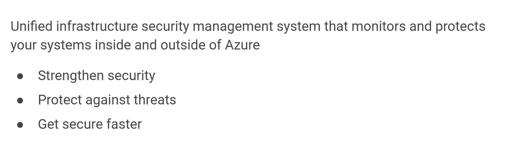

# Describe general security and network security features (10-15%)

## Table of contents
  - [**Describe Azure security features**](#describe-azure-security-features)
    - [Describe basic features of Azure Security Center](#describe-basic-features-of-azure-security-center)
    - [Describe the functionality and usage of Key Vault](#describe-the-functionality-and-usage-of-key-vault)
    - [Describe the functionality and usage of Azure Sentinel](#describe-the-functionality-and-usage-of-azure-sentinel)
    - [Describe the functionality and usage of Azure Dedicated Hosts](#describe-the-functionality-and-usage-of-azure-dedicated-hosts)
  - [**Describe Azure network security**](#describe-azure-network-security)
    - [Describe the concept of defense in depth](#describe-the-concept-of-defense-in-depth)
    - [Describe the functionality and usage of Network Security Groups (NSG)](#describe-the-functionality-and-usage-of-network-security-groups-nsg)    - [**How do I specify NSG rules?**](#how-do-i-specify-nsg-rules)
    - [Describe the functionality and usage of Azure Firewall](#describe-the-functionality-and-usage-of-azure-firewall)
    - [Describe the functionality and usage of Azure DDoS protection](#describe-the-functionality-and-usage-of-azure-ddos-protection)
  - [**What service tiers are available to DDoS Protection?**](#what-service-tiers-are-available-to-ddos-protection)
  - [**What kinds of attacks can DDoS Protection help prevent?**](#what-kinds-of-attacks-can-ddos-protection-help-prevent)
  - [Combine Azure services to create a complete network security solution](#combine-azure-services-to-create-a-complete-network-security-solution)    - [**Secure the perimeter layer**](#secure-the-perimeter-layer)
    - [**Secure the network layer**](#secure-the-network-layer)
    - [**Combine services**](#combine-services)

## **Describe Azure security features**

### Describe basic features of Azure Security Center

[#8 Understanding security, privacy, compliance, and trust](https://www.notion.so/8-Understanding-security-privacy-compliance-and-trust-d1e3ca2f37664f5d924b2f07c99beb2b) 

- Gives security score

    

- Get security recommendations

    

- This connects security section of Azure Advisor

[Azure Security Center](https://azure.microsoft.com/services/security-center) is a monitoring service that provides visibility of your security posture across all of your services, both on Azure and on-premises. The term *security posture* refers to cybersecurity policies and controls, as well as how well you can predict, prevent, and respond to security threats.

Security Center can:

- Monitor security settings across on-premises and cloud workloads.
- Automatically apply required security settings to new resources as they come online.
- Provide security recommendations that are based on your current configurations, resources, and networks.
- Continuously monitor your resources and perform automatic security assessments to identify potential vulnerabilities before those vulnerabilities can be exploited.
- Use machine learning to detect and block malware from being installed on your virtual machines (VMs) and other resources. You can also use *adaptive application controls* to define rules that list allowed applications to ensure that only applications you allow can run.
- Detect and analyze potential inbound attacks and investigate threats and any post-breach activity that might have occurred.
- **Provide just-in-time access control for network ports. Doing so reduces your attack surface by ensuring that the network only allows traffic that you require at the time that you need it to.**

    ### **What's secure score?**

    [Secure score](https://docs.microsoft.com/en-us/azure/security-center/secure-score-security-controls/) is a measurement of an organization's security posture.

    Secure score is based on *security controls*, or groups of related security recommendations. Your score is based on the percentage of security controls that you satisfy. The more security controls you satisfy, the higher the score you receive. Your score improves when you remediate all of the recommendations for a single resource within a control.

    Here's an example from the Azure portal showing a score of 57 percent, or 34 out of 60 points.

    

    Following the secure score recommendations can help protect your organization from threats. From a centralized dashboard in Azure Security Center, organizations can monitor and work on the security of their Azure resources like identities, data, apps, devices, and infrastructure.

    Secure score helps you:

    - Report on the current state of your organization's security posture.
    - Improve your security posture by providing discoverability, visibility, guidance, and control.
    - Compare with benchmarks and establish key performance indicators (KPIs).

    ### **Protect against threats**

    Security Center includes advanced cloud defense capabilities for VMs, network security, and file integrity. Let's look at how some of these capabilities apply to Tailwind Traders.

    - **Just-in-time VM access**

        Tailwind Traders will configure just-in-time access to VMs. This access blocks traffic by default to specific network ports of VMs, but allows traffic for a specified time when an admin requests and approves it.

    - **Adaptive application controls**

        Tailwind Traders can control which applications are allowed to run on its VMs. In the background, Security Center uses machine learning to look at the processes running on a VM. It creates exception rules for each resource group that holds the VMs and provides recommendations. This process provides alerts that inform the company about unauthorized applications that are running on its VMs.

    - **Adaptive network hardening**

        Security Center can monitor the internet traffic patterns of the VMs, and compare those patterns with the company's current network security group (NSG) settings. From there, Security Center can make recommendations about whether the NSGs should be locked down further and provide remediation steps.

    - **File integrity monitoring**

        Tailwind Traders can also configure the monitoring of changes to important files on both Windows and Linux, registry settings, applications, and other aspects that might indicate a security attack.

### Describe the functionality and usage of Key Vault

[#8 Understanding security, privacy, compliance, and trust](https://www.notion.so/8-Understanding-security-privacy-compliance-and-trust-d1e3ca2f37664f5d924b2f07c99beb2b) 

- Store secrets, keys

    

- Working

    

Azure Key Vault is a centralized cloud service for storing an application's secrets in a single, central location. It provides secure access to sensitive information by providing access control and logging capabilities.

Azure Key Vault can help you:

- **Manage secrets**

    You can use Key Vault to securely store and tightly control access to tokens, passwords, certificates, API keys, and other secrets.

- **Manage encryption keys**

    You can use Key Vault as a key management solution. Key Vault makes it easier to create and control the encryption keys that are used to encrypt your data.

- **Manage SSL/TLS certificates**

    Key Vault enables you to provision, manage, and deploy your public and private Secure Sockets Layer/Transport Layer Security (SSL/TLS) certificates for both your Azure resources and your internal resources.

- **Store secrets backed by hardware security modules (HSMs)**

    These secrets and keys can be protected either by software or by FIPS 140-2 Level 2 validated HSMs.

    ### **What are the benefits of Azure Key Vault?**

    The benefits of using Key Vault include:

    - **Centralized application secrets**

        Centralizing the storage for your application secrets enables you to control their distribution, and reduces the chances that secrets are accidentally leaked.

    - **Securely stored secrets and keys**

        Azure uses industry-standard algorithms, key lengths, and HSMs. Access to Key Vault requires proper authentication and authorization.

    - **Access monitoring and access control**

        By using Key Vault, you can monitor and control access to your application secrets.

    - **Simplified administration of application secrets**

        Key Vault makes it easier to enroll and renew certificates from public certificate authorities (CAs). You can also scale up and replicate content within regions and use standard certificate management tools.

    - **Integration with other Azure services**

        You can integrate Key Vault with storage accounts, container registries, event hubs, and many more Azure services. These services can then securely reference the secrets stored in Key Vault.

### Describe the functionality and usage of Azure Sentinel

[#8 Understanding security, privacy, compliance, and trust](https://www.notion.so/8-Understanding-security-privacy-compliance-and-trust-d1e3ca2f37664f5d924b2f07c99beb2b) 

Security management on a large scale can benefit from a dedicated security information and event management (SIEM) system. A SIEM system aggregates security data from many different sources (as long as those sources support an open-standard logging format). It also provides capabilities for threat detection and response.

[Azure Sentinel](https://azure.microsoft.com/services/azure-sentinel/) is Microsoft's cloud-based SIEM system. It uses intelligent security analytics and threat analysis.

Azure Sentinel enables you to:

- **Collect cloud data at scale**

    Collect data across all users, devices, applications, and infrastructure, both on-premises and from multiple clouds.

- **Detect previously undetected threats**

    Minimize false positives by using Microsoft's comprehensive analytics and threat intelligence.

- **Investigate threats with artificial intelligence**

    Examine suspicious activities at scale, tapping into years of cybersecurity experience from Microsoft.

- **Respond to incidents rapidly**

    Use built-in orchestration and automation of common tasks.

    ## **Detect threats**

    Tailwind Traders needs to be notified when something suspicious occurs. It decides to use both built-in analytics and custom rules to detect threats.

    **Built in analytics** use templates designed by Microsoft's team of security experts and analysts based on known threats, common attack vectors, and escalation chains for suspicious activity. These templates can be customized and search across the environment for any activity that looks suspicious. Some templates use machine learning behavioral analytics that are based on Microsoft proprietary algorithms.

    **Custom analytics** are rules that you create to search for specific criteria within your environment. You can preview the number of results that the query would generate (based on past log events) and set a schedule for the query to run. You can also set an alert threshold.

    ## **Investigate and respond**

    When Azure Sentinel detects suspicious events, Tailwind Traders can investigate specific alerts or *incidents* (a group of related alerts). With the investigation graph, the company can review information from entities directly connected to the alert, and see common exploration queries to help guide the investigation.

    Here's an example that shows what an investigation graph looks like in Azure Sentinel.

    

    The company will also use [Azure Monitor Workbooks](https://docs.microsoft.com/en-us/azure/azure-monitor/platform/workbooks-overview/) to automate responses to threats. For example, it can set an alert that looks for malicious IP addresses that access the network and create a workbook that does the following steps:

    1. When the alert is triggered, open a ticket in the IT ticketing system.
    2. Send a message to the security operations channel in Microsoft Teams or Slack to make sure the security analysts are aware of the incident.
    3. Send all of the information in the alert to the senior network admin and to the security admin. The email message includes two user option buttons: **Block** or **Ignore**.

    When an admin chooses **Block**, the IP address is blocked in the firewall, and the user is disabled in Azure Active Directory. When an admin chooses **Ignore**, the alert is closed in Azure Sentinel, and the incident is closed in the IT ticketing system.

    The workbook continues to run after it receives a response from the admins.

    Workbooks can be run manually or automatically when a rule triggers an alert.

### Describe the functionality and usage of Azure Dedicated Hosts

[#2 Azure Core Services - Azure Virtual Machines](https://www.notion.so/2-Azure-Core-Services-Azure-Virtual-Machines-a9ade338a1fa49c783411889d63d641e) 

[Azure Dedicated Host](https://azure.microsoft.com/services/virtual-machines/dedicated-host/) provides dedicated physical servers to host your Azure VMs for Windows and Linux.

Here's a diagram that shows how VMs relate to dedicated hosts and host groups. A *dedicated host* is mapped to a physical server in an Azure datacenter. A *host group* is a collection of dedicated hosts.

Azure Dedicated Host:

- Gives you visibility into, and control over, the server infrastructure that's running your Azure VMs.
- Helps address compliance requirements by deploying your workloads on an isolated server.
- Lets you choose the number of processors, server capabilities, VM series, and VM sizes within the same host.

    ### **Availability considerations for Dedicated Host**

    After a dedicated host is provisioned, Azure assigns it to the physical server in Microsoft's cloud datacenter.

    For high availability, you can provision multiple hosts in a *host group*, and deploy your VMs across this group. VMs on dedicated hosts can also take advantage of *maintenance control*. This feature enables you to control when regular maintenance updates occur, within a 35-day rolling window.

    ### **Pricing considerations**

    You're charged per dedicated host, independent of how many VMs you deploy to it. The host price is based on the VM family, type (hardware size), and region.

    Software licensing, storage, and network usage are billed separately from the host and VMs. For more information. see [Azure Dedicated Host pricing](https://aka.ms/ADHPricing/).

## **Describe Azure network security**

### Describe the concept of defense in depth

The objective of *defense in depth* is to protect information and prevent it from being stolen by those who aren't authorized to access it.

A defense-in-depth strategy uses a series of mechanisms to slow the advance of an attack that aims at acquiring unauthorized access to data.

- Going to enforce security → all the way from beginning to the end

    

    Here's a brief overview of the role of each layer:

    - The *physical security* layer is the first line of defense to protect computing hardware in the datacenter.
    - The *identity and access* layer controls access to infrastructure and change control.
    - The *perimeter* layer uses distributed denial of service (DDoS) protection to filter large-scale attacks before they can cause a denial of service for users.
    - The *network* layer limits communication between resources through segmentation and access controls.
    - The *compute* layer secures access to virtual machines.
    - The *application* layer helps ensure that applications are secure and free of security vulnerabilities.
    - The *data* layer controls access to business and customer data that you need to protect.

        **Physical security**

        Physically securing access to buildings and controlling access to computing hardware within the datacenter are the first line of defense.

        With physical security, the intent is to provide physical safeguards against access to assets. These safeguards ensure that other layers can't be bypassed, and loss or theft is handled appropriately. Microsoft uses various physical security mechanisms in its cloud datacenters.

        **Identity and access**

        At this layer, it's important to:

        - Control access to infrastructure and change control.
        - Use single sign-on (SSO) and multifactor authentication.
        - Audit events and changes.

        The identity and access layer is all about ensuring that identities are secure, access is granted only to what's needed, and sign-in events and changes are logged.

        **Perimeter**

        At this layer, it's important to:

        - Use DDoS protection to filter large-scale attacks before they can affect the availability of a system for users.
        - Use perimeter firewalls to identify and alert on malicious attacks against your network.

        At the network perimeter, it's about protecting from network-based attacks against your resources. Identifying these attacks, eliminating their impact, and alerting you when they happen are important ways to keep your network secure.

        **Network**

        At this layer, it's important to:

        - Limit communication between resources.
        - Deny by default.
        - Restrict inbound internet access and limit outbound access where appropriate.
        - Implement secure connectivity to on-premises networks.

        At this layer, the focus is on limiting the network connectivity across all your resources to allow only what's required. By limiting this communication, you reduce the risk of an attack spreading to other systems in your network.

        **Compute**

        At this layer, it's important to:

        - Secure access to virtual machines.
        - Implement endpoint protection on devices and keep systems patched and current.

        Malware, unpatched systems, and improperly secured systems open your environment to attacks. The focus in this layer is on making sure that your compute resources are secure and that you have the proper controls in place to minimize security issues.

        **Application**

        At this layer, it's important to:

        - Ensure that applications are secure and free of vulnerabilities.
        - Store sensitive application secrets in a secure storage medium.
        - Make security a design requirement for all application development.

        Integrating security into the application development lifecycle helps reduce the number of vulnerabilities introduced in code. Every development team should ensure that its applications are secure by default.

        **Data**

        In almost all cases, attackers are after data:

        - Stored in a database.
        - Stored on disk inside virtual machines.
        - Stored in software as a service (SaaS) applications, such as Office 365.
        - Managed through cloud storage.

        Those who store and control access to data are responsible for ensuring that it's properly secured. Often, regulatory requirements dictate the controls and processes that must be in place to ensure the confidentiality, integrity, and availability of the data.

    - Another way of looking → more you can implement → safer you are

        

    ## **Security posture**

    Your *security posture* is your organization's ability to protect from and respond to security threats. The common principles used to define a security posture are *confidentiality*, *integrity*, and *availability*, known collectively as CIA.

    - **Confidentiality**

        The *principle of least privilege* means restricting access to information only to individuals explicitly granted access, at only the level that they need to perform their work. This information includes protection of user passwords, email content, and access levels to applications and underlying infrastructure.

    - **Integrity**

        Prevent unauthorized changes to information:

        - At rest: when it's stored.
        - In transit: when it's being transferred from one place to another, including from a local computer to the cloud.

        A common approach used in data transmission is for the sender to create a unique fingerprint of the data by using a one-way hashing algorithm. The hash is sent to the receiver along with the data. The receiver recalculates the data's hash and compares it to the original to ensure that the data wasn't lost or modified in transit.

    - **Availability**

        Ensure that services are functioning and can be accessed only by authorized users. *Denial-of-service attacks* are designed to degrade the availability of a system, affecting its users.

### Describe the functionality and usage of Network Security Groups (NSG)

[#3 Azure Core Services - Networking](https://www.notion.so/3-Azure-Core-Services-Networking-aa5e08d5a2684dafb16d228ef85d12f4) 

- VPC → with subnets

    

A network security group enables you to filter network traffic to and from Azure resources within an Azure virtual network. You can think of NSGs like an internal firewall. An NSG can contain multiple inbound and outbound security rules that enable you to filter traffic to and from resources by source and destination IP address, port, and protocol.

### **How do I specify NSG rules?**

A network security group can contain as many rules as you need, within Azure subscription limits. Each rule specifies these properties:

[Untitled](https://www.notion.so/8a503cda161d4ffba973b3acfbf8ca38)

When you create a network security group, Azure creates a series of default rules to provide a baseline level of security. You can't remove the default rules, but you can override them by creating new rules with higher priorities.

### Describe the functionality and usage of Azure Firewall

[#8 Understanding security, privacy, compliance, and trust](https://www.notion.so/8-Understanding-security-privacy-compliance-and-trust-d1e3ca2f37664f5d924b2f07c99beb2b) 

[Azure Firewall](https://azure.microsoft.com/services/azure-firewall) is a managed, cloud-based network security service that helps protect resources in your Azure virtual networks. A virtual network is similar to a traditional network that you'd operate in your own datacenter. It's a fundamental building block for your private network that enables virtual machines and other compute resources to securely communicate with each other, the internet, and on-premises networks.

Here's a diagram that shows a basic Azure Firewall implementation:

Azure Firewall is a stateful firewall. A stateful firewall analyzes the complete context of a network connection, not just an individual packet of network traffic. Azure Firewall features high availability and unrestricted cloud scalability.

Azure Firewall provides many features, including:

- Built-in high availability.
- Unrestricted cloud scalability.
- Inbound and outbound filtering rules.
- Inbound Destination Network Address Translation (DNAT) support.
- Azure Monitor logging.

With Azure Firewall, you can configure:

- Application rules that define fully qualified domain names (FQDNs) that can be accessed from a subnet.
- Network rules that define source address, protocol, destination port, and destination address.
- Network Address Translation (NAT) rules that define destination IP addresses and ports to translate inbound requests.

### Describe the functionality and usage of Azure DDoS protection

A distributed denial of service attack attempts to overwhelm and exhaust an application's resources, making the application slow or unresponsive to legitimate users. DDoS attacks can target any resource that's publicly reachable through the internet, including websites.

[#8 Understanding security, privacy, compliance, and trust](https://www.notion.so/8-Understanding-security-privacy-compliance-and-trust-d1e3ca2f37664f5d924b2f07c99beb2b) 

[Azure DDoS Protection](https://azure.microsoft.com/services/ddos-protection/) (Standard) helps protect your Azure resources from DDoS attacks.

When you combine DDoS Protection with recommended application design practices, you help provide a defense against DDoS attacks. DDoS Protection uses the scale and elasticity of Microsoft's global network to bring DDoS mitigation capacity to every Azure region. The DDoS Protection service helps protect your Azure applications by analyzing and discarding DDoS traffic at the Azure network edge, before it can affect your service's availability.

This diagram shows network traffic flowing into Azure from both customers and an attacker:

## **What service tiers are available to DDoS Protection?**

DDoS Protection provides these service tiers:

- **Basic**

    The Basic service tier is automatically enabled for free as part of your Azure subscription.

    Always-on traffic monitoring and real-time mitigation of common network-level attacks provide the same defenses that Microsoft's online services use. The Basic service tier ensures that Azure infrastructure itself is not affected during a large-scale DDoS attack.

    The Azure global network is used to distribute and mitigate attack traffic across Azure regions.

- **Standard**

    The Standard service tier provides additional mitigation capabilities that are tuned specifically to Azure Virtual Network resources. DDoS Protection Standard is relatively easy to enable and requires no changes to your applications.

    The Standard tier provides always-on traffic monitoring and real-time mitigation of common network-level attacks. It provides the same defenses that Microsoft's online services use.

    Protection policies are tuned through dedicated traffic monitoring and machine learning algorithms. Policies are applied to public IP addresses, which are associated with resources deployed in virtual networks such as Azure Load Balancer and Application Gateway.

    The Azure global network is used to distribute and mitigate attack traffic across Azure regions.

## **What kinds of attacks can DDoS Protection help prevent?**

The Standard service tier can help prevent:

- **Volumetric attacks**

    The goal of this attack is to flood the network layer with a substantial amount of seemingly legitimate traffic.

- **Protocol attacks**

    These attacks render a target inaccessible by exploiting a weakness in the layer 3 and layer 4 protocol stack.

- **Resource-layer (application-layer) attacks (only with web application firewall)**

    These attacks target web application packets to disrupt the transmission of data between hosts. You need a web application firewall (WAF) to protect against L7 attacks. DDoS Protection Standard protects the WAF from volumetric and protocol attacks.

## Combine Azure services to create a complete network security solution

### **Secure the perimeter layer**

The perimeter layer is about protecting your organization's resources from network-based attacks. Identifying these attacks, alerting the appropriate security teams, and eliminating their impact are important to keeping your network secure. To do this:

- Use Azure DDoS Protection to filter large-scale attacks before they can cause a denial of service for users.
- Use perimeter firewalls with Azure Firewall to identify and alert on malicious attacks against your network.

### **Secure the network layer**

At this layer, the focus is on limiting network connectivity across all of your resources to allow only what's required. Segment your resources and use network-level controls to restrict communication to only what's needed.

By restricting connectivity, you reduce the risk of lateral movement throughout your network from an attack. Use network security groups to create rules that define allowed inbound and outbound communication at this layer. Here are some recommended practices:

- Limit communication between resources by segmenting your network and configuring access controls.
- Deny by default.
- Restrict inbound internet access and limit outbound where appropriate.
- Implement secure connectivity to on-premises networks.

### **Combine services**

You can combine Azure networking and security services to manage your network security and provide increased layered protection. Here are two ways you can combine services:

- **Network security groups and Azure Firewall**

    Azure Firewall complements the functionality of network security groups. Together, they provide better defense-in-depth network security.

    Network security groups provide distributed network-layer traffic filtering to limit traffic to resources within virtual networks in each subscription.

    Azure Firewall is a fully stateful, centralized network firewall as a service. It provides network-level and application-level protection across different subscriptions and virtual networks.

- **Azure Application Gateway web application firewall and Azure Firewall**

    **Web application firewall (WAF) is a feature of Azure Application Gateway that provides your web applications with centralized, inbound protection against common exploits and vulnerabilities.**

    Azure Firewall provides:

    - Inbound protection for non-HTTP/S protocols (for example, RDP, SSH, and FTP).
    - Outbound network-level protection for all ports and protocols.
    - Application-level protection for outbound HTTP/S.

    Combining them provides more layers of protection.