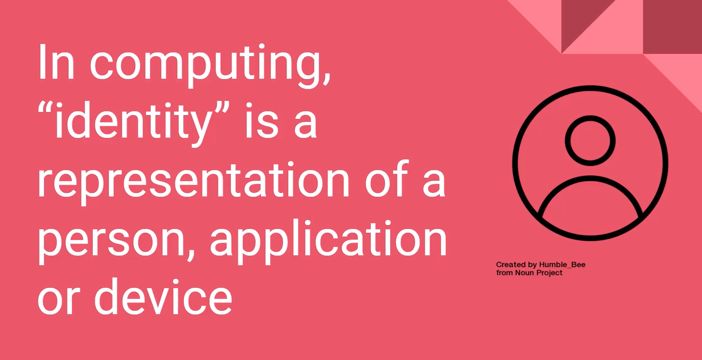

# Describe identity, governance, privacy, and compliance features (20-25%)

## Table of contents
  - [**Describe core Azure identity services**](#describe-core-azure-identity-services)
    - [Explain the difference between authentication and authorization](#explain-the-difference-between-authentication-and-authorization)
    - [Define Azure Active Directory](#define-azure-active-directory)
    - [Describe the functionality and usage of Azure Active Directory](#describe-the-functionality-and-usage-of-azure-active-directory)
    - [**What services does Azure AD provide?**](#what-services-does-azure-ad-provide)
  - [**How can I connect Active Directory with Azure AD?**](#how-can-i-connect-active-directory-with-azure-ad)
    - [Describe the functionality and usage of Conditional Access, Multi-Factor Authentication (MFA), and Single Sign-On (SSO)](#describe-the-functionality-and-usage-of-conditional-access-multi-factor-authentication-mfa-and-single-sign-on-sso)
  - [**What's single sign-on?**](#whats-single-sign-on)
  - [**What's multifactor authentication?**](#whats-multifactor-authentication)
  - [**What's Conditional Access?**](#whats-conditional-access)
    - [**Where is Conditional Access available?**](#where-is-conditional-access-available)
  - [**Describe Azure governance features**](#describe-azure-governance-features)
    - [Describe the functionality and usage of Role-Based Access Control (RBAC)](#describe-the-functionality-and-usage-of-role-based-access-control-rbac)
    - [Describe the functionality and usage of resource locks](#describe-the-functionality-and-usage-of-resource-locks)
    - [Describe the functionality and usage of tags](#describe-the-functionality-and-usage-of-tags)
    - [Describe the functionality and usage of Azure Policy](#describe-the-functionality-and-usage-of-azure-policy)
    - [Describe the functionality and usage of Azure Blueprints](#describe-the-functionality-and-usage-of-azure-blueprints)
  - [**Azure Blueprints in action**](#azure-blueprints-in-action)
  - [**What are blueprint artifacts?**](#what-are-blueprint-artifacts)
  - [**How will Tailwind Traders use Azure Blueprints for ISO 27001 compliance?**](#how-will-tailwind-traders-use-azure-blueprints-for-iso-27001-compliance)
    - [Describe the Cloud Adoption Framework for Azure](#describe-the-cloud-adoption-framework-for-azure)
  - [**Describe privacy and compliance resources**](#describe-privacy-and-compliance-resources)
  - [**Which compliance categories are available on Azure?**](#which-compliance-categories-are-available-on-azure)
    - [Describe the Microsoft core tenets of Security, Privacy, and Compliance](#describe-the-microsoft-core-tenets-of-security-privacy-and-compliance)
    - [Describe the purpose of the Microsoft Privacy Statement, Product Terms site, and Data Protection Addendum (DPA)](#describe-the-purpose-of-the-microsoft-privacy-statement-product-terms-site-and-data-protection-addendum-dpa)
    - [Describe the purpose of the Trust Center & Azure Compliance Documentation](#describe-the-purpose-of-the-trust-center--azure-compliance-documentation)
    - [Describe the purpose of Azure Sovereign Regions](#describe-the-purpose-of-azure-sovereign-regions)

## **Describe core Azure identity services**

### Explain the difference between authentication and authorization

- What is Identity?

    

- Authentication

    

- Authorization

    

    ### **What is authentication?**

    Authentication is the process of establishing the identity of a person or service that wants to access a resource. It involves the act of challenging a party for legitimate credentials and provides the basis for creating a security principal for identity and access control. It establishes whether the user is who they say they are.

    ### **What is authorization?**

    Authentication establishes the user's identity, but authorization is the process of establishing what level of access an authenticated person or service has. It specifies what data they're allowed to access and what they can do with it.

    Here's a diagram that shows the relationship between authentication and authorization:

    

### Define Azure Active Directory

[#8 Understanding security, privacy, compliance, and trust](https://www.notion.so/8-Understanding-security-privacy-compliance-and-trust-d1e3ca2f37664f5d924b2f07c99beb2b) 

- Traditional AD uses protocols → not with Internet → like LDAP
- Azure AD → Identity as a Service

- SAML, OpenID, WS Federation

    ### How does Azure AD compare to Active Directory?

    Active Directory is related to Azure AD, but they have some key differences.

    Microsoft introduced Active Directory in Windows 2000 to give organizations the ability to manage multiple on-premises infrastructure components and systems by using a single identity per user.

    For on-premises environments, Active Directory running on Windows Server provides an identity and access management service that's managed by your own organization. Azure AD is Microsoft's cloud-based identity and access management service. With Azure AD, you control the identity accounts, but Microsoft ensures that the service is available globally. If you've worked with Active Directory, Azure AD will be familiar to you.

    When you secure identities on-premises with Active Directory, Microsoft doesn't monitor sign-in attempts. When you connect Active Directory with Azure AD, Microsoft can help protect you by detecting suspicious sign-in attempts at no extra cost. For example, Azure AD can detect sign-in attempts from unexpected locations or unknown devices.

    ## **Who uses Azure AD?**

    Azure AD is for:

    - **IT administrators**

        Administrators can use Azure AD to control access to applications and resources based on their business requirements.

    - **App developers**

        Developers can use Azure AD to provide a standards-based approach for adding functionality to applications that they build, such as adding SSO functionality to an app or enabling an app to work with a user's existing credentials.

    - **Users**

        Users can manage their identities. For example, self-service password reset enables users to change or reset their password with no involvement from an IT administrator or help desk.

    - **Online service subscribers**

        Microsoft 365, Microsoft Office 365, Azure, and Microsoft Dynamics CRM Online subscribers are already using Azure AD.

    A *tenant* is a representation of an organization. A tenant is typically separated from other tenants and has its own identity.

    **Each Microsoft 365, Office 365, Azure, and Dynamics CRM Online tenant is automatically an Azure AD tenant.**

### Describe the functionality and usage of Azure Active Directory

[#8 Understanding security, privacy, compliance, and trust](https://www.notion.so/8-Understanding-security-privacy-compliance-and-trust-d1e3ca2f37664f5d924b2f07c99beb2b) 

- Security
- Reduced development time, easier support
- More features → beyond basic Authentication features
- Centralized administration
- SSO enabling support → for windows user-ids
- Integration with other Azure services

### **What services does Azure AD provide?**

Azure AD provides services such as:

- **Authentication**

    This includes verifying identity to access applications and resources. It also includes providing functionality such as self-service password reset, multifactor authentication, a custom list of banned passwords, and smart lockout services.

- **Single sign-on**

    SSO enables you to remember only one username and one password to access multiple applications. A single identity is tied to a user, which simplifies the security model. As users change roles or leave an organization, access modifications are tied to that identity, which greatly reduces the effort needed to change or disable accounts.

- **Application management**

    You can manage your cloud and on-premises apps by using Azure AD. Features like Application Proxy, SaaS apps, the My Apps portal (also called the *access panel*), and single-sign on provide a better user experience.

- **Device management**

    Along with accounts for individual people, Azure AD supports the registration of devices. Registration enables devices to be managed through tools like Microsoft Intune. It also allows for device-based conditional access policies to restrict access attempts to only those coming from known devices, regardless of the requesting user account.

## **How can I connect Active Directory with Azure AD?**

Connecting Active Directory with Azure AD enables you to provide a consistent identity experience to your users.

There are a few ways to connect your existing Active Directory installation with Azure AD. Perhaps the most popular method is to use Azure AD Connect.

Azure AD Connect synchronizes user identities between on-premises Active Directory and Azure AD. Azure AD Connect synchronizes changes between both identity systems, so you can use features like SSO, multifactor authentication, and self-service password reset under both systems. Self-service password reset prevents users from using known compromised passwords.

Here's a diagram that shows how Azure AD Connect fits between on-premises Active Directory and Azure AD:

### Describe the functionality and usage of Conditional Access, Multi-Factor Authentication (MFA), and Single Sign-On (SSO)

[#8 Understanding security, privacy, compliance, and trust](https://www.notion.so/8-Understanding-security-privacy-compliance-and-trust-d1e3ca2f37664f5d924b2f07c99beb2b) 

- Azure AD

    

    - Powers other Microsoft services

        

- Single SSO → sync-up identities from on-premise windows setup
- Azure AD Conditional Access
    - Premium Licence Required
    - Situation:

        

- Azure MFA

    

    - 3 factors

        

## **What's single sign-on?**

Single sign-on enables a user to sign in one time and use that credential to access multiple resources and applications from different providers.

More identities mean more passwords to remember and change. Password policies can vary among applications. As complexity requirements increase, it becomes increasingly difficult for users to remember them. The more passwords a user has to manage, the greater the risk of a credential-related security incident.

Consider the process of managing all those identities. Additional strain is placed on help desks as they deal with account lockouts and password reset requests. If a user leaves an organization, tracking down all those identities and ensuring they are disabled can be challenging. If an identity is overlooked, this might allow access when it should have been eliminated.

With SSO, you need to remember only one ID and one password. Access across applications is granted to a single identity that's tied to the user, which simplifies the security model. As users change roles or leave an organization, access is tied to a single identity. This change greatly reduces the effort needed to change or disable accounts. Using SSO for accounts makes it easier for users to manage their identities and increases your security capabilities.

You'll find resources at the end of this module about how to enable SSO through Azure AD.

## **What's multifactor authentication?**

*Multifactor authentication* is a process where a user is prompted during the sign-in process for an additional form of identification. Examples include a code on their mobile phone or a fingerprint scan.

Think about how you sign in to websites, email, or online gaming services. In addition to your username and password, have you ever needed to enter a code that was sent to your phone? If so, you've used multifactor authentication to sign in.

Multifactor authentication provides additional security for your identities by requiring two or more elements to fully authenticate.

These elements fall into three categories:

- **Something the user knows**

    This might be an email address and password.

- **Something the user has**

    This might be a code that's sent to the user's mobile phone.

- **Something the user is**

    This is typically some sort of biometric property, such as a fingerprint or face scan that's used on many mobile devices.

    

## **What's Conditional Access?**

Conditional Access is a tool that Azure Active Directory uses to allow (or deny) access to resources based on identity *signals*. **These signals include who the user is, where the user is, and what device the user is requesting access from.**

Conditional Access helps IT administrators:

- Empower users to be productive wherever and whenever.
- Protect the organization's assets.

Conditional Access also provides a more granular multifactor authentication experience for users. For example, a user might not be challenged for second authentication factor if they're at a known location. However, they might be challenged for a second authentication factor if their sign-in signals are unusual or they're at an unexpected location.

During sign-in, Conditional Access collects signals from the user, makes decisions based on those signals, and then enforces that decision by allowing or denying the access request or challenging for a multifactor authentication response.

Conditional Access is useful when you need to:

- Require multifactor authentication to access an application.

    You can configure whether all users require multifactor authentication or only certain users, such as administrators.

    You can also configure whether multifactor authentication applies to access from all networks or only untrusted networks.

- Require access to services only through approved client applications.

    For example, you might want to allow users to access Office 365 services from a mobile device as long as they use approved client apps, like the Outlook mobile app.

- Require users to access your application only from managed devices.

    A *managed device* is a device that meets your standards for security and compliance.

- Block access from untrusted sources, such as access from unknown or unexpected locations.

    Conditional Access comes with a What If tool, which helps you plan and troubleshoot your Conditional Access policies. You can use this tool to model your proposed Conditional Access policies across recent sign-in attempts from your users to see what the impact would have been if those policies had been enabled. The What If tool enables you to test your proposed Conditional Access policies before you implement them.

### **Where is Conditional Access available?**

To use Conditional Access, you need an Azure AD Premium P1 or P2 license. If you have a Microsoft 365 Business Premium license, you also have access to Conditional Access features.

---

## **Describe Azure governance features**

The term governance describes the general process of establishing rules and policies and ensuring that those rules and policies are enforced.

Governance is most beneficial when you have:

- Multiple engineering teams working in Azure.
- Multiple subscriptions to manage.
- Regulatory requirements that must be enforced.
- Standards that must be followed for all cloud resources.

    There are three main aspects to consider when you create and manage subscriptions: billing, access control, and subscription limits.

    Let's look at each of these aspects in more detail.

    ## **Billing**

    You can create one billing report per subscription. If you have multiple departments and need to do a "chargeback" of cloud costs, one possible solution is to organize subscriptions by department or by project.

    Resource tags can also help. You'll explore tags later in this module. When you define how many subscriptions you need and what to name them, take into account your internal billing requirements.

    ## **Access control**

    A subscription is a deployment boundary for Azure resources. Every subscription is associated with an Azure Active Directory tenant. Each tenant provides administrators the ability to set granular access through defined roles by using Azure role-based access control.

    When you design your subscription architecture, consider the deployment boundary factor. For example, do you need separate subscriptions for development and for production environments? With separate subscriptions, you can control access to each one separately and isolate their resources from one another.

    ## **Subscription limits**

    Subscriptions also have some resource limitations. For example, the maximum number of network Azure ExpressRoute circuits per subscription is 10. Those limits should be considered during your design phase. If you'll need to exceed those limits, you might need to add more subscriptions. If you hit a hard limit maximum, there's no flexibility to increase it.

    Management groups are also available to assist with managing subscriptions. A management group manages access, policies, and compliance across multiple Azure subscriptions. You'll learn more about management groups later in this module.

### Describe the functionality and usage of Role-Based Access Control (RBAC)

[#8 Understanding security, privacy, compliance, and trust](https://www.notion.so/8-Understanding-security-privacy-compliance-and-trust-d1e3ca2f37664f5d924b2f07c99beb2b) 

- Set of pre-defined roles

    

Role-based access control is applied to a *scope*, which is a resource or set of resources that this access applies to.

Here's a diagram that shows the relationship between roles and scopes.

Scopes include:

- A management group (a collection of multiple subscriptions).
- A single subscription.
- A resource group.
- A single resource.

    When you grant access at a parent scope, those permissions are inherited by all child scopes. For example:

    - When you assign the [Owner](https://docs.microsoft.com/en-us/azure/role-based-access-control/built-in-roles#owner) role to a user at the management group scope, that user can manage everything in all subscriptions within the management group.
    - When you assign the [Reader](https://docs.microsoft.com/en-us/azure/role-based-access-control/built-in-roles#reader) role to a group at the subscription scope, the members of that group can view every resource group and resource within the subscription.
    - When you assign the [Contributor](https://docs.microsoft.com/en-us/azure/role-based-access-control/built-in-roles#contributor) role to an application at the resource group scope, the application can manage resources of all types within that resource group, but not other resource groups within the subscription.

    ### **When should I use Azure RBAC?**

    Use Azure RBAC when you need to:

    - Allow one user to manage VMs in a subscription and another user to manage virtual networks.
    - Allow a database administrator group to manage SQL databases in a subscription.
    - Allow a user to manage all resources in a resource group, such as virtual machines, websites, and subnets.
    - Allow an application to access all resources in a resource group.

    ### **How is Azure RBAC enforced?**

    Azure RBAC is enforced on any action that's initiated against an Azure resource that passes through Azure Resource Manager. Resource Manager is a management service that provides a way to organize and secure your cloud resources.

    You typically access Resource Manager from the Azure portal, Azure Cloud Shell, Azure PowerShell, and the Azure CLI. Azure RBAC doesn't enforce access permissions at the application or data level. Application security must be handled by your application.

    RBAC uses an *allow model*. When you're assigned a role, RBAC *allows* you to perform certain actions, such as read, write, or delete. If one role assignment grants you read permissions to a resource group and a different role assignment grants you write permissions to the same resource group, you have both read and write permissions on that resource group.

### Describe the functionality and usage of resource locks

A [resource lock](https://docs.microsoft.com/en-us/azure/azure-resource-manager/management/lock-resources) prevents resources from being accidentally deleted or changed.

Even with Azure role-based access control (Azure RBAC) policies in place, there's still a risk that people with the right level of access could delete critical cloud resources. Think of a resource lock as a warning system that reminds you that a resource should not be deleted or changed.

[#8 Understanding security, privacy, compliance, and trust](https://www.notion.so/8-Understanding-security-privacy-compliance-and-trust-d1e3ca2f37664f5d924b2f07c99beb2b) 

- 2 types of locks

    

    - Using RBAC, you can restrict who has access to the locks

    You can apply locks to a subscription, a resource group, or an individual resource. You can set the lock level to **CanNotDelete** or **ReadOnly**.

    - **CanNotDelete** means authorized people can still read and modify a resource, but they can't delete the resource without first removing the lock.
    - **ReadOnly** means authorized people can read a resource, but they can't delete or change the resource. Applying this lock is like restricting all authorized users to the permissions granted by the **Reader** role in Azure RBAC.

    ### **How do I delete or change a locked resource?**

    Although locking helps prevent accidental changes, you can still make changes by following a two-step process.

    To modify a locked resource, you must first remove the lock. After you remove the lock, you can apply any action you have permissions to perform. This additional step allows the action to be taken, but it helps protect your administrators from doing something they might not have intended to do.

    Resource locks apply regardless of RBAC permissions. Even if you're an owner of the resource, you must still remove the lock before you can perform the blocked activity.

    ### **Combine resource locks with Azure Blueprints**

    What if a cloud administrator accidentally deletes a resource lock? If the resource lock is removed, its associated resources can be changed or deleted.

    To make the protection process more robust, you can combine resource locks with Azure Blueprints. Azure Blueprints enables you to define the set of standard Azure resources that your organization requires. **For example, you can define a blueprint that specifies that a certain resource lock must exist. Azure Blueprints can automatically replace the resource lock if that lock is removed.**

### Describe the functionality and usage of tags

- Resource metadata
- Benefit

    

    Tags provide extra information, or metadata, about your resources. This metadata is useful for:

    - **Resource management**

        Tags enable you to locate and act on resources that are associated with specific workloads, environments, business units, and owners.

    - **Cost management and optimization**

        Tags enable you to group resources so that you can report on costs, allocate internal cost centers, track budgets, and forecast estimated cost.

    - **Operations management**

        Tags enable you to group resources according to how critical their availability is to your business. This grouping helps you formulate service-level agreements (SLAs). An SLA is an uptime or performance guarantee between you and your users.

    - **Security**

        Tags enable you to classify data by its security level, such as *public* or *confidential*.

    - **Governance and regulatory compliance**

        Tags enable you to identify resources that align with governance or regulatory compliance requirements, such as ISO 27001.

        Tags can also be part of your standards enforcement efforts. For example, you might require that all resources be tagged with an owner or department name.

    - **Workload optimization and automation**

        Tags can help you visualize all of the resources that participate in complex deployments. For example, you might tag a resource with its associated workload or application name and use software such as Azure DevOps to perform automated tasks on those resources.

    You can also manage tags by using Azure Policy. For example, you can apply tags to a resource group, but those tags aren't automatically applied to the resources within that resource group. You can use Azure Policy to ensure that a resource inherits the same tags as its parent resource group. You'll learn more about Azure Policy later in this module.

    You can also use Azure Policy to enforce tagging rules and conventions. For example, you can require that certain tags be added to new resources as they're provisioned. You can also define rules that reapply tags that have been removed.

    Here's an example that shows these tags as they're applied to a virtual machine during provisioning.

    

### Describe the functionality and usage of Azure Policy

Azure Policy is a service in Azure that enables you to create, assign, and manage policies that control or audit your resources. These policies enforce different rules and effects over your resource configurations so that those configurations stay compliant with corporate standards.

[#8 Understanding security, privacy, compliance, and trust](https://www.notion.so/8-Understanding-security-privacy-compliance-and-trust-d1e3ca2f37664f5d924b2f07c99beb2b) 

- Governance

- Evaluate compliance
- Example of built-in policies

    

- Can create custom policies using JSON definition
- Azure portal → policy

    

    - Definitions → 100+
    - Policy → resources should be in same location as resource group location → JSON definition

        

        - Logic

            

            - This will not restrict creation of resource → but will show somewhere as compliance/non-compliant
    - Scope → will decide where exactly to enforce the policy

        

        - Resources can also be excluded

    ## **How does Azure Policy define policies?**

    Azure Policy enables you to define both individual policies and groups of related policies, known as *initiatives*. Azure Policy evaluates your resources and highlights resources that aren't compliant with the policies you've created. Azure Policy can also prevent noncompliant resources from being created.

    Azure Policy comes with a number of built-in policy and initiative definitions that you can use, under categories such as Storage, Networking, Compute, Security Center, and Monitoring.

    For example, say you define a policy that allows only a certain stock-keeping unit (SKU) size of virtual machines (VMs) to be used in your environment. After you enable this policy, that policy is applied when you create new VMs or resize existing VMs. Azure Policy also evaluates any current VMs in your environment.

    In some cases, Azure Policy can automatically remediate noncompliant resources and configurations to ensure the integrity of the state of the resources. For example, if all resources in a certain resource group should be tagged with the **AppName** tag and a value of "SpecialOrders," Azure Policy can automatically reapply that tag if it has been removed.

    Azure Policy also integrates with Azure DevOps by applying any continuous integration and delivery pipeline policies that apply to the pre-deployment and post-deployment phases of your applications.

    ## **Azure Policy in action**

    Implementing a policy in Azure Policy involves these three steps:

    1. Create a policy definition.
    2. Assign the definition to resources.
    3. Review the evaluation results.

        ### **1. Create a policy definition**

        A policy definition expresses what to evaluate and what action to take. For example, you could prevent VMs from being deployed in certain Azure regions. You also could audit your storage accounts to verify that they only accept connections from allowed networks.

        Every policy definition has conditions under which it's enforced. A policy definition also has an accompanying effect that takes place when the conditions are met. Here are some example policy definitions:

        - **Allowed virtual machine SKUs**

            This policy enables you to specify a set of VM SKUs that your organization can deploy.

        - **Allowed locations**

            This policy enables you to restrict the locations that your organization can specify when it deploys resources. Its effect is used to enforce your geographic compliance requirements.

        - **MFA should be enabled on accounts with write permissions on your subscription**

            This policy requires that multifactor authentication (MFA) be enabled for all subscription accounts with write privileges to prevent a breach of accounts or resources.

        - **CORS should not allow every resource to access your web applications**

            Cross-origin resource sharing (CORS) is an HTTP feature that enables a web application running under one domain to access resources in another domain. For security reasons, modern web browsers restrict cross-site scripting by default. This policy allows only required domains to interact with your web app.

        - **System updates should be installed on your machines**

            This policy enables Azure Security Center to recommend missing security system updates on your servers.

        ### **2. Assign the definition to resources**

        To implement your policy definitions, you assign definitions to resources. A *policy assignment* is a policy definition that takes place within a specific scope. This scope could be a management group (a collection of multiple subscriptions), a single subscription, or a resource group.

        Policy assignments are inherited by all child resources within that scope. If a policy is applied to a resource group, that policy is applied to all resources within that resource group. You can exclude a subscope from the policy assignment if there are specific child resources you need to be exempt from the policy assignment.

        ### **3. Review the evaluation results**

        When a condition is evaluated against your existing resources, each resource is marked as compliant or noncompliant. You can review the noncompliant policy results and take any action that's needed.

        Policy evaluation happens about once per hour. If you make changes to your policy definition and create a policy assignment, that policy is evaluated over your resources within the hour

    ## **What are Azure Policy initiatives?**

    An Azure Policy initiative is a way of grouping related policies into one set. The initiative definition contains all of the policy definitions to help track your compliance state for a larger goal.

    For example, Azure Policy includes an initiative named **Enable Monitoring in Azure Security Center**. Its goal is to monitor all of the available security recommendations for all Azure resource types in Azure Security Center.

    Under this initiative, the following policy definitions are included:

    - **Monitor unencrypted SQL Database in Security Center**

        This policy monitors for unencrypted SQL databases and servers.

    - **Monitor OS vulnerabilities in Security Center**

        This policy monitors servers that don't satisfy the configured OS vulnerability baseline.

    - **Monitor missing Endpoint Protection in Security Center**

        This policy monitors for servers that don't have an installed endpoint protection agent.

    In fact, the **Enable Monitoring in Azure Security Center** initiative contains over 100 separate policy definitions.

    Azure Policy also includes initiatives that support regulatory compliance standards such as HIPAA and ISO 27001.

    **LAB → needs Azure Subscription to try → good to read**

    [https://docs.microsoft.com/en-gb/learn/modules/build-cloud-governance-strategy-azure/9-restrict-location-azure-policy](https://docs.microsoft.com/en-gb/learn/modules/build-cloud-governance-strategy-azure/9-restrict-location-azure-policy)

### Describe the functionality and usage of Azure Blueprints

What happens when your cloud environment starts to grow beyond just one subscription? How can you scale the configuration of these features, knowing they need to be enforced for resources in new subscriptions?

Instead of having to configure features like Azure Policy for each new subscription, with [Azure Blueprints](https://azure.microsoft.com/services/blueprints) you can define a repeatable set of governance tools and standard Azure resources that your organization requires. In this way, development teams can rapidly build and deploy new environments with the knowledge that they're building within organizational compliance with a set of built-in components that speed the development and deployment phases.

Azure Blueprints orchestrates the deployment of various resource templates and other artifacts, such as:

- Role assignments
- Policy assignments
- Azure Resource Manager templates
- Resource groups

[#8 Understanding security, privacy, compliance, and trust](https://www.notion.so/8-Understanding-security-privacy-compliance-and-trust-d1e3ca2f37664f5d924b2f07c99beb2b) 

- Create blueprint

    

    - Templates supported ISO 27001
    - HIPAA → blueprint

        

## **Azure Blueprints in action**

When you form a cloud center of excellence team or a cloud custodian team, that team can use Azure Blueprints to scale their governance practices throughout the organization.

Implementing a blueprint in Azure Blueprints involves these three steps:

1. Create an Azure blueprint.
2. Assign the blueprint.
3. Track the blueprint assignments.

With Azure Blueprints, the relationship between the blueprint definition (what should be deployed) and the blueprint assignment (what was deployed) is preserved. In other words, Azure creates a record that associates a resource with the blueprint that defines it. This connection helps you track and audit your deployments.

Blueprints are also versioned. Versioning enables you to track and comment on changes to your blueprint.

## **What are blueprint artifacts?**

Each component in the blueprint definition is known as an *artifact*.

It is possible for artifacts to have no additional parameters (configurations). An example is the **Deploy threat detection on SQL servers** policy, which requires no additional configuration.

Artifacts can also contain one or more parameters that you can configure. The following screenshot shows the **Allowed locations** policy. This policy includes a parameter that specifies the allowed locations.

## **How will Tailwind Traders use Azure Blueprints for ISO 27001 compliance?**

[ISO 27001](https://www.iso.org/isoiec-27001-information-security.html) is a standard that applies to the security of IT systems, published by the International Organization for Standardization. As part of its quality process, Tailwind Traders wants to certify that it complies with this standard. Azure Blueprints has several built-in blueprint definitions that relate to ISO 27001.

As an IT administrator, you decide to investigate the **ISO 27001: Shared Services Blueprint** definition. Here's an outline of your plan.

1. Define a management group that's named **PROD-MG**.

    Recall that a management group manages access, policies, and compliance across multiple Azure subscriptions. Every new Azure subscription is added to this management group when the subscription is created.

2. Create a blueprint definition that's based on the **ISO 27001: Shared Services Blueprint** template. Then publish the blueprint.
3. Assign the blueprint to your **PROD-MG** management group.

The following image shows artifacts that are created when you run an ISO 27001 blueprint from a template.

You see that the blueprint template contains policy assignments, Resource Manager templates, and resource groups. The blueprint deploys these artifacts to any existing subscriptions within the PROD-MG management group. The blueprint also deploys these artifacts to any new subscriptions as they're created and added to the management group.

### Describe the Cloud Adoption Framework for Azure

[#9 Understand Azure Pricing and Support](https://www.notion.so/9-Understand-Azure-Pricing-and-Support-e1677813e17a4519ae5fc5eb420d31ac) 

The Cloud Adoption Framework consists of tools, documentation, and proven practices. The Cloud Adoption Framework includes these stages:

1. Define your strategy.
2. Make a plan.
3. Ready your organization.
4. Adopt the cloud.
5. Govern and manage your cloud environments.

    

## **Describe privacy and compliance resources**

In general, compliance means to adhere to a law, standard, or set of guidelines. Regulatory compliance refers to the discipline and process of ensuring that a company follows the laws that governing bodies enforce.

## **Which compliance categories are available on Azure?**

Although there are many more, the following image shows some of the more popular compliance offerings that are available on Azure. These offerings are grouped under four categories: Global, US Government, Industry, and Regional.

### Describe the Microsoft core tenets of Security, Privacy, and Compliance

- Azure: Trusted cloud

    

    - Security

        

    - Privacy

        

    - Compliance

        

    - Reliability and Resiliency

        

    - Protecting IP

        

### Describe the purpose of the Microsoft Privacy Statement, Product Terms site, and Data Protection Addendum (DPA)

- privacy.microsoft.com

    

    The [Microsoft Privacy Statement](https://privacy.microsoft.com/privacystatement) explains what personal data Microsoft collects, how Microsoft uses it, and for what purposes.

    The privacy statement covers all of Microsoft's services, websites, apps, software, servers, and devices. This list ranges from enterprise and server products to devices that you use in your home to software that students use at school.

    Microsoft's privacy statement also provides information that's relevant to specific products such as Windows and Xbox.

- Online Service term (OST) → contract with you what services you are getting

    

    The Online Services Terms (OST) is a legal agreement between Microsoft and the customer. The OST details the obligations by both parties with respect to the processing and security of customer data and personal data. The OST applies specifically to Microsoft's online services that you license through a subscription, including Azure, Dynamics 365, Office 365, and Bing Maps.

- Data Protection Addendum (DPA)
    - How your data is protected, how long it is stored after you have deleted

    

    The Data Protection Addendum (DPA) further defines the data processing and security terms for online services. These terms include:

    - Compliance with laws.
    - Disclosure of processed data.
    - Data Security, which includes security practices and policies, data encryption, data access, customer responsibilities, and compliance with auditing.
    - Data transfer, retention, and deletion.

### Describe the purpose of the Trust Center & Azure Compliance Documentation

The Trust Center showcases Microsoft's principles for maintaining data integrity in the cloud and how Microsoft implements and supports security, privacy, compliance, and transparency in all Microsoft cloud products and services. The Trust Center is an important part of the Microsoft Trusted Cloud Initiative and provides support and resources for the legal and compliance community.

- Privacy statements, government compliance documentations

    

    

- GDPR

    

- ISO

    

- Cybersecurity framework

    

    The Trust Center provides:

    - In-depth information about security, privacy, compliance offerings, policies, features, and practices across Microsoft cloud products.
    - Additional resources for each topic.
    - Links to the security, privacy, and compliance blogs and upcoming events.

    The Trust Center is a great resource for other people in your organization who might play a role in security, privacy, and compliance. These people include business managers, risk assessment and privacy officers, and legal compliance teams.

    ## **What is the Azure compliance documentation?**

    The [Azure compliance documentation](https://docs.microsoft.com/en-us/azure/compliance/) provides you with detailed documentation about legal and regulatory standards and compliance on Azure.

    Here you find compliance offerings across these categories:

    - Global
    - US government
    - Financial services
    - Health
    - Media and manufacturing
    - Regional

    There are also additional compliance resources, such as audit reports, privacy information, compliance implementations and mappings, and white papers and analyst reports. Country and region privacy and compliance guidelines are also included. Some resources might require you to be signed in to your cloud service to access them.

### Describe the purpose of Azure Sovereign Regions

- Azure Government → USA → Not accessible by public

    Azure Government is a separate instance of the Microsoft Azure service. It addresses the security and compliance needs of US federal agencies, state and local governments, and their solution providers. Azure Government offers physical isolation from non-US government deployments and provides screened US personnel.

    

    

    Azure Government services handle data that is subject to certain government regulations and requirements:

    - Federal Risk and Authorization Management Program (FedRAMP)
    - National Institute of Standards and Technology (NIST) 800.171 Defense Industrial Base (DIB)
    - International Traffic in Arms Regulations (ITAR)
    - Internal Revenue Service (IRS) 1075
    - Department of Defense (DoD) L4
    - Criminal Justice Information Service (CJIS)

    To provide the highest level of security and compliance, Azure Government uses physically isolated datacenters and networks located only in the US. Azure Government customers, such as the US federal, state, and local government or their partners, are subject to validation of eligibility.

    Azure Government provides the broadest compliance and Level 5 DoD approval. Azure Government is [available in eight geographies](https://azure.microsoft.com/global-infrastructure/geographies/#geographies?azure-portal=true) and offers the most compliance certifications of any cloud provider.

    - Isolated data centers separate from the Azure Cloud
    - Meets standards specific to the government
- Azure China → Separate

    [Azure China 21Vianet](https://docs.microsoft.com/en-us/azure/china) is operated by 21Vianet. It's a physically separated instance of cloud services located in China. Azure China 21Vianet is independently operated and transacted by Shanghai Blue Cloud Technology Co., Ltd. ("21Vianet"), a wholly owned subsidiary of Beijing 21Vianet Broadband Data Center Co., Ltd.

    According to the China Telecommunication Regulation, providers of cloud services, infrastructure as a service (IaaS) and platform as a service (PaaS), must have value-added telecom permits. Only locally registered companies with less than 50 percent foreign investment qualify for these permits. To comply with this regulation, the Azure service in China is operated by 21Vianet, based on the technologies licensed from Microsoft.