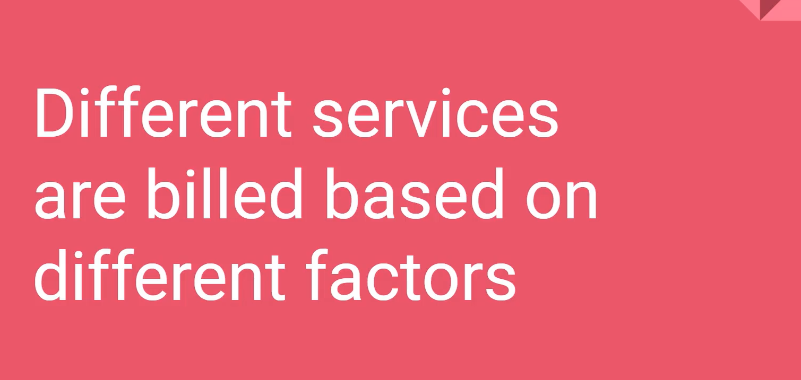

# Describe Azure cost management and Service Level Agreements (10-15%)

## Table of contents
  - [**Describe methods for planning and managing costs**](#describe-methods-for-planning-and-managing-costs)
    - [Identify factors that can affect costs (resource types, services, locations, ingress and egress traffic)](#identify-factors-that-can-affect-costs-resource-types-services-locations-ingress-and-egress-traffic)
    - [Describe the functionality and usage of the Pricing calculator and the Total Cost of Ownership (TCO) calculator](#describe-the-functionality-and-usage-of-the-pricing-calculator-and-the-total-cost-of-ownership-tco-calculator)
    - [Purchase Azure services](#purchase-azure-services)
    - [**What types of Azure subscriptions can I use?**](#what-types-of-azure-subscriptions-can-i-use)
    - [**How do I purchase Azure services?**](#how-do-i-purchase-azure-services)
    - [Describe the functionality and usage of Azure Cost Management](#describe-the-functionality-and-usage-of-azure-cost-management)
  - [**Describe Azure Service Level Agreements (SLAs) and service lifecycles**](#describe-azure-service-level-agreements-slas-and-service-lifecycles)
    - [Describe the purpose of an Azure Service Level Agreement (SLA) & actions that can impact an SLA](#describe-the-purpose-of-an-azure-service-level-agreement-sla--actions-that-can-impact-an-sla)
    - [Describe the service lifecycle in Azure](#describe-the-service-lifecycle-in-azure)

## **Describe methods for planning and managing costs**

### Identify factors that can affect costs (resource types, services, locations, ingress and egress traffic)

[#9 Understand Azure Pricing and Support](https://www.notion.so/9-Understand-Azure-Pricing-and-Support-e1677813e17a4519ae5fc5eb420d31ac) 

- Free Services

    

- Most services → metered
    - Pay per usage (consumption model)

        

        - Services
            - Outbound bandwidth → 5GB free then pay

            

    - Pay per time (per second)
        - You will still pay for storage

            

        - Stability in pricing

            

    - Pay for bandwidth
        - First 5 GB is free → going out → then charged
        - Inbound data is free
        - Bandwidth costs

            

            - 1 PB of data = $52000 USD

        ## **What factors affect cost?**

        The way you use resources, your subscription type, and pricing from third-party vendors are common factors. Let's take a quick look at each.

        ### **Resource type**

        A number of factors influence the cost of Azure resources. They depend on the type of resource or how you customize it.

        For example, with a storage account you specify a type (such as block blob storage or table storage), a performance tier (standard or premium), and an access tier (hot, cool, or archive). These selections present different costs.

        ### **Usage meters**

        When you provision a resource, Azure creates *meters* to track usage of that resource. Azure uses these meters to generate a usage record that's later used to help calculate your bill.

        Think of usage meters similar to how you use electricity or water in your home. You might pay a base price each month for electricity or water service, but your final bill is based on the total amount that you consumed.

        Let's look at a single VM as an example. The following kinds of meters are relevant to tracking its usage:

        - Overall CPU time.
        - Time spent with a public IP address.
        - Incoming (ingress) and outgoing (egress) network traffic in and out of the VM.
        - Disk size and amount of disk read and disk write operations.

        Each meter tracks a specific type of usage. For example, a meter might track bandwidth usage (ingress or egress network traffic in bits per second), number of operations, or its size (storage capacity in bytes).

        The usage that a meter tracks correlates to a quantity of billable units. Those units are charged to your account for each billing period. The rate per billable unit depends on the resource type you're using.

        ### **Resource usage**

        In Azure, you're always charged based on what you use. As an example, let's look at how this billing applies to deallocating a VM.

        In Azure, you can delete or deallocate a VM. Deleting a VM means that you no longer need it. The VM is removed from your subscription, and then it's prepared for another customer.

        Deallocating a VM means that the VM is no longer running. But the associated hard disks and data are still kept in Azure. The VM isn't assigned to a CPU or network in Azure's datacenter, so it doesn't generate the costs associated with compute time or the VM's IP address. Because the disks and data are still stored, and the resource is present in your Azure subscription, you're still billed for disk storage.

        Deallocating a VM when you don't plan on using it for some time is just one way to minimize costs. For example, you might deallocate the VMs you use for testing purposes on weekends when your testing team isn't using them. You'll learn more about ways to minimize cost later in this module.

        ### **Azure subscription types**

        Some Azure subscription types also include usage allowances, which affect costs.

        For example, an Azure free trial subscription provides access to a number of Azure products that are free for 12 months. It also includes credit to spend within your first 30 days of sign-up. And you get access to more than 25 products that are always free (based on resource and region availability).

        ### **Azure Marketplace**

        You can also purchase Azure-based solutions and services from third-party vendors through Azure Marketplace. Examples include managed network firewall appliances or connectors to third-party backup services. Billing structures are set by the vendor.

        ## **Does location or network traffic affect cost?**

        When you provision a resource in Azure, you need to define the location (known as the Azure region) of where it will be deployed. Let's see why this decision can have cost consequences.

        ### **Location**

        Azure infrastructure is distributed globally, which enables you to deploy your services centrally or provision your services closest to where your customers use them.

        Different regions can have different associated prices. Because geographic regions can impact where your network traffic flows, network traffic is a cost influence to consider as well.

        For example, say Tailwind Traders decides to provision its Azure resources in the Azure regions that offer the lowest prices. That decision would save the company some money. But, if they need to transfer data between those regions, or if their users are located in different parts of the world, any potential savings could be offset by the additional network usage costs of transferring data between those resources.

        ### **Zones for billing of network traffic**

        Billing zones are a factor in determining the cost of some Azure services.

        [Bandwidth](https://azure.microsoft.com/pricing/details/bandwidth) refers to data moving in and out of Azure datacenters. Some inbound data transfers (data going into Azure datacenters) are free. For outbound data transfers (data leaving Azure datacenters), data transfer pricing is based on *zones*.

        

        A zone is a geographical grouping of Azure regions for billing purposes. The following zones include some of the regions as shown here:

        - **Zone 1**: Australia Central, West US, East US, Canada West, West Europe, France Central, and others
        - **Zone 2**: Australia East, Japan West, Central India, Korea South, and others
        - **Zone 3**: Brazil South, South Africa North, South Africa West, UAE Central, UAE North
        - **DE Zone 1**: Germany Central, Germany Northeast

    ### Identify factors that can reduce costs (reserved instances, reserved capacity, hybrid use benefit, spot pricing)

    [#9 Understand Azure Pricing and Support](https://www.notion.so/9-Understand-Azure-Pricing-and-Support-e1677813e17a4519ae5fc5eb420d31ac) 

    - Azure Advisor cost tab → can recommend cost saving possibilities
    - Auto shutdown on dev/QA resources
    - Utilize cool/archive storage where possible
    - Reserved instances → VM for a specific period → saves a lot of money
    - Billing alerts → Budget alerts
    - Use policy to restrict access to certain expensive resources
    - Auto scaling resources → downsize when resources over-provisioned → by moving to smaller VMs as per the workload
    - Ensure every resource has an owner → tags can help to better tracking
    - Spot pricing → Ability to use VM when nobody is using  it for a discounted price
        - But when someone needs to use it, you need to give it back

### Describe the functionality and usage of the Pricing calculator and the Total Cost of Ownership (TCO) calculator

[#9 Understand Azure Pricing and Support](https://www.notion.so/9-Understand-Azure-Pricing-and-Support-e1677813e17a4519ae5fc5eb420d31ac) 

- Pricing calculator

    

    

- TCO calculator

    

    - Other costs → which you have to pay with on-premise solution

        

    ## **What's the TCO Calculator?**

    The [TCO Calculator](https://azure.microsoft.com/pricing/tco/calculator) helps you estimate the cost savings of operating your solution on Azure over time, instead of in your on-premises datacenter.

    The term *total cost of ownership* is commonly used in finance. It can be hard to see all the hidden costs related to operating a technology capability on-premises. Software licenses and hardware are additional costs.

    With the TCO Calculator, you enter the details of your on-premises workloads. Then you review the suggested industry average cost (which you can adjust) for related operational costs. These costs include electricity, network maintenance, and IT labor. You're then presented with a side-by-side report. Using the report, you can compare those costs with the same workloads running on Azure.

    

    ## **How does the TCO Calculator work?**

    Working with the TCO Calculator involves three steps:

    - Define your workloads.
    - Adjust assumptions.
    - View the report.

### Purchase Azure services

### **What types of Azure subscriptions can I use?**

You probably know that an Azure *subscription* provides you with access to Azure resources, such as virtual machines (VMs), storage, and databases. The types of resources you use impact your monthly bill.

Azure offers both free and paid subscription options to fit your needs and requirements. They are:

- **Free trial**

    A free trial subscription provides you with 12 months of popular free services, a credit to explore any Azure service for 30 days, and more than 25 services that are always free. Your Azure services are disabled when the trial ends or when your credit expires for paid products, unless you upgrade to a paid subscription.

- **Pay-as-you-go**

    A pay-as-you-go subscription enables you to pay for what you use by attaching a credit or debit card to your account. Organizations can apply for volume discounts and prepaid invoicing.

- **Member offers**

    Your existing membership to certain Microsoft products and services might provide you with credits for your Azure account and reduced rates on Azure services. For example, member offers are available to Visual Studio subscribers, Microsoft Partner Network members, Microsoft for Startups members, and Microsoft Imagine members.

### **How do I purchase Azure services?**

There are three main ways to purchase services on Azure. They are:

- **Through an Enterprise Agreement**

    Larger customers, known as enterprise customers, can sign an Enterprise Agreement with Microsoft. This agreement commits them to spending a predetermined amount on Azure services over a period of three years. The service fee is typically paid annually. As an Enterprise Agreement customer, you'll receive the best customized pricing based on the kinds and amounts of services you plan on using.

- **Directly from the web**

    Here, you purchase Azure services directly from the Azure portal website and pay standard prices. You're billed monthly, as a credit card payment or through an invoice. This purchasing method is known as Web Direct.

- **Through a Cloud Solution Provider**

    A Cloud Solution Provider (CSP) is a Microsoft Partner who helps you build solutions on top of Azure. Your CSP bills you for your Azure usage at a price they determine. They also answer your support questions and escalate them to Microsoft, as needed.

### Describe the functionality and usage of Azure Cost Management

[#9 Understand Azure Pricing and Support](https://www.notion.so/9-Understand-Azure-Pricing-and-Support-e1677813e17a4519ae5fc5eb420d31ac) 

- Historical cost analysis
    - Another free toll inside Azure to analyze spending

        

- Create budgets here
- Scheduled reports

## **Describe Azure Service Level Agreements (SLAs) and service lifecycles**

### Describe the purpose of an Azure Service Level Agreement (SLA) & actions that can impact an SLA

A service-level agreement (SLA) is a formal agreement between a service company and the customer. For Azure, this agreement defines the performance standards that Microsoft commits to for you, the customer.

[#9 Understand Azure Pricing and Support](https://www.notion.so/9-Understand-Azure-Pricing-and-Support-e1677813e17a4519ae5fc5eb420d31ac) 

- All services → SLA provided

- SLA for Virtual Machines - actions that can impact an SLA

    

- if they don't meet their promise

    

- SLA for load balancer

    

    ## **What's in a typical SLA?**

    A typical SLA breaks down into these sections:

    - **Introduction**

        This section explains what to expect in the SLA, including its scope and how subscription renewals can affect the terms.

    - **General terms**

        This section contains terms that are used throughout the SLA so that both parties (you and Microsoft) have a consistent vocabulary. For example, this section might define what's meant by downtime, incidents, and error codes.

        This section also defines the general terms of the agreement, including how to submit a claim, receive credit for any performance or availability issues, and limitations of the agreement.

    - **SLA details**

        This section defines the specific guarantees for the service. Performance commitments are commonly measured as a percentage. That percentage typically ranges from 99.9 percent ("three nines") to 99.99 percent ("four nines").

        The primary performance commitment typically focuses on *uptime*, or the percentage of time that a product or service is successfully operational. Some SLAs focus on other factors as well, including *latency*, or how fast the service must respond to a request.

        This section also defines any additional terms that are specific to this service.

    ## **How do percentages relate to total downtime?**

    *Downtime* refers to the time duration that the service is unavailable.

    The difference between 99.9 percent and 99.99 percent might seem minor, but it's important to understand what these numbers mean in terms of total downtime.

    Here's a table to give you a sense of how total downtime decreases as the SLA percentage increases from 99 percent to 99.999 percent:

    [Untitled](https://www.notion.so/00e4126b442f4b29b7516a4882fbd2bc)

    These amounts are cumulative, which means that the duration of multiple different service outages would be combined, or added together.

    ## **What are service credits?**

    A *service credit* is the percentage of the fees you paid that are credited back to you according to the claim approval process.

    An SLA describes how Microsoft responds when an Azure service fails to perform to its specification. For example, you might receive a discount on your Azure bill as compensation when a service fails to perform according to its SLA.

    Credits typically increase as uptime decreases. Here's how credits are applied for Azure Database for MySQL according to uptime:

    [Untitled](https://www.notion.so/7d937336767148ffa4ff332e5cc95e4e)

    ## **How do I know when there's an outage?**

    [Azure status](https://status.azure.com/status) provides a global view of the health of Azure services and regions. If you suspect there's an outage, this is often a good place to start your investigation.

    Azure status provides an RSS feed of changes to the health of Azure services that you can subscribe to. You can connect this feed to communication software such as Microsoft Teams or Slack.

    From the Azure status page, you can also access Azure Service Health. This provides a personalized view of the health of the Azure services and regions that you're using, directly from the Azure portal.

    ## **How can I request a service credit from Microsoft?**

    Typically, you need to file a claim with Microsoft to receive a service credit. If you purchase Azure services from a Cloud Solution Provider (CSP) partner, your CSP typically manages the claims process.

    Each SLA specifies the timeline by which you must submit your claim and when Microsoft processes your claim. For many services, you must submit your claim by the end of the calendar month following the month in which the incident occurred.

    Next, let's look at some other factors that Tailwind Traders needs to consider that might affect SLA performance targets.

    ## **Combine SLAs to compute the composite SLA**

    After you've identified the SLA for the individual workloads in the Special Orders application, you might notice that those SLAs are not all the same. How does this affect our overall application SLA requirement of 99.9 percent? To work that out, you'll need to do some math.

    The process of combining SLAs helps you compute the *composite SLA* for a set of services. Computing the composite SLA requires that you multiply the SLA of each individual service.

    From [Service Level Agreements](https://azure.microsoft.com/support/legal/sla/), you discover the SLA for each Azure service that you need. They are:

    [Untitled](https://www.notion.so/2f76a7d5a333436b83b43fe557756d3e)

    Therefore, for the Special Orders application, the composite SLA would be:

    

    Recall that you need two virtual machines. Therefore, you include the Virtual Machines SLA of 99.9 percent two times in the formula.

    Note that even though all of the individual services have SLAs equal to or better than the application SLA, combining them results in an overall number that's *lower* than the 99.9 percent you need. Why? Because using multiple services adds an extra level of complexity and slightly increases the risk of failure.

    You see here that the composite SLA of 99.78 percent doesn't meet the required SLA of 99.9 percent. You might go back to team and ask whether this is acceptable. Or you might implement some other strategies into your design to improve this SLA.

    ### **Build availability requirements into your design**

    There are application design considerations you can use that relate to the underlying cloud infrastructure.

    For example, to improve the availability of the application, avoid having any single points of failure. So instead of adding more virtual machines, you can deploy one or more extra instances of the same virtual machine across the different availability zones in the same Azure region.

    An *availability zone* is a unique physical location within an Azure region. Each zone is made up of one or more datacenters equipped with independent power, cooling, and networking. These zones use different schedules for maintenance, so if one zone is affected, your virtual machine instance in the other zone is unaffected.

    Deploying two or more instances of an Azure virtual machine across two or more availability zones raises the virtual machine SLA to 99.99 percent. Recalculating your composite SLA above with this Virtual Machines SLA gives you an application SLA of

    

    This revised SLA of 99.96 percent exceeds your target of 99.9 percent.

### Describe the service lifecycle in Azure

The *service lifecycle* defines how every Azure service is released for public use.

Every Azure service starts in the development phase. In this phase, the Azure team collects and defines its requirements, and begins to build the service.

Next, the service is released to the public preview phase. During this phase, the public can access and experiment with it so that it can provide feedback. Your feedback helps Microsoft improve services. More importantly, providing feedback gives you the opportunity to request new or different capabilities so that services better meet your needs.

After a new Azure service is validated and tested, it's released to all customers as a production-ready service. This is known as *general availability* (GA).

[#9 Understand Azure Pricing and Support](https://www.notion.so/9-Understand-Azure-Pricing-and-Support-e1677813e17a4519ae5fc5eb420d31ac) 

- Preview features

    

    - Could change significantly before going live
    - Public & Private preview
        - Public preview

            

        - Private preview

            

            

            

        - General Availability (GA)
            - Announcements → if features goes in GA

                

    ## **How can I access preview services?**

    You can access preview services from the Azure portal.

    Here's how to see what preview services are available. You can follow along if you have an Azure subscription.

    1. Go to the [Azure portal](https://portal.azure.com/) and sign in.
    2. Select **Create a resource**.
    3. Enter *preview* in the search box, and select **Enter**.
    4. Select a service to learn more about it. You can also launch the service if you'd like to try it out.

    ## **How can I stay updated on the latest announcements?**

    The [Azure updates](https://azure.microsoft.com/updates) page provides information about the latest updates to Azure products, services, and features, as well as product roadmaps and announcements.

    From the Azure updates page, you can:

    - View details about all Azure updates.
    - See which updates are in general availability, preview, or development.

        

    - Browse updates by product category or update type.
    - Search for updates by keyword.
    - Subscribe to an RSS feed to receive notifications.
    - Access the Microsoft Connect page to read Azure product news and announcements.