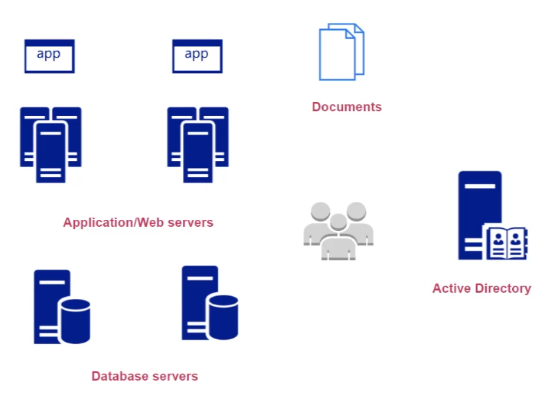

# #10 Putting Everything Together

## Table of contents
- [Understanding your requirements](#understanding-your-requirements)
- [Choosing the right cloud model](#choosing-the-right-cloud-model)
- [Storing user documents](#storing-user-documents)
- [Understanding costs](#understanding-costs)
- [High Availability](#high-availability)
- [High Elasticity](#high-elasticity)
- [Connecting data center to Azure](#connecting-data-center-to-azure)
- [The user identities](#the-user-identities)
- [Monitoring your infrastructure](#monitoring-your-infrastructure)

## Understanding your requirements

- You want to migrate some of the workloads onto Azure

    

- Company bought physical servers → might be hosting application → data center is on-premise
- Database servers → again on-premise
- Applications in the on-premises data center → must be able to talk to applications in Azure
- They are using Microsoft Active Directory → storing information about employees
- Some workloads → will continue to remain in the on-premises data center

---

## Choosing the right cloud model

- IaaS or PaaS

    

    - Migrating Application
        - You can spin-up VM → install IIS → host your application
        - You can also directly start using Azure Web Apps → check if it supports the underlying language runtime
        - Remember → IaaS will provide more control than PaaS solution
    - No need to manage underlying infra → you save on cost
    - Migrating database
        - Host it on Azure VM → too much work
        - Azure SQL database service → easier to use and direct migration possible
    - Server-less compute option is also available → Azure Functions

---

## Storing user documents

- Application → might be storing documents uploaded by user → in VM → on-premise
    - You can use isolated architecture → store documents in **Azure Blob Storage** → Azure Storage Accounts
    - This will decouple the architecture → no need to worry about the underlying storage space, unlike VM's disk space
    - Web Apps can easily access the data from storage account

---

## Understanding costs

- You can put tags on resources → then in the billing aspect → you can filter/drill down on your specific department billings
    - You can also create multiple subscriptions based on different departments
- You can use pricing calculator of Azure → understanding the migration cost

    

- You also have support plans → which should also be considered in the cost
- Data migration → for security → you might want to invest more

---

## High Availability

- This is strongly supported by Azure → most of them have SLA in place
    - Azure Web Apps → 99.95% (not for free/shared plans)
- Azure VMs
    - Use → Availability Sets for improving availability → distributed across fault and update domains
    - You can also use Availability Zones → protects against data center level failure
        - This does not protect from → region level failures

---

## High Elasticity

- Ability to scale architecture → based on demand
- Azure VM → you can increase VM size whenever you want
    - You can use → Virtual Machine Scale Set (kind of works like AWS auto scaling)
        - Remember → Application get automatically installed as VM scales → it's your responsibility
        - This can be used with Azure Load Balancer → for distributing traffic

---

## Connecting data center to Azure

- For connection some on-premise data center to talk to application hosted on Azure
    - You can use → Site-to-Site VPN connection to Azure VPC
    - You can also use → Azure ExpressRoute Connection → dedicated connection

---

## The user identities

- Microsoft Active Directory → migrated to → Azure Active Directory
    - Double maintenance
- You can use → Azure AD Connect → this will synchronize user from Active directory to Azure AD
    - Then you can give access to the user → on different resources

---

## Monitoring your infrastructure

- You can use Azure Monitor tool → Azure Log Analytics Workspace
    - Logs can come from Azure VM, database or directly from on-premise database
- Azure monitor → you can create alerts based on the metrics