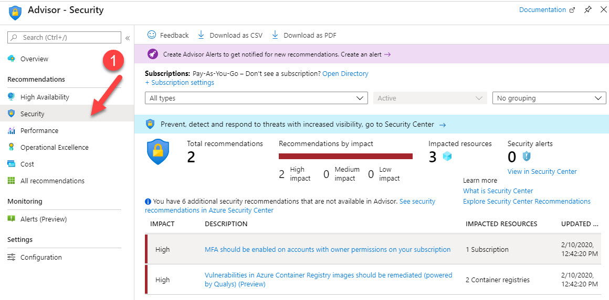

# #11 Important Questions (Points)

Your company needs to deploy an application to virtual machines hosted in Azure. The solution must ensure an SLA of 99.99%. What is the minimum number of virtual machines and availability zones that you need to recommend for the deployment

- For all Virtual Machines that have two or more instances deployed across two or more Availability Zones in the same Azure region, Microsoft will guarantee Virtual Machine Connectivity to at least one instance at least 99.99% of the time

---

**Your team needs a tool that can be used to correlate events from multiple resources into a central repository. Which of the following can be used for this purpose**

- You can stream data from multiple resources into Azure Log Analytics. You can then fire queries to correlate the events within **Azure Log Analytics**.

---

**Which of the following customers are eligible to use Azure Government to develop a cloud solution? Choose 2 answers from the options given below**

- Azure Government is mainly meant for US federal, state, and local government or their partners

---

A team is currently planning on using Azure for hosting resources. They are going to create users which would have access to the Azure resources. They want to implement Multi-Factor authentication for the users. Are two valid methods for Azure Multi-Factor authentication ,picture identification and entering a passport number

- The methods available for Multi-Factor Authentication are password, Microsoft Authenticator App, SMS, Voice call and App Passwords.

---

Which of the following support plan gives you access to best practice information, health status and notifications, and 24/7 access to billing information at the lowest possible cost

- Basic

---

**You decide to create a virtual machine which is of the size “D2s_v3”. If you plan to stop the virtual machine, will you incur any costs for the storage associated with the virtual machine**

- The storage aspect is a separate resource in Azure. And storage has its own billing mechanism. So even if a virtual machine is in the Stopped (Deallocated) state, you will still incur costs for the storage

---

**Your company is planning on using Azure for hosting Infrastructure level resources such as Azure Virtual Machines. When planning for the costing aspect for these resources, is there a flexibility offered when it comes to Capital and Operational Expenditure**

- If you look at hosting resources in Azure, the most prevalent feature is that you don’t need to invest in Capital Expenditure. The costing for resources is mostly built on the Pay-As-You-Go model. But even then, for certain resources like Azure Virtual Machines, you can also use Reserved Capacity to pay an upfront cost and get discounts in the long run for the Virtual Machine. Hence there is flexibility when it comes to Capital and Operational Expenditure for Azure based resources.

---

**Under which of the following circumstances could a company look at decommissioning its data center**

- Only if a company has all of its resources hosted in a public cloud like Azure, that means they have no dependency on their on-premise data centers , then they can look at decommissioning their data centers. But if they have a private cloud in place, that means their environment depends on their data centers and hence they need to still retain the data centers. And if they have a hybrid connectivity, that means that there is a partial dependency on their on-premise data centers

---

**An administrator needs to run a script written in Powershell. This script is going to create a virtual machine in Azure. Would you be able to run the script on a machine that has Chrome OS installed and uses Azure Cloud Shell**

- Azure Cloud Shell can be used to run both Powershell and Azure CLI commands. And this can be accessed via the Azure portal via a browser.

---

**An administrator needs to run a script written in Powershell. This script is going to create a virtual machine in Azure. Would you be able to run the script on a machine that has macOS and Powershell core installed**

- You can install Powershell on a macOS machine and then run Powershell scripts accordingly.

---

**You've just setup a new Azure account and are currently using a new Azure  subscription. Your team has deployed a number of resources to Azure such as Azure virtual machines, Azure storage accounts.** 

**Your team needs a tool that can provide guidance and recommendations that can be 
used to improve the security of your current Azure environment. Which of the following service can be used for this purpose.**

- The Azure Advisor tool can be used to provide recommendations for your  Azure environment from different fronts such as Security and Cost. An example is shown below wherein security recommendations are displayed in the Azure Advisor tool.

    

---

A team is planning on deploying Azure Virtual Machines to a resource group named “demogroup”. The group has been created in the US Central region. Do the virtual machines deployed to the resource group also need to be deployed to the US Central region only

- The region for the resources in the resource group are not dependent on the region defined for the resource group. The resources can be in a different region from the region defined for the resource group.

---

A team is planning on assigning tags to a resource group. Would the tags be inherited by resources in the resource group

- The resources in the resource group would not automatically inherit the tags defined at the resource group level.

---

**Your team is planning on using the Azure Advisor tool. Would the Azure Advisor tool give recommendations on how to configure network settings for Azure virtual machines**

- No, the Azure Advisor tool would not provide recommendations on network settings.

---

**A support engineer currently has a computer that runs Ubuntu. Which of the following Azure Management tools could be run from this computer. Choose all that apply**

- You can download and install the Azure CLI on Linux based operating systems. You can also install Powershell on Linux based operating systems.

---

**Which of the following can be used to allow an organization to manage the compliance of resources across multiple subscriptions**

- You can club subscriptions into Management groups. This allows you to manage the compliance of resources across multiple subscriptions.

---

**Does Microsoft release most of the Azure services in private preview before being introduced in public preview → NO**

- This does not have to be case for each service. It depends on what is the type of feedback Microsoft wants to get back for a particular service.

---

**Is it possible to merge subscriptions into a single subscription**

- Each subscription is a separate entity that can’t be merged.

---

**A set of virtual machines have been created in a subscription. You have now paid for a new subscription. Is it possible to move the virtual machines to the new subscription**

- Yes, you can move virtual machines across subscriptions

---

A company has defined the following resources in Azure

a) 10 Public IP addresses

b) 20 users in Azure AD

c) 5 user groups in Azure AD

They now want to reduce the costs associated with the Azure account. Would 
the removal of the users from the account help reduce the cost.

- The Azure AD Free edition has an object limit of 5,00,000. So, the 20 users would be free of cost. Hence removing the users would not have an impact on the cost
- The 5 user groups would be free of cost. Hence removing the user groups would not have an impact on the cost
- Yes, public IP addresses have a cost associated with them. If they are not being used, it is better to delete them to save on costs

---

**You need to create a virtual machine in Azure. Which of the following storage account service is used to store the data disks for the virtual machine**

- The Virtual Hard disks for the virtual machines are stored in the Blob service within the storage account

---

**Is it True that when you use a General purpose v2 storage account, you are only charged for the amount of data stored?**

- You also get charged for the amount of read and write operations performed and for any data transfer activities.

---

Your company needs to track various regulatory standards and regulations that Azure products abide by. Which of the following can be used for this requirement?

- You can use the Microsoft Trust Center to actually see how the Azure platform complies with various standards.

    

    You can use the below link to view the different compliance standards met by Azure

    [https://azure.microsoft.com/en-us/overview/trusted-cloud/compliance/](https://azure.microsoft.com/en-us/overview/trusted-cloud/compliance/)

---

You have an Azure subscription. You have created a resource group named 
“azuredemo”. You are planning on creating a virtual machine via the following command

```bash
az vm create --resource-group azuredemo --name demovm --image UbuntuLTS --generate-ssh-keys
```

From the Azure portal, you decide to launch Azure Cloud Shell, select PowerShell and then the run the command.

Would this meet the requirement?

- Yes, you can execute this command from Azure Cloud Shell with PowerShell

    A screenshot of the command running is shown below

    

---

**You are planning on storing 1 TB of data in Azure Blob storage. You are going to store the same copy of data in two separate Azure storage accounts located in different regions. Even though the size of the data is the same in both regions, would you be charged the same when it comes to storage costs for Azure Blob storage?**

- The storage costs vary from region to region.

---

You have an Azure virtual network named demo-network defined as part of  your Azure subscription. This is part of a resource group named  “azuredemo”. You then assign a policy to the subscription which prohibits the use of Virtual Networks in the resource group “azuredemo”.

Which of the following would happen as a result of the application of the policy?

- The policy would not make changes to existing resources. It would only mark the resources as compliant or not.

---

**Which of the following provides a common platform for deploying objects to a cloud infrastructure and also ensure consistency in the implementation across the Azure environment?**

- The Azure Resource Manager is responsible for the deployment of resources to Azure.

---

**If you use a Platform as a service in Azure to host a web application, CAN you can increase the memory by changing the pricing tier?**

- With the Azure Web App service, you can change the pricing tier to get more memory for the underlying applications. As an example, showing below the pricing tiers available for the Standard App Service Plans for Azure Web Apps.


---

If you use a Platform as a service in Azure to host a web application, CAN you can configure the hosts to automatically scale the number of instances based on demand?

- If you are using Azure Web Apps, which is the platform as a service in Azure, you can use the Standard and Premium App Service Plan to scale up the number of instances based on demand.

---

Is it TRUE that once you create Azure resources for services that are in public preview, you have to recreate them again once the service becomes generally available?

- No, once you create the resource, even after the service becomes generally available, your resource will still be available.

---

Is it TRUE that Azure Security Center can be used to monitor both Azure resources and on-premises resources?

- Yes, Azure Security Center can also be used to monitor your on-premises resources. **For example, for virtual machines in your on-premises network, you can install agents that can send data to Azure security center.**

---

**Is it TRUE that ALL Azure Security Center features are free?**

- No, in Azure Security Center, for advanced features, you have to use Azure Security Standard Tier. This has a cost associated


---

Is it TRUE that you can download a regulatory compliance report from Azure Security Center?

- Yes, you can download the regulatory compliance report from Azure Security Center. Here you can easily go to Regulatory Compliance and download the report.

    

---

**A company has just setup an Azure subscription and an Azure AD tenant. Is it possible for the company to setup Group policies in Azure Active Directory?**

- Group policies are not available in Azure Active Directory

---

A company has just setup an Azure subscription and an Azure AD tenant. Is it possible for the company to join Windows 10 devices to Azure Active Directory?

- Yes, you can join Windows 10 devices to Azure Active Directory. One can refer to the following link for joining of devices to Azure AD

    [https://docs.microsoft.com/en-us/azure/active-directory/user-help/user-help-join-device-on-network](https://docs.microsoft.com/en-us/azure/active-directory/user-help/user-help-join-device-on-network)

    

---

A company has just setup an Azure subscription and an Azure AD tenant. Is it possible for the company to join Android devices to Azure Active Directory?

- You can't join Android devices; you can just register them.

---

Which service provides network traffic filtering across multiple Azure subscriptions and virtual networks?

- You can use the Azure Firewall service to filter traffic across various virtual networks. Remember that network security groups can only be attached to subnets and virtual machines.

---

**Is it TRUE that Azure Active Directory groups support dynamic membership rules?**

- Yes, you can create dynamic membership rules for users defined in Azure Active Directory.

---

A company is planning on hosting a set of virtual machines on the Azure platform. They want to ensure traffic is encrypted when being sent from the virtual machine to the Internet. Can the company use the tools on the virtual machine to encrypt the traffic

- Yes, so you can use tools or in-built services on the virtual machine itself to encrypt the traffic. For example, if you are hosting Internet Information Services on a Windows machine, you can use the SSL feature on Internet Information Services to encrypt the traffic that flows out of the virtual machine.

---

A company wants to implement a hybrid cloud model. Can they simply extend their computing resources from their internal network to the public cloud

- Many cloud providers such as Azure have the capabilities for companies to extend their infrastructure from their on-premise network to Azure.

---

A company is planning on hosting a set of virtual machines on the Azure platform. They want to ensure traffic is encrypted when being sent from the virtual machine to the Internet. Can the company use the Azure Firewall service to encrypt the traffic

- The Azure Firewall service can be used to protect your infrastructure against Internet based attacks. But it can’t be used to encrypt the traffic.

---

A company wants to use a service in public preview and deploy the subsequent resource to their production environment. Can the company deploy a service in public preview to a production-based environment

- Services in the public preview can be deployed to production-based environments. But this is not recommended , since there is no SLA for services in public preview

---

A team wants to use an Azure Free account. Is it True that if the company uses a free account, they would only get a subset of Azure services to choose from

- No, The Azure free account will allow users to use all the services available on the Azure platform.

---

A team wants to use an Azure Free account. Is it possible for the team to create 5 Azure free accounts with the same Microsoft account

- Each Microsoft account can only be tagged to one Free account.

---

A company has setup an Azure account and a subscription. Is it True that authorization to access Azure resources can only be provided to Active Directory users

- It is not necessary that only Active Directory based users have access to resources hosted in Azure.

---

A company has setup an Azure account and a subscription. Is it True that access to resources in Azure can be provided to identities stored in either Azure Active Directory, third party cloud services or even those stored in on-premise Active Directory

- Yes, you have the option of granting access to Identities stored across multiple identity stores.

---

A team wants to create a Virtual Private connection between Azure and their on-premise data center. The team has setup a VPN device on their on-premise data center which has an IP address of 101.9.8.8. Which of the following is used to represent the VPN device in Azure

- The Local network gateway resource is used to represent the VPN device in the on-premise infrastructure.

---

Which of the following is a feature of the Azure SQL data warehousing service?

- The Azure SQL data warehousing solution has high availability already built into the solution.

---

If you have Azure resources deployed to all regions in Azure, you can then implement availability zones in all regions

- Not all regions come with availability zones. You need to check the Microsoft site to see whether a region has availability zones. Also, if you deploy resources to a region that already has availability zones, then you can make use of the availability zones in that region.

---

Are availability zones used to replicate data and applications to multiple regions

- Each region is separate and availability zones only work for a particular region. You can’t use them to replicate data across regions.

---

A team is planning on using Azure storage. Are three copies made of the data stored in an Azure storage account

- To achieve high availability the service makes 3 copies of your data → LRS

---

A team is planning on using Azure storage. Is the data stored in the Azure storage account automatically replicated to another Azure data center

- This depends on the type of replication method you chose for the storage account. Here we have to assume our answer based on the lowest redundancy option that is available for Azure storage accounts. And that is Locally-redundant storage. Here the data is only replicated three times within a particular physical location and NOT across data centers.

---

A company wants to use Azure Active Directory. Do they need to implement domain controllers on Azure virtual machines to use Azure Active Directory?

- Azure Active Directory is a managed service. You don’t need to host any domain controllers yourself to use Azure Active Directory.

---

Your system architecture consists of the usage of 2 Azure services. One is an Azure Web app that provides an SLA of 99.95%. Another is an Azure SQL Database which provides an SLA of 99.99%. Which of the following would map to the final SLA determined by the system?

- The final SLA would the product of the SLA of the two services.

    One can visit the below URL for a better understanding of business metrics

    [https://docs.microsoft.com/en-us/azure/architecture/framework/resiliency/business-metrics](https://docs.microsoft.com/en-us/azure/architecture/framework/resiliency/business-metrics)

---

What happens if Microsoft decides to end support for an Azure service that does not have a successor service?

- Microsoft would provide at least 12 months notification. This is as per the Modern Lifecycle policy for Azure products


This can be referred to in the following link - [https://support.microsoft.com/en-us/help/30881](https://support.microsoft.com/en-us/help/30881)

---

You have to identity CapEX and OpEx costs.

Are Azure Reserved VM Instances an example of CapEx costs?

- Yes, since you do need to make an initial investment to reap large discounts, this comes under capital expenditure.

---

A company needs to migrate a set of applications to Azure. These applications have custom dependencies that need to be installed alongside the application. Which of the following would you use as the type of service for hosting the application?

- Here since you need to also install custom dependencies for the application, this means you also need to have control over the underlying operating system. With “Platform as a service”, you won’t have control over the underlying operating system to install any dependencies.

---

**Can you associate a network security group with a virtual network?**

- Network Security Groups can only be associated with either a subnet or a virtual network interface

    This is also mentioned in the Microsoft documentation

    

    Reference - [https://docs.microsoft.com/en-us/azure/virtual-network/security-overview](https://docs.microsoft.com/en-us/azure/virtual-network/security-overview)

---

Is it TRUE that an Azure resource can have multiple Delete locks?

- Yes, you can have multiple delete locks for a resource

    

---

A company is planning on setting up multiple Azure subscriptions and Azure AD tenants. Is it possible for an Azure subscription to be linked to multiple Azure AD tenants?

- No, at a time, an Azure subscription can only be linked to one Azure AD tenant.

---

Your Azure Free Trial Account has expired. Which of the following can’t you do once the account has expired?

- When your Azure Free trial account expires, you can log into the Azure Portal, but you will not be able to access the data.

---

If your company uses an Azure Free account, can they only deploy Azure virtual machines and Azure storage accounts?

- With the Azure Free account, you can deploy resources based on other services as well.

---

To which cloud models can you deploy physical servers?

- You can deploy physical servers to your private cloud infrastructure. And in the hybrid cloud, you are using both a mixture of the private and public cloud. So, you can deploy physical servers to the private cloud infrastructure in the hybrid cloud setup.

---

Which resources can be used as a source for a Network security group inbound security rule?

- You can use either IP Addresses, Service tags and Application security groups.

    

---

You need to choose the right Azure service for the desired requirement

Which of the following would you use for the following requirement?

**“Analyze security log files from Azure virtual machines”**

- You can use Azure Sentinel to analyze the security logs files from Azure virtual machines.

---

You need to choose the right Azure service for the desired requirement

Which of the following would you use for the following requirement?

**“Display the secure score for an Azure subscription”**

- With Azure Security Center, you can see the overall secure score for an Azure subscription.

---

Which of the following are two characteristics of the public cloud?

- When you host resources on Azure, you can use the Pay-As-You-Go model  wherein you can pay for resources on demand. And you can pay for resources based on an hourly charge, which is similar to metered pricing. In Azure, you your self can go ahead and work with services on the platform. And this is related to self-service management.

---

Can you use Azure Availability zones to protect Azure virtual machines from a region failure?

- You cannot use Azure Availability zones to protect against a region failure.

---

**Is it TRUE that a user account in Azure Active Directory can only be assigned one license?**

- A user can be assigned multiple licenses

---