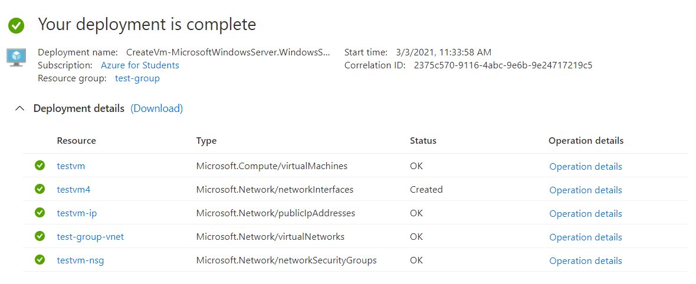

# #2 Azure Core Services - Azure Virtual Machines

### Virtual Machine Service

- Create Linux and Windows VMs in seconds
- Physical servers → Create VMs using Hyper-V or VMware (Manual)
- Azure → Don't worry about physical servers, only take care of VMs
- don't need to buy the physical server
- only pay for the running cost of the virtual server
- terminate virtual server at any point in time
- host different types of workloads

### Deploying a VM

- Resources deployed along a virtual machine
    - Virtual Network → VM resides inside the virtual network
    - OS Disks/Data disks
    - Virtual Network Interface Card assigned to VM
        - Private IP address/Public IP address
    - Network Security Group assigned to Network Interface Card

### Create a Windows Server VM using Azure (Demo) → EASY

- Standard D2s V3 - 2 CPUs, 8 GB memory
- RDP 3389 allow to traffic
- Add disks - choose required OS disk type, or add additional data disks
- VM needs to a part of virtual network → separate resource → created in the same region
    - Provides subnet + Public IP



- All resources created in deploying a VM


- Connect using RDP → Username + Password

### Azure Subscription → Usage + Quotas to see the limits for the subscription


### Generations in VMs Images

- Generation 1 - earlier machines
- Generation 2 - new machines → Improved boot architecture + improved boot time

[Azure support for generation 2 VMs - Azure Virtual Machines](https://docs.microsoft.com/en-us/azure/virtual-machines/generation-2)

- Install IIS on Windows Server VM → Server Manager

    

    

    - Access IIS from outside → Enable port 80 in NSG (Network Security Group) → Networking Tab

### Virtual Machine Types/Series

[Virtual Machine series | Microsoft Azure](https://azure.microsoft.com/en-us/pricing/details/virtual-machines/series/)

### Azure Pricing/Costing

[Pricing calculator | Microsoft Azure](https://azure.microsoft.com/en-au/pricing/calculator/)

- Cost Management → Cost Analysis
- Cost Management → Budget

### State of Virtual Machines

- Create VM → allocated OS disk - 127 GB, temporary disk - 4 GB
- Store data on data disk (not on temporary disk → since it gets deleted on stopping VM)
- Stop VM → Stop VM using portal or shutdown VM (difference!)
    - Portal shutdown → It can restart on the same physical server or different (no guarantee)
    - IP changes/lost when VM start/stop → Need static IP
    - VM shutdown → won't deallocate it from the physical server
- Private IP address → used for communicating within the azure network with other machines

- Create a Linux VM

    

    - Install nginx → hosted on port 80

    ```jsx
    sudo apt-get update
    sudo apt-get install nginx
    ```

    - Add port 80 in NSG (inbound rules)

    

### Azure Marketplace

[Microsoft Azure Marketplace](https://azuremarketplace.microsoft.com/en-us/marketplace/)

- Deploy wordpress → search for solution + deploy


### **Availability Sets**

- Set of VMs hosting the same application → load balancing
- 2 VMs hosted on the same physical server/rack and what if the server goes down, then application also goes down


- VM launched on the availability set → assigned to a fault domain
- Another VM launched → assigned to another fault domain
- It is our responsibility to assign VM to different availability set
- Update domains → update required on physical server then server needs to be restarted → VM goes down again
- Generally → Application is spread across fault domains and update domains for high availability
- Updates are done one at a time so that it is being server from other server
- **Create Availability Set**

    

    - There is no way to assign an existing VM to an availability set

    

    - If fault domain 0 goes down, then application can be served from fault domain 1
    - If there is any planned maintainence on the physical server, then if update domain 0 is being updated, then update domain 1 can be used to serve the application

- **Availability Set (EXTRA)**

    [Availability Set, Fault Domains And Update Domains In Azure Virtual Machine](https://www.c-sharpcorner.com/article/availability-set-fault-domains-and-update-domains-in-azure-virtual-machie/)

    - Availability Sets ensure that the Azure virtual machines are deployed across multiple isolated hardware nodes in a cluster.
    - By deploying your vms across multiple hardware nodes Azure ensures that if hardware or software failure happens within Azure, only a sub-set of your virtual machines are impacted and your overall solution is safe and in working condition.
    - Availability set provides redundancy for your virtual machines.
    - Availability set spreads your virtual machines across multiple fault domains and update domains.
    - If you want to leverage Microsoft’s 99.95% SLA from Microsoft you must place your VMs inside availability set except your VMs are having premium storage.
    - **Fault Domains**
        - Fault domains define the group of virtual machines that share a common power source and network switch.
        - Each and every fault domain contains some racks and each rack contains virtual machine.
        - Each of these Fault domain shares a power supply and a network switch.
        - If there is a failure in the fault domain then all the resources in the fault domain become unavailable.
        - You should place your VMs such a way that each fault domain get one web server, one database server and like that.
    - **Update Domains**
        - Virtual machines get update domains automatically once they are put inside availability set.
        - All virtual machines within that update domain will reboot together.
        - Update domains are used for patching of the virtual machines.
        - Only one update domain would be updated at the time

        

### Availability Zones

- more broader than Availability sets (around racks)
- Unique physical locations that are equipped with independent power, cooling and networking
- Normally 3 availability zones in a region


- More broad - availability across data center
- If entire data centre in zone 1 goes down, it can be accessed from other zones.
- SLA of 99.99% with two or more Availability Zone
- No additional cost for creating VMs with Availability Set/Zone
- Though Extra Cost for bandwidth communication across VMs in different zones - only for Availability Zones


- Multiple regions will generally have 3 different zones

- Availability Sets or Zones - Virtual Machine (Points to be noted)
    - We have to **manually** spin up new machines in different availability set or zone
    - We have to ensure that same application is deployed in all machines - won't be done automatically → Extensions for the VM can be used here

### **Azure dedicated hosts**

- VMs are created on a physical host in a data centre → This host can be shared across different users
- Entire physical host can be allocated → Azure dedicated hosts
    - No other customers can launch their own VMs now → It's specially used by one team/company
    - Underlying maintenance events can be controlled now → Important for large organizations
- Meant for large organizations - 96 vCPUs will be provided with the host family for example

- Workload
    - A unit of functionality - application or service
    - Example: Developed a web application and needs to be hosted → A workload

# Important Points (Provided)

**Virtual Machines**

Let's go through some important points when it comes the topics discussed in this section

**1. Choosing the size for the virtual machine** - Remember that the size of the virtual machine plays an important role in both the cost and performance you get for your virtual machine.

If you are looking at the Free services provided by Azure - [https://azure.microsoft.com/en-us/free/](https://azure.microsoft.com/en-us/free/)


Here you get 750 hours of compute ONLY free per month ONLY for the **B1S VM Size**

So if you look at the sizes for Azure virtual machines, this corresponds to just getting 1 vCPU and 1GiB of RAM which is quite less to hosting a workload on the server. Hence please keep this in mind. If you need better performance, you will have to choose a virtual machine size that is outside the boundaries of the Free service.


**2. Costing for a virtual machine** - Remember that costing for a virtual virtual machine depends on several factors, such as time as it runs for, the region used for hosting the virtual machine, the underlying operating system.

If you don't need the virtual machine running for a certain duration of time, you can always go ahead and stop the virtual machine. This will ensure you don't get charged for the compute cost of the virtual machine.


To ensure you don't get charged for the compute costs for the virtual machine, the virtual machine must be in the Stopped (deallocated) state.


Also keep a note that you will still be charged for other aspects of the virtual machine ( such as the disks attached to the virtual machine) , even if the virtual machine is stopped.


**Availability Sets**

When you host your virtual machines in Azure, you sometimes need to cater to the following

1. An unplanned event wherein the underlying infrastructure fails unexpectedly. The failures could be attributed to network failures , local disk failures or even rack failures.
2. Planned maintenance events , wherein Microsoft needs to make planned updates to the underlying physical environment. In such cases , a reboot might be required on your virtual machine.

You can increase the availability of your application by making use of availability sets. Each virtual machine that is assigned to the availability set is assigned a separate fault and update domain.

**Fault domains** are used to define the group of virtual machines that share a common source and network switch. You can have up to 3 fault domains.

**Update domains** are used to group virtual machines and physical hardware that can be rebooted at the same time. You can have up to 20 update domains.

If you deploy two or more virtual machines in an Availability set, you will get a guarantee of virtual machine connectivity to at least one virtual machine 99.95% of the time.

**Availability Zones**

1. This features help provides better availability for your application by protecting them from datacenter failures.

2. Each Availability zone is a unique physical location in an Azure region.

3. Each zone comprises of one or more data centers that has independent power, cooling, and networking

4. Hence the physical separation of the Availability Zones helps protect applications against data center failures

5. Using Availability Zones, you can be guaranteed an availability of 99.99% for your virtual machines. You need to ensure that you have 2 or more virtual machines running across multiple availability zones

An interesting fact - Does it cost more to use an Availability Zone. Well no, you don't get charged separately for the use of Availability Zones.

Below is an excerpt from the Microsoft documentation


Reference - [https://docs.microsoft.com/en-us/azure/availability-zones/az-overview](https://docs.microsoft.com/en-us/azure/availability-zones/az-overview)