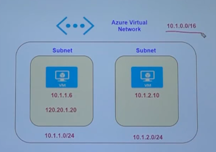

# #3 Azure Core Services - Networking

### **IP Addressing**

- For web browser to access the application → needs the IP address which is hosting the application

### **Azure Virtual Network**

- IP address range → 10.1.0.0/16
- **Subnets → logical separation of resources inside virtual network**
- Each of the subnets can have multiple VMs
- Private IP address → address picked up from the subnet range
- Public IP address → address signed from accessing from outside
- Database server → can be placed using private IP address and no public IP so it can be only accessed from inside
- Example of Virtual Network

    

    In this above example, we have a Virtual Network with IP address range 

    10.1.0.0/16 → [10.1.0.0 - 10.1.255.255] (CIDR Notation)

    Subnet 1 → 10.1.1.0/24 → [10.1.1.0 - 10.1.1.255]

    Subnet 2 → 10.1.2.0/24 → [10.1.2.0 - 10.1.2.255]

    VM inside Subnet 1 is assigned a private IP address → 10.1.1.6 and public IP address → 120.20.1.20

    VM inside Subnet 2 is assigned a private IP address → 10.1.2.10

- **Azure Virtual Network Demo**

    

    

    - Create VM in the same region and location as the Virtual Network (otherwise it won't be found)
    - You can choose your custom virtual network while creating a new VM

    

### **Communication across virtual machines in a virtual network**

- Add additional subnet for logical separation → choose virtual network + new subnet while creating new VM

    

- From Staging VM → access Demo VM IIS which is running → can be accessed using private IP address of other machine within the same virtual network

    

- Windows server by default allows port 80 → so it can be accessed across subnets
- If port is 8080 → then it needs to be allowed using Windows Firewall → for accessing across subnets
- Architecture example

    

    - default subnet VM → can access VM inside SubnetA using **private IP** → internal communication
    - access default subnet VM from production network → port should be allowed in NSG
    - communication across virtual network is not enabled by default → virtual network peering is required

### **Network Security Groups (NSG)**

- Used to control the traffic that flows in and out of virtual machine
- gets attached to the network interface that is attached to your VM
- can be attached to either to network interface or linked to the entire subnet → entire subnet means it will affect to all the VMs inside the subnet
- consists of inbound and outbound security rules
    - Inbound → control the flow of traffic which flows in the VM
    - Outbound → control the flow of traffic which flows out of the VM
- Information required to add a rule
    - Priority
    - Port Number
    - Protocol - TCP/UDP/Any
    - Source and Destination → Source maybe IP address of your computer or anywhere, Destination could be VM, entire Virtual Network
- Default NSG example → can't delete or change these rules

    

    - AllowVnetInBound → Allows traffic across all VMs inside the virtual network
    - AllowAzureLoadBalancerInBound
    - DenyAllInBound → Any other traffic is denied (can't be removed → so you need to add a rule with less priority)
- Adding a machine with specific IP address → In CIDR notation x.x.x.x/32
- Destination can be set to Virtual Network for more tight security

    

- **Less priority → Means higher preference !!!**
- Rules are evaluated step by step in increasing order of priority
- Outbound port rule → AllowInternetOutBound → enabled → so VM can access the internet from inside
- If you have an outbound port rule that disables the AllowInternetOutBound and you have an inbound port rule that allows traffic on port 80, will you still able to access application from outside? → **!! YES !!** (rules are evaluated in isolation to inbound and outbound)

### **Application Security Groups**

- Applied with the help of network security groups
- Control traffic on web servers and database servers differently → within the same subnet (without creating separate subnets)
- Create application security groups → assign web servers and database servers on different application security groups
- Logical grouping for applications

### **Network connectivity options**

- Virtual Network Peering
    - Used to connect two virtual networks together → since each virtual network is isolated
    - Establish communication using private IP
    - Create virtual network peering connection → so that two virtual networks can communicate using private IPs

        

- Point-to-Site VPN Connection
    - This connection happens over the internet
    - Rather than connecting VMs using Public IP → access VMs using private IP addresses
    - Client workstations using VPN gateway can access VMs using private IP address → Point-to-Site VPN connection
    - VPN gateaway resource needs to be deployed in Azure → can be configured

- Site-to-Site VPN Connection
    - Entire data center needs to connect the virtual network using private IP address
    - Data center needs a routing device → provide public IP address
    - Azure VPN gateway + Local network gateway resource required → configured
    - Secure → since network is not exposed using public IP addresses

    

### **Azure ExpressRoute**

- Stable connection on to Azure → Create ExpressRoute Circuit
- Traffic flows via Microsoft Backbone network → not usual internet backbone
- Bandwidth not limited → performance + availability improved
- ExpressRoute Circuit → can connect to Azure Virtual Network + Office + databases
- Direct connectivity to Azure itself
- Choose a connectivity provider
- Different billing options

# Important Points (Provided)

Let's go through some important points when it comes the topics discussed in this section

**Azure Virtual Network**

The Azure Virtual Network service is used to define an isolated network in Azure. The virtual network can then be used to host your resources such as Azure virtual machines.

The Azure virtual network gets assigned an address space which you specify when you create an Azure virtual network

You can then add subnets to your Azure virtual network. This helps divide your network into more logical segments.

An example is shown below of having multiple subnets. You could have one subnet named SubnetA in the virtual network to host your Web servers and another subnet to host the Database servers.

When you create a virtual machine in a virtual network, the virtual machine gets a Private IP address from the address space of the subnet is it launched in.

**Network Security Groups**

These are used to filter network traffic to and from Azure resources in an Azure virtual network.

A network security group is attached to the network interface attached to the virtual machine.

- A network security group consists of Inbound rules that are used to control the traffic inbound into a virtual machine
- By default all traffic into a virtual machine is DENIED.
- You have explicitly add rules to allow traffic into a virtual machine
- There are also outbound rules to control the traffic flowing out of the virtual machine. By default all traffic outbound onto the Internet is allowed.
- 

**Virtual Network Peering**

- Virtual Network Peering is used to connect two Azure virtual networks together via the backbone network.
- Azure supports connecting two virtual networks located in the same region or networks located across regions.
- Once you enable virtual network peering between two virtual networks, the virtual machines can then communicate via their private IP addresses across the peering connection.
- You can also peer virtual networks that are located across different subscriptions.
- The virtual networks can't have overlapping CIDR blocks.
- 

**Point-to-Site VPN Connection**

A Point-to-Site VPN connection is used to establish a secure connection between multiple client machines in an Azure virtual network via the Internet.

Below is a diagram from the Microsoft documentation on a sample scenario

Image reference -[https://docs.microsoft.com/en-us/azure/vpn-gateway/vpn-gateway-howto-point-to-site-resource-manager-portal](https://docs.microsoft.com/en-us/azure/vpn-gateway/vpn-gateway-howto-point-to-site-resource-manager-portal)

To implement a Point to Site VPN connection, you need to create a VPN Gateway in Azure.

**Site-to-Site VPN Connection**

A Site-to-Site VPN connection is used to establish a secure connection between an on-premise network and an Azure network via the Internet.

Below is a diagram from the Microsoft documentation on a sample scenario

Image reference - [https://docs.microsoft.com/en-us/azure/vpn-gateway/vpn-gateway-howto-site-to-site-resource-manager-portal](https://docs.microsoft.com/en-us/azure/vpn-gateway/vpn-gateway-howto-site-to-site-resource-manager-portal)

- On the on-premise side, you need to have a VPN device that can route traffic via the Internet onto the VPN gateway in Azure. The VPN device can be a hardware device like a Cisco router or a software device ( e.g Windows Server 2016 running Routing and Remote services). The VPN device needs to have a publically routable IP address.
- The subnets in your on-premise network must not overlap with the subnets in your Azure virtual network
- The Site-to-Site VPN connection uses an IPSec tunnel to encrypt the traffic.
- The VPN gateway resource you create in Azure is used to route encrypted traffic between your on-premise data center and your Azure virtual network.