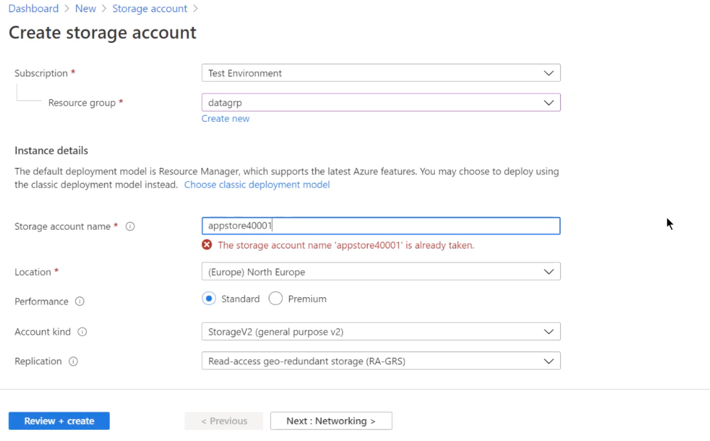

# #4 Azure Core Services - Azure Storage

### **Introduction to Azure Storage**

- Storage Accounts
    - blob service → used for object level storage → can be used to store images, videos and other data
    - Storing videos to VM → if VM goes down, data is deleted
    - Application can store videos to blob storage using the blob services
    - Service of storage account → highly reliable, **scalable**, flexible

---

### **Azure Storage Accounts - Service types**

- Blob storage → object level storage → also used for storing disk files + VM → stored as VHD
- Table storage → relational table-like data
- File storage → file shares in your storage account → can be accessed by different VMs → using SMBs
- Queue storage → component sending message to another component → can write message to a queue and it can be picked by other component

---

### **Creating a storage account**

- Unique storage account name required → same as bucket name
- General Purpose v2 → gets all services (blob + table + file + queue)

    

- Public endpoint → for availability from outside

    

- All features available with the storage account → containers + file + tables + queues

    

---

### **!!** **More on storage accounts !!**

- **Types of storage accounts**
    - General purpose v2 → blob, file, queue and table services
    - General purpose v1 → same as above but older version (not latest features)
    - BlockBlobStorage accounts → specifically used for premium performance for storing block or append blobs
    - FileStorage accounts → permium performance for file-only storage
    - BlobStorage accounts → legacy storage account
- **Azure Blob Storage**
    - Object storage for cloud
    - massive amount of unstructured data storage
    - highly recommended for storing images, documents, video and audio files
    - **Within blob service → need to create a container → store the blob objects**
    - 3 different types of blobs:
        - Block blobs → storing text and binary data
        - Append blobs → logging data
        - Page blobs → store virtual hard disk files for Azure VMs
- **Replication**
    - For high availability
    - Replication Techniques:
        - Locally-Redundant Storage (LRS) → data is replicated **synchronously** *three times* within a physical location → in the primary region
        - Zone-Redundant Storage (ZRS) → data is replicated **synchronously** across three Azure availability zones → in the primary region. If entire data center goes down → then still it is available
        - Geo-Redundant Storage (GRS) → data is replicated **synchronously** three times in the primary region → then replicated asynchronously to the secondary region.
            - Used especially for disaster recovery scenarios.
            - Data in the secondary region only available if primary region goes down
        - Read access Geo-Redundant Storage (RA-GRS) → data is replicated **synchronously** three times in the primary region → then replicated **asynchronously** to the secondary region
            - Data in the secondary region is also avaliable for read-only purposes
        - Geo-zone-redundant Storage (GZRS) → data is replicated **synchronously** across three Azure availability zones → in the primary region → then replicated **asynchronously** to the secondary region
        - Read Access Geo-zone-redundant storage (RA-GZRS) → data is replicated **synchronously** across three Azure availability zones → in the primary region → then replicated **asynchronously** to the secondary region → data in the secondary region is also available for read-only purposes.
    - Higher availability → higher replication → more cost
    - Redundancy options → depending upon the account type

    

- **Access tiers**
    - Hot → optimized for storing data that is accessed frequently → **set at the account level**
    - Cool → optimized for storing data that is accessed infrequently → stored for atleast 30 days → **can be set at the account level**
        - storage costs are lower for cool access tiers than hot access tiers
    - Archive tier → optimized for storing data that is rarely accessed and stored for at least 180 days → **can only be set at the blob level**
        - **You can't access the blob in the archive tier → rehydrate the blob before it can be accessed**
        - storage costs are least for Archive access tier → access costs are the highest

---

### **Working with BLOB service (Lab)**

- Create a container for your objects → name + public access level

    

- Upload blob → any file can be uploaded
- Text based files can be edited and content can be changed
- Every object in the blob service is given its own
- **blob url pattern → <storage account name>.blob.core.windows.net/<container name>/<file name>**


- In the above URL → says resource not found → since public access level is set to private (no anonymous access)
- Several ways to authorize the resource for accessibility
- No need to worry about storage space → automatically the blob storage will scale depending upon the requirement

---

### **Storage Accounts - Access Tiers (Lab)**

- By default → files are set with Hot Access tier → data will be accessed frequently


- Objects can be set access tier using configuration of storage account


- Storage costs of cool tier < storage costs of hot tier
- Storage access costs of cool tier > storage access costs of hot tier
- Tier can also be changed at the object level → provided with an extra option of Archive tier


- Storage cost of object in Archive tier < Storage cost of object in Cool tier
- Once object is set to archive → cannot be accessed directly
    - For accessing the archive object again → you can use change tier → but it will rehydrate the blob from Archive to Hot or Cool **(time consuming)**

    

---

### **Azure File Shares (File Storage)**

- Users logging into workstation → create file shares for each user → save data in the cloud
- Storage can be accessed via SMB (Server Message Block)
- No need to maintain the physical server
- No need to maintain the storage
- Save costs → related to networking
- Create File Share Example


- Quota → for controlling the file share size
- Premium tiers allowed if storage account is created on Premium tier
- Example → Storage Account created with Premium performance → for better performance in accessing file shares

    

- Transaction optimized → for better performance when files are accessed very frequently
- In File share → you are charged for storage + access tier (both)
- Cost of accessing the file in cool access tier is higher than hot access tier
- How it is different to blob storage?
    - You can create directories → upload file
    - Instead of every file accessed via url → file can be accessed by connecting to file share

        

    - Paste command to PowerShell
    - This will connect file share to Z: drive

        

    - Using shell → files can be accessed + created → that will be stored in FileShare

        

    - If you are not able to connect to file share → maybe firewall blocking port 445

---

### **Azure Queue Storage**

- Why Queue Storage?
    - Videos are stored in a container → application which pick up videos from one container and process it and then store in another container
    - As soon as new video is added in the container → it can posted in a queue with URL which application can pick for processing
    - Queues can be used to decouple the components of entire system

    

    - Create a queue using storage account and add message to it in JSON format

    

    - Generally done by application to send messages to queue and read it whenever required by dequeue.

---

### **Azure Table Storage**

- can be used to store large amount of structure NoSQL data in the cloud
- key/attribute store → does not conform to any schema
- can store data sets for your application → user data, device information
- don't use table service for → complex joins, foreign keys, or stored procedures
- Create table → add data using Azure Storage Explorer


Table entities represent the units of data that are stored in a table. Table entities are similar to rows in a typical relational database table. Each entity defines a collection of properties. Each property is defined as a key/value pair by its name, value, and the value's data type. Entities must define the following three system properties as part of the property collection:

- **PartitionKey**: The **PartitionKey** property stores string values that identify the partition that an entity belongs to. Entities that have the same **PartitionKey** value are stored in the same partition.
- **RowKey**: The **RowKey** property stores string values that uniquely identify entities within each partition. The **PartitionKey** and the **RowKey** together form the primary key for the entity.
- **Timestamp**: The **Timestamp** property provides traceability for an entity. A timestamp is a date/time value that tells you the last time the entity was modified. A timestamp is sometimes referred to as the entity's *version*. Modifications to timestamps are ignored because the table service maintains the value for this property during all insert and update operations.


To better illustrate the concept of partitioning, the following figure shows a table that contains a small subset of data for foot race event registrations. The figure presents a conceptual view of partitioning where the **PartitionKey** contains three different values: the event's name combined with three distances (full marathon, half marathon, and 10 km). This example uses two partition servers. Server A contains registrations for the half-marathon and 10-km distances. Server B contains only the full-marathon distances. The **RowKey** values are shown to provide context, but the values aren't meaningful for this example.


- Entity Example → extra properties can be added


[Design a scalable partitioning strategy for Azure Table storage (REST API) - Azure Storage](https://docs.microsoft.com/en-us/rest/api/storageservices/designing-a-scalable-partitioning-strategy-for-azure-table-storage#uyi)

---

### **Paired Regions**

- RA-GRS → needs to replicate data on another location
- We don't have the ability to decide what is the secondary region for this replication → Predefined by Azure

    

---

- **Azure Blob Development using Visual Studio**
    - Upload simple text file into Azure Blob Container Storage

    ```csharp
    using Azure.Storage.Blobs;
    using System;
    using System.IO;
    using System.Threading.Tasks;

    namespace BlobProject
    {
        class Program
        {
            static string ConnectionString = "DefaultEndpointsProtocol=https;AccountName=xxxxxx;AccountKey=+tu66dy9/qU+mri9UzugKUTLDd9HYqeWHXvdSQzTlZZQsJpv7OWkvwKHoBFfscqIliZ8qKC2bEEfqeF8vT8Hkw==;EndpointSuffix=core.windows.net";
            static async Task Main(string[] args)
            {
                BlobServiceClient blobServiceClient = new BlobServiceClient(ConnectionString);
                BlobContainerClient blobContainerClient = blobServiceClient.GetBlobContainerClient("testcontainer");

                BlobClient blobClient = blobContainerClient.GetBlobClient("sample.txt");
                using FileStream uploadFileStream = File.OpenRead("C:\\tmp\\sample.txt");
                await blobClient.UploadAsync(uploadFileStream, true);
                uploadFileStream.Close();

                Console.WriteLine("File Uploaded");
                Console.WriteLine("Operation Completed");
            }
        }
    }
    ```

---

### **Azure Development with Queue Service**

- Send & Recieve message to and from a queue

```csharp
using Azure.Storage.Queues;
using Azure.Storage.Queues.Models;
using System;
using System.Threading.Tasks;

namespace SendMessage
{
    class Program
    {
        static string ConnectionString = "DefaultEndpointsProtocol=https;AccountName=testcreedstorage;AccountKey=+tu66dy9/qU+mri9UzugKUTLDd9HYqeWHXvdSQzTlZZQsJpv7OWkvwKHoBFfscqIliZ8qKC2bEEfqeF8vT8Hkw==;EndpointSuffix=core.windows.net";
       
        static async Task Main(string[] args)
        {
            // send message
            QueueClient queueClient = new QueueClient(ConnectionString, "testqueue");
            queueClient.SendMessage("This is a test message");
            Console.WriteLine("Message sent to queue");

            // receive message
            QueueMessage message = queueClient.ReceiveMessage();
            Console.WriteLine(message.Body);
        }
    }
```

---

### **Azure SQL Databases**

- Host SQL Server on Azure
    - Infrastructure as a Service → Install VM and host SQL on top of it
    - Platform as a Service → Azure SQL database
        - You don't need to worry about managing VM machines
        - Backup/Patching is also not considered
    - Single database
    - Managed Instance → Use most compatible version of SQL server
    - Elastic Pool → Combine multiple databases to use shared pool
- Azure SQL Server Service
    - IaaS advantages
        - Full control over SQL engine
        - easy to migrate from an on-premise instance → own database version
        - private IP addressing via the virtual network
        - But,
            - have to manage underlying VM
            - have to manage the SQL instance
            - implement own high availability solution
            - manage the backups
    - PaaS advantages
        - 99.99% availabilty guaranteed
        - features → built-in backups, patching + recovery
        - built-in advanced intelligence and security
        - But,
            - migration from existing on-premise instance might be difficult
            - Some sql features may not be available
            - No concept of private IP addressing → no managing firewalls
        - Purchasing Models
            - DTU → Database transaction Unit
                - Blended measure of CPU, memory and read-write rates → charged together rather than separately
                - different service tiers
                - Each service tiers → different features + different pricing

                

            - vCore-based
                - Independently scale the compute and storage
                - choose different service tiers
                - replica's for high availability
                - make use of Azure hybrid benefit
                - save on costs → if you have existing SQL server
            - Managed Instance Offer
                - New deployment model → allows for easy migration of existing on-premise SQL server databases
                - 100% compatability → lates SQL server on-premises (EE) database engine
                - provides a native virtual network implementation
                - no management of infrastucture
    - Azure SQL database (LAB)
        - Provision a Azure SQL database

            

        - Database will be hosted on a server → managed by Azure
        - Server name can be hosted by providing unique server name with admin login and password (For SSMS access)
        - Want to use SQL elastic pool? → No/Yes
        - Default → Gen5 → 2 vCores + 32 GB
        - DTU-based → Drastic change in cost → good for demo purposes

            

        - vCores-based → more costly → suitable for production environments

            

        - Connectivity Methods

            

            - 
        - Additional settings → Backup database or sample database can be used
        - It will create 2 resources → SQL server + SQL database

            

        - Connect via SSMS → need server name + login details
        - Connect for another workstation → set server firewall and add another client IP

        

    - Inline SQL Query Editor

        

        

    - SQL Database - IaaS vs PaaS

        

    - Azure SQL Managed Instance
        - fully managed + scalable cloud database service
        - 100% compatible with all features of latest SQL
        - option to shift their existing SQL server → Azure
        - native implementation with Azure Virtual Network
        - All features of managed service

            

    - Azure Database for MySQL
        - fully managed database service
        - underlying platform → managed by Azure
        - Backups + Patching + High availability

            

        - Pricing Tiers

            

        - Admin username + password → logging in using MySQL workbench
        - Connection security → add client IP address

    - Azure Database for PostgreSQL
        - free + open-source
        - supports ACID → views/foreign keys
        - backup + patching + high availability

            

        - PostgreSQL → Azure Data Studio → supports all platforms
        - Connection security → Add client IP address on to the firewall for accessing database

            

---

### **SQL Data Warehouse (Azure Synapse)**

- Data can come from multiple sources → data needs to be collected for performing analysis
- Data Injestion layer → injesting raw data
- Prepare and train your data → convert unstructured to structured data
- Store unstructured data to Azure Data Lake Storage
- Structure data after transformation can be stored in Data warehouse
- Data warehouse can be used to perform analytics using PowerBI
- **LAB → Azure Synapse**
    - Resource → Azure Synapse Analytics
    - Workspace name → collection of assets for data warehouse
    - Synapse requires Azure data lake storage for storing its metadata

        

    - SQL administrator credentials can be provided in Security
    - Allow connections from all IP addresses
    - Synapse → SQL pools → serverless pool can be used by default
    - If you want to store tables that will persist in data warehouse → Create dedicated SQL pool
    - Minimum cost of dedicated SQL pool is 1.51 USD/hour

        

    - You can now take dedicated SQL end point
    - SSMS can now be used using the server name → xxx....synapse.net
    - Looks very similar to Azure SQL database → but here SQL data warehouse is being used

        

    - Transfer data from Azure SQL Database to Synapse Dedicated SQL pool
        - If data moves from 1 region to another → need to pay for data transfer
        - Allow SQL services to access SQL database → marked as Yes
        - Create resource → **Azure Data Factory** → ETL tool

            

            - Configure git later → Create Resource
            - SQL database → xxx..database.windows.net vs SQL data warehouse → xxxx..sql.azuresynapse.net
            - Azure Data Factory → copy SalesOrderDetail into SQL data warehouse
            - Use Author & Monitor → log you in to Data Factory

                

            - Copy data tool → task name (pipeline flow)
                - Specify source data store
                - Supports a lot of services to take data from/n

                

                - Choose Azure SQL database → choose dataset

                    

                - Specify destination data store → Create connection by using new linked service → Azure Synapse Analytics
                - Automatic table mapping

                    

                - Copy method → Bulk insert
                - Create pipeline → Create datasets → Execute pipeline
                - Monitor → pipelines

                    

        - **Azure Synapse + Power BI**
            - Once data is in the warehouse → Power BI can be used to create reports
            - Use power BI desktop → get data → Choose Azure → Azure Synapse

                

            - You can load the table → will detect fields for building visualizations
            - Create visualizations → drag and drop

                

---

### **Azure Data Lake Storage**

- Act as a repository for large quantities of raw data
- data can processed later on → convert to a structured format
- structured data can then be sent onto a data warehouse
- Create simple storage account with data lake storage enabled

    

- 
- Now storage account → with data lake storage enabled
- Now containers with blob storage with support hierarchies
- Microsoft Azure Storage Explorer Tool → blob containers can be viewed
- Individual permissions can be given

    

- Access control enabled for underlying files and folders

---

### **Azure CosmosDB Service → NoSQL Data Store**

- Multi-model database → support for multiple APIs
    - JSON based documents → Core(SQL)
    - Table-like data → Azure Table
    - MongoDB, Cassandra, Gremlin(graph) API
- You can specify the API when creating the account → to define what kind of data can be stored in the CosmosDB account
- Single digit millisecond data access (FAST)
- Globally distributed
    - Multi-region accounts can be enabled
    - Data can be replicated to another regions → needs to be enabled
    - Benefit? → Application where User across the world is accessing the application → data can be brought more closer to the user due to replication + availability if one region goes down
    - Costing needs to be considered
    - High availability → more cost
- 99.999% high avail
- 10-ms latencies for both read (indexed) and writes
- Every partition of data → protected by replica-sets
- Charged on the number of request units + storage consumed
- Request Unit → % Memory + % CPU + % IOPS
- This service is completely serverless → no deployment of physical server is required
- RU is consumed whenever Read, Insert, Upsert, Delete, or Query operation
- Assign RU at the database or container level
- RU are allocated in each region
- **Cosmos DB LAB**
    - Create Azure Cosmos DB Account

        

    - Choose API based on the requirement → Core (SQL)
    - Capacity mode → Provisoned throughput → charged on the basis of Request Units (RU)
    - Free tier → 400 RU/s and 5 GB storage
    - Account → Data Explorer
        - Create database + Create Container → Customer for storing customer info

            

        - Customer → Partition key → better performance for query the container → /customerid → Partition all data based on customer ID
        - Core (SQL) → JSON-based documents → Add items (NoSQL data store)

            

        - New SQL query → can work here!!
    - Azure SQL Database vs Cosmos DB
        - JSON-store + unstructured data → Cosmos DB
        - Structured data + foreign keys + joins requirement → Azure SQL database
        - On-premise MongoDB → Cosmos DB

---

### **Azure Databricks**

- Fully managed, cloud-based platform → Big Data + Machine Learning
- tool → analyze your data
- Based on **Apache Spark**
- Spark → processing engine → analyze big data using SQL
- managed version of databricks
- Create Databricks resource → workspace

    

- Launch workspace
- Create a new cluster → processing data → Uses Spark runtime version backend

    

- Upload CSV file → store in blob container in storage account
- Using cluster → display content of this file
- Create new notebook → with language python → uses the underlying cluster

    

- Read the file and display it → will execute on Apache Spark Cluster → provisoned by Azure Databricks

```python
blob_account_name = "appstore4000011"
accountkey="W2ucVHdKQn4RZwqBu+H9TKa0bnpYK00BINXOwnviJZXNzwHa9Df7R7TuJ09Vcmznpu9EYclJbEX6eO50pkpdYQ=="
 
wasbs_path = "wasbs://data@appstore4000011.blob.core.windows.net"
fullname = "fs.azure.account.key." +blob_account_name+ ".blob.core.windows.net"
 
 
dbutils.fs.mount(
  source = wasbs_path,
  mount_point ="/mnt/data2",
  extra_configs = {fullname : accountkey})
 
 
ds = spark.read.csv("/mnt/data2/customer.csv")
 
display(ds)
```

# Important Points (Provided)

Let's go through some important points when it comes the topics discussed in this section

**Azure Storage Accounts**

Types of storage accounts

- **General-purpose v2 accounts** – This is recommended for most scenarios. This storage account type provides the blob, file , queue and table service.
- **General-purpose v1 accounts** – This also provides the blob, file , queue and table service, but is the older version of this account type.
- **BlockBlobStorage accounts** – This is specifically when you want premium performance for storing block or append blobs.
- **FileStorage accounts** – This is specifically when you want premium performance for file-only storage.
- **BlobStorage accounts** – This is a legacy storage account. Use General-purpose v2 account as much as possible.

The most common type of storage account is the General Purpose v2 storage account.

Use case scenarios for the different services in a General Purpose v2 storage account

**Blob service**

- This is object storage for the cloud.
- Here you can store massive amounts of unstructured data on the cloud.
- This is highly recommended when you want to store images, documents, video and audio files.
- Within the blob service, you create a container that is used to store the blob objects.

There are three different types of blobs

**Block blobs** – This is used for storing text and binary data.

**Append blobs** – This is ideal for logging data.

**Page blobs** – This is used to store virtual hard disk files for Azure virtual machines.


To use the Blob service you have to first create a container and then upload the blobs or objects into the container.


When you upload an object or blob to the service, each bob gets a unique URL which you can access if you are assigned the right permissions


**File service** - Use this service if you need to store files that need to be accessed by machines using the SMB (Server Message Block) protocol

In the File service, you can first go ahead and create a file share.

You can then mount this file share from different machines. You can't mount drives with the Blob service.


**Table service** - Use this if you want to store NoSQL data or table like data.

It's easy and simple to create a table and add data from the Azure portal itself.


**Queue service** - Use this if you want to exchange messages between components of your application


**Azure Storage Accounts - Replication**

There are different replication techniques available to make your data highly available.

The different replication techniques available

1. *Locally-redundant storage (LRS)* Here data is replicated synchronously three times within a physical location in the primary region.
2. *Zone-redundant storage (ZRS)* Here data is replicated synchronously across three Azure availability zones in the primary region. This is good when you want to have data present even in the event of a data center failure.
3. *Geo-redundant storage (GRS)* Here data is replicated synchronously three times in the primary region, then replicated asynchronously to the secondary region.
4. *Read access Geo-redundant storage (RA-GRS)* Here data is replicated synchronously three times in the primary region, then replicated asynchronously to the secondary region. Here the data in the secondary region is also available for read-only purposes.

**Azure Storage Accounts - Access tiers**

Access tiers help you optimize the storage costs and access costs for your data. The different access tiers are

**1. Hot** – This is optimized for storing data that is accessed frequently. This can be set at the account level.

**2. Cool** – This is optimized for storing data that is infrequently accessed and stored for at least 30 days. This can be set at the account level.

**Note:- For the Cool Access tier , the storage costs are lower than the Hot tier. But the access costs are higher than the Hot access tier.**

**3. Archive tier** - This is optimized for storing data that is rarely accessed and stored for at least 180 days. This can be set only at the blob level.

**Note:- When a blob is in the archive tier, you can’t access the blob. You have to rehydrate the blob first before it can be accessed.**

**Also the storage costs are the least when it comes to the Archive access tier. But the access costs are the highest.**

**Azure SQL Database (Platform as a service)**

This is a service that allows you to create a managed Microsoft SQL Server database on the cloud. The advantages of using this service

1. You don't have to manage the underlying infrastructure. This is managed by Azure.
2. You have a variety of purchasing options
3. You have automated backups. This reduces the burden of managing backups.
4. It gives you a service level agreement of 99.99%

If you need to have more control over the database engine, then consider installing the SQL Server engine on an Azure virtual machine.

**Azure Synapse Analytics**

This was formerly known as Azure SQL Data warehouse.

This service is used for enterprise data warehousing and Big Data Analytics

When you want to perform analysis on a large data set , consider using this service.

Below is a snapshot from the Microsoft documentation on where this tool fits in the picture of Big Data


**Azure Cosmos DB**

This is a data store that companies can opt for , when they want to get low latency access to their data and they want high availability for their data.

It is a multi-model database. This means you can choose from a variety of options when it comes to what type of data you want to store in the account.

