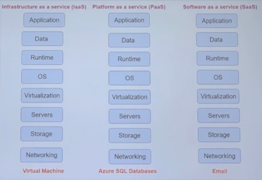

# #5 Understanding Cloud Concepts

### **Benefits of the cloud - High Availability**

- Services → concept of High Availability
- Storage accounts → Replication options
    - 3 copies of data in Azure Data Center → Locally Redundant Storage
    - Another option → Geo redundant storage → data copied to different storage clusters
- Application availability is also available

### **Benefits of the cloud - Scalability**

- Azure Blob Storage → No storage requirement → Keep on uploading data
    - This service will automatically scale → both in Compute + Storage
    - Almost unlimited storage
- Scale application → Virtual Machine ScaleSet
    - Load on the application increases → CPU >80%
        - With ScaleSet → More VMs can be added to the environment so that load gets distributed

### **Benefits of the cloud - Disaster Recovery**

- Example → Hosting application in Central US → all services in the region goes down
    - Option 1 → VMs available in another region → techniques to migrate data and app to another region
    - If entire region goes down → Disaster Recovery Scenario
    - Replication option available → replicated across different regions → Paying more now

### **Benefits of the cloud - Elasticity**

- How systems can adapt to workload - by scaling and descaling based on the load
- CPU% is going beyond some threshold → upscaling required
    - Quick way → **Resize** the VM to add more CPUs and Memory → option available

### **Benefits of the cloud - Fault Tolerance**

- How tolerant is your application/system is to fault?
- Published new version and application broke → How well your application can recover?
- Faults can happen at infra level also → VM goes down
- VM service → Have a good SLA
- VMs → make use of Availability Zones/Availability Sets → makes VM fault tolerant (Features)

### **Cloud Service Models**

- IaaS vs PaaS vs SaaS

    

- IaaS → Virtualization + Servers + Storage + Networking (Managed by Azure)
    - Other components managed by User
    - Azure Virtual Machine Service
    - Physical Servers + Storage → managed by Azure
    - SLA (Service Level Agreement) provided
    - Scale based on demand provided
- PaaS → Runtime + OS  (Also managed by Azure)
    - Take care → Application + Data
    - Azure SQL database service or Azure Web App Service
    - No need to manage OS and Runtime
    - Data can be hosted + Application
    - Azure CosmosDB, MySQL, PostgreSQL
    - Pay-as-you-go model
- SaaS → Everything managed by Cloud → Gmail
    - Office 365
    - No need to manage anything
    - Directly use the application on Internet

### **Cloud model types**

- Public cloud → available through the internet to user
    - Azure, AWS, GCP
    - Data → stored in somebody's else platform
    - available to anybody who want to use → pay what you use
    - Servers + Storage managed by the cloud provider
    - No need for capital investment → pay-as-you-go model
    - don't need to manage underlying physical infra
    - data centers located at different regions
    - quickly provision resources on the cloud
- Private cloud → create services for user in their own organisation
    - Companies can implement their own security protocols → improved security
    - Data → located only in the private cloud → cannot be exposed
    - hosted on-premise or 3rd-party provided
    - complete contrl over the environment
    - Data help in the environment → complete control by the business
- Hybrid cloud → private + public cloud
    - allows data + application → shared
    - businesses can leverage their existing on-premise environment
    - data can be made more secure
    - functionalities can be extended using public cloud environment
    - move workloads to the cloud gradually

### **Economies of scale**

- Ability of carrying out tasks more efficiently or at a lower-cost per unit → operating at a larger scale
- Cloud providers buy the hardware at discount → pass the costs to customers
- If number of customers increase → chances of service costs can go down
- Capital Expenditure → spending of money on physical infra upfront
    - Server costs
    - Storage costs
    - Network costs
    - Backup and archive costs
    - Datacenter infrastructure costs
    - Buy software licenses
- Operational Expenditure
    - ongoing money spent for services and products
    - recurring cost
    - yearly support agreement with vendors → need to renewed
    - keep hardware running → electricity, cooling, etc

### **Shared Responsibility Model**

[https://docs.microsoft.com/en-us/azure/security/fundamentals/shared-responsibility](https://docs.microsoft.com/en-us/azure/security/fundamentals/shared-responsibility)

- As you consider and evaluate public cloud services, it’s critical to understand the shared responsibility model and which security tasks are handled by the cloud provider and which tasks are handled by you. The workload responsibilities vary depending on whether the workload is hosted on Software as a Service (SaaS), Platform as a Service (PaaS), Infrastructure as a Service (IaaS), or in an on-premises datacenter.

    

    For all cloud deployment types, you own your data and identities. You are responsible for protecting the security of your data and identities, on-premises resources, and the cloud components you control (which varies by service type).

    Regardless of the type of deployment, the following responsibilities are always retained by you:

    - Data
    - Endpoints
    - Account
    - Access management

# Important Points (Provided)

Let's go through some important points when it comes the topics discussed in this section

**High Availability**

This refers to technologies that can be used to minimize IT disruptions by ensuring applications and infrastructure is made fault-tolerant.

Let's say that you had the following architecture for your application. Your application is hosted on a single virtual machine.

What happens if the virtual machine goes down for any reason, your application would not be available.

To make your application more redundant and more tolerant to failures, why not host your application on a collection of servers

Here even if one machine were to go down , you would still have the other one available. This makes your application more tolerant to infrastructure level failures.

You can also increase the availability for your virtual machines by distributing them across **Availability Zones** or **Availability Sets**.

**Disaster Recovery**

This refers to the concept of minimizing IT disruptions by recovering them to another data center that could be located hundreds to miles away from the original data center hosting your application.

The following architecture diagram is an example of implementing disaster recovery

Here your application is running on virtual machines in the West US region. Here the users are accessing your application.

At the same time, you might have the application hosted in another region (East US). The application might be in a shutdown state. This is only meant to be running if the primary region goes down for any reason.

Not lets say there is a disaster in the West US region and all the data centers go down.

To minimize any disruption to your users , the requests to the application could now be redirected to the application in the East US region. So now you would start the application here and make sure all requests are routed to the secondary region.

**Elasticity**

Elasticity refers to the concept of how flexible your architecture can scale based on demand.

For virtual machines , you can increase or decrease the size of the virtual machine at any point in time.

**Cloud Service Model**

The different cloud service models

**Infrastructure as a service (IaaS)**

- An example is the Azure virtual machine service.
- Here you don’t need to manage the underlying infrastructure.
- The physical servers and storage is managed for you.
- This helps remove the capital expense and reduces ongoing cost.
- The Virtual Machine also has an SLA. To achieve that SLA for any on-premise server would require a lot of work.
- Infrastructure cloud services also allow you to scale based on demand.

**Platform as a service**

- An example is the Azure SQL Database service or the Azure Web App service.
- Here you don’t need to manage the infrastructure or even the underlying operating system and platform components.
- You can just start hosting your data or your web application.
- Reduces development time.
- You can use an array of database technologies available in the case of Azure.
- All of these services use a Pay-as-you-go model.

**Software as a service**

- An example is Microsoft Office 365.
- Here you don’t need to manage the infrastructure or even the underlying operating system, platform components or even the software.
- Here you just start directly using the software.
- You can access your application data from anywhere.
- You don’t have the headache of managing anything.

**Cloud Models**

**Public Cloud**

- These are services that are offered over the public internet.
- It’s available to anybody who wants to use them. Users then pay based on service they use.
- Here all the servers and storage is managed by the cloud provider

**Advantages of the Public Cloud**

- No need for a capital investment – You normally don’t pay any money upfront to use a cloud service. Most of the services are based on a pay-as-you-go model.
- You don’t need to manage the underlying physical infrastructure. Hence on-going maintenance costs are also reduced.
- Cloud providers such as Azure have data centers located at different regions across the world.
- You can quickly provision resources on the cloud. It allows you to get up and running in no time.

**Private Cloud**

- These are set of services that are normally only used by users of a business or organization.
- The private cloud could be hosted either on the company’s on-premise environment. Or it could be provided by a third-party service provider.

    **Advantages of the Private Cloud**

- The business has complete control over the environment.
- They can implement their own security protocols at every layer to secure the environment.
- The data held in the environment is in complete control by the business.

**Hybrid Cloud**

- This is a combination of both the public and private cloud.
- It allows data and applications to be shared across both cloud environments.

**Advantages of the Hybrid Cloud**

- Businesses can still leverage their existing on-premise environment. This is important if they have already made a substantial investment in getting their environment in place.
- They can keep data which needs to be secured by their standards in their on-premise environment.
- They can extend their infrastructure to the cloud without making a further investment.
- They can move workloads to the cloud gradually.