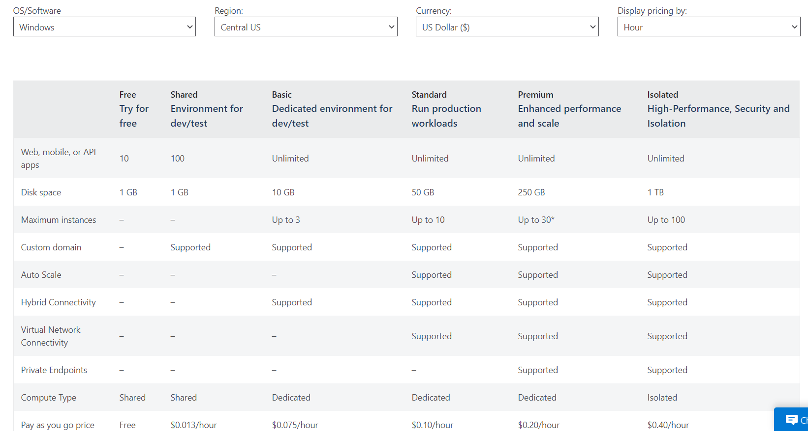

# #6 More on Azure Core Services - Part 1

### **Azure Web Apps**

- In-house developed web app → any language → deploy on Azure?
    - Create new VM → then host your application
    - Or, deploy your application → Azure App Service (Azure Web Apps)
        - VM will be deployed for you by Azure
        - You don't need to manage the underlying web server and config → managed by Azure
- Advantages
    - Don't have to manage underlying compute infrastructure
    - Features such as Autoscaling + Security
    - DevOps capabilities → includes Continuous deployment

### Azure App Service Plans

[App Service Pricing | Microsoft Azure](https://azure.microsoft.com/en-us/pricing/details/app-service/windows/)



- Free Service plan → 60 mins/day limitation on each web app
- Shared → 100 applications → 240 mins/day compute available
- Basic or more → removes the number of minutes limit → unlimited number of applications

    

### **Azure Web Apps (Demo)**

- Create Azure Web App Resource with instance name → .azurewebsites.net (appended)

    

- Supports a variety of Runtime Stack
- Underlying Operation System → Windows/Linux
- App Service Plan Linking required → Standard S1 → 100 total Azure Compute Units (ACU) + 1.75 GB memory (Basic)
- Enable Application Insights → Logging + Extra Insights
- Deploy [ASP.NET](http://asp.NET) App from VS 2019 → Azure App Service

    

- Once profile in place → Publish to Azure Web App

---

### **Virtual Machine Scale Sets**

- Application being accessed by a lot of users → CPU % is going beyond 90% → performance issue
    - One option → increase the instance size (Resize is allowed) → might not completely solve it
    - Another option → deploy multiple VM and distribute load → Automatically → Scale Sets
- Azure → define VM Scale Sets
    - Launch 1 VM as a part of Scale Set → and set conditions → CPU > 65% → automatically add VM to this scale set
    - Scripting required to install application on the newly added VM
    - 2 VM → look at collective utilization and if it goes beyond 65% → add another VM
    - **!! Bootstrapping of application is required !!**
    - Increasing VM → Scale out process
    - If demand goes down → add scale-in condition → if CPU goes below 65% → terminate VMs
    - Add conditions for scale-out and scale-in architecture
- **LAB**
    - Add new resource → VM scale set

        

    - Underlying Image can be set
    - Allow wizard to create a new virtual network
    - Allow ports → port 22, enable public IP address → Edit Network Interface
    - Scaling
        - Set initial instance count

            

        - Scale out and Scale in configuration

            

    - Induce artifical load → to see scaling → for duration of 10 minutes

        

    - New instances automatically spinned up

        

---

### **Azure Load Balancer Service**

- Scenario → Virtual Network defined and in 1 subnet have 2 VMs
- Distribute load of the user to be equally distributed across 2 VMs
- Load Balancer Service → will be part of the virtual network
- Users will now directly hit the load balancer → that will distribute the traffic equally to different VMs
- Create Load Balancer Easy → But some important configuration is required
    - Backend Pool → what are the different VMs to target
    - Frontend IP → users will hit the frontend IP and exposed to users
    - Health Probe → used by load balancer to understand whether the VMs are healthy are not
        - Regular intervals → send the response back to load balancer to know if VM is healthy
        - Determine whether the VM is healthy or not → using Health Probe configuration
    - Load Balancing Rules → defines on what port should the traffic be directed to on to the VM
- **Lab - Implement Basic Azure Load Balancer**

    

    - For load balancer to work → VMs should be a part of Availability set or VM scale set

        

        - Assigning public IP to VMs in the availability set is not required now
        - VMs should be in the same virtual network
        - Remove Public IP from VMs → Network Interface → Disassociate
    - Create Public IP address

        

    - Create Load Balancer

        

        - Assign public IP → Azure Load Balancer → Use existing
    - Add a backend pool → add VMs which will be part of Availability set

        

        - Able to choose both VMs to be a part of backend pool → because they are a part of same availability set
    - Add a health probe

        

        - This will check after every 5 seconds → hits a request on port 80
        - If request is not recieved 2 times → VM is considered unhealthy
    - Add load balancing rules
        - How to redirect traffic from frontend IP address to which backend port

        

        - Forward request from frontend port 80 to backend port 80
        - Health probe is also set here
    - VMs added to load balancer will get the load balancer's Public IP

---

### **Azure Resource Manager Templates (ARM)**

- Easily deploy your underlying infrastructure using infrastructure as code
- help automate repetitive deployments
- Using portal to deploy → 3 VM + Azure Web App + Azure SQL database → tedious if need to do it again and again
- Using ARM templates → JSON file to define deployments
- Sections
    - Parameters → helps to make template more dynamic
    - Variables → values that can be reused
    - User-defined functions → create your own customized functions
    - Resources → where you specify the resources that are going to be deployed via template
    - Outputs → values that get returned from the deployed resources
- **LAB**
    - Create → New → Template Deployment

        

    - Templates are available in github repo also
    - Template example → JSON

        

    - resources → array of objects
    - apiVersion important → different apiVersion provides different types of functionality
    - parameters → combo box will be given while deployment

        

        

---

### **Azure Traffic Manager Service**

- A DNS-based routing service
- This routes traffic based on DNS
- Create → Traffic Manager Profile → Users will hit it
- Traffic Manager Profile will decide where to route the request
- Azure load balancer can only route within the same region, but Azure Traffic Manager can route traffic across different regions → as it is a DNS-based routing tools
- Routing Methods
    - Priority → priorities can be given to different endpoints
    - Weightage → endpoints can be given weight like 30% of the traffic goes to endpoint 1

    

- **LAB**
    - Publish 2 web apps → then create Azure Traffic Manager Profile using Priority method → make one web app down and see how traffic is routed
    - Create → Traffic Manager Profile → Resource location not specified → since this resource works at the global level

        

    - Go to resource → Endpoints → Add endpoint

        

    - Target resource type → App Service
    - Target resource → Choose your App Service
    - Priority 1 → for routing all requests to this application
    - Priority 2 → in case something happens to priority 1, then route the traffic to priority 2
    - Configuration → Endpoint monitor settings → To enable on which port enpoints should be checked

        

    - Monitor status → Online (Endpoints)
    - If one primary endpoint is down → traffic manager should route traffic to the secondary endpoint

        

---

### Using powershell

- Powershell can be used with Azure Modules
- Open powershell as administrator
- Install & Import Az Module → Connect to Azure Account

```powershell
Set-ExecutionPolicy RemoteSigned

Install-Module -Name Az -AllowClobber -Scope CurrentUser

Import-Module Az -Verbose

Connect-AzAccount
```

- Now commands can be issues

```powershell
Get-AZResourceGroup -Location centralus

# To create a storage account
# Please add the resourceGroupName and StorageaccountName
$location="Central US"
$resourceGroup=""
$storageAccountName=""
$skuName="Standard_LRS"
$storageAccount=New-AzureRmStorageAccount -ResourceGroupName $resourceGroup -Name $storageAccountName -Location $location -SkuName $skuName

# To create a container
$ctx=$storageAccount.Context
$containerName="demo"
New-AzureStorageContainer -Name $containerName -Context $ctx -Permission blob

# Adding a blob to the storage container
Set-AzureStorageBlobContent -File "Filelocation+name" -Container $containerName -Blob "filename" -Context $ctx
```

---

### Using Azure Dedicated Command-Line Interface (CLI)

[Install the Azure CLI](https://docs.microsoft.com/en-us/cli/azure/install-azure-cli)

- Specifically to work with Azure-based resources
- Install Azure CLI → login
- `az` command is now available in command line

```bash
az login

az group list --query "[?location=='centralus']"

# To create a storage account
az storage account create --location "Central US" --name yourstorageaccountname --resource-group yourresourcegroupname --sku "Standard_LRS"

# To create a container
az storage container create --name "Yourcontainername" --account-name= yourstorageaccountname --account-key=yourstorageaccountkey

# To upload a file
az storage blob upload --file "Filelocation+FileName" --container-name "Yourcontainername" --name "Filename" --account-name=yourstorageaccountname --account-key=yourstorageaccountkey
```

---

### Using Azure Cloud Shell

- Can be used in the Azure portal
- Either powershell or Bash can be used

    

---

### Azure Serverless Services

- Azure Functions → best example
- Deploy some function as code → VMs needs to be deployed
- Azure Functions → code can be directly deployed → no deployment of physical servers needed
- Improve faster development
- Less maintenance overhead
- Serverless Compute → no need to worry about underlying infrastructure
    - Azure Functions
    - Serverless Kubernetes
    - Azure Logic Apps → can develop workflows
    - Azure Event Grid → listen to event emitted from Azure services
    - Azure Service Bus → messaging bus
- Other serverless tools
    - Azure DevOps
    - Azure SQL database serverless
    - Azure Cosmos DB

---

### Azure Functions

- Application → multiple functions
- If you want to host only functions → invoked whenever they are required
- Create function → upload the code → application can invoke these functions whenever needed
- Only get billed for the time the function runs
- Short-lived
- Stateless → function has no idea what is the state of the application
- Each function serves a seperate purpose
- Service allows you to run small pieces of code as functions → underlying infra is completely managed by Azure
- Variety of programming languages supported
- Invoking your function
    - HTTP Trigger
    - Timer Trigger
    - Invoke based on other services → if file is stored in blob storage → then trigger can be used to connect Azure function
- Pricing plans
    - Consumption Plan → pay for the time the code runs
    - App Service Plan → linked to the same plan
    - Premium Plan → pre-warmed instances always ready to run
- **LAB**
    - Resource → Create Function App

        

    - Runtime stack can be selected
    - Hosting → will create new storage account
    - Plan type can be also be selected → Consumption (Serverless) → Default
    - Resource → Add function

        

    - HTTP Trigger → default code is given

    ```csharp
    public static async Task<IActionResult> Run(HttpRequest req, ILogger log)
    {
      string name = req.Query["name"];
    }
    ```

    

    - Get Function URL → will give public URL to hit using postman/external app
    - Infrastructure completely managed by Azure

---

### Azure Logic Apps

- helps you schedule, automate and orchestrate tasks, business processes and workflows
- Design a workflow in Azure Logic Apps → workflow starts with a trigger → trigger is fired via a specific event
- Trigger fired → logic app engine create a logic app instance to run the workflow
- Connectors for Azure Logic Apps
- Built-in connectors provided
- Example
    - Create an instance of Azure Logic App
    - If any event occurs in the Resource group → details must to be added onto to Azure Blob Storage (Simple workflow)
    - Resource → Logic App → Create

        

    - Go to Resource → Logic Apps Designer → Start with common trigger or in-build templates
    - Create → Blank logic App
        - Trigger to start the workflow
        - Events from all the services goes through the Event Grid → listens for all the events
        - Trigger → Azure Event Grid → When a resource event occurs → Sign-in
        - Choose → What resource type to listen to and what events

            

        - Add events you want to listen to the trigger
        - Connectors are also available to external services → Gmail/Tasks
        - Blob file name → Can be created using dynamic content

            

        - Any action/event on the resource group is now stored in the blob storage with the ID of the event as the file name

            

        - Trigger history can be also be viewed in the Logic App

            

# Important Points

Let's go through some important points when it comes the topics discussed in this section

**Azure App Service**

- This is an HTTP-based service that allows you to host web applications, REST API's and mobile back ends. You can develop a program in programming languages such as .NET, .NET Core, Java, Ruby, Node.js, PHP and Python.
- Here you don't need to manage the underlying infrastructure. It allows you to focus on code development.
- Each App service needs to be associated with an App Service Plan.
- Each App service plan has an associated cost per month and also has specific features based on the plan you choose.

**Virtual Machine Scale Sets**

- This service allows you to create and manage a group of identical load balanced virtual machines.
- Here the number of Virtual Machine instances in the scale set can scale based on demand
- This is the best service if you want to add scalability to your application

**Azure Load Balancer**

The Azure Load balancer is used to distribute incoming network traffic to a backend group of servers.

This service helps increase the availability of your entire application architecture


Here the Load Balancer would take the incoming requests from the users and direct the requests to virtual machines running in an Azure virtual network.

If you have a web application running on the backend virtual machines, the requests would be distributed across the virtual machines by the Azure Load Balancer.

**Other tools to access Azure resources**

You can use other tools to access and work with Azure resources

- You can use PowerShell which can work on Windows, macOS and Linux
- You can use the Azure command line interface which can work on Windows, macOS and Linux
- You can use Azure cloud shell from the browser, which can then work on any operating system which has browser support

**Azure Functions**

- This service allows you to run small pieces of code as functions.
- Here you just develop and upload the code to an Azure Function.
- You only get billed for the amount of time the code is run.
- You can use a variety of programming languages in Azure Functions.
- C#, Java , JavaScript, PowerShell and Python.
- You can use libraries by using NuGet and NPM packages.

**Pricing plans available for Azure Functions**

**Consumption Plan** – Here you only pay for the time the code runs.

**App Service Plan** – If you already have an App Service plan that runs a web application, you can reuse the same plan to run Azure Functions. This would save on cost if you already have an App Service Plan in place.

**Premium Plan** – Here you get a number of pre-warmed instances that are always online and ready to run your functions. The plan also automatically adds more compute when required.

You can also invoke your functions via various triggers


**Azure Logic Apps**

This is a cloud service that helps you schedule, automate and orchestrate tasks , business processes and workflows.

**How it works**

- You first design a workflow in Azure Logic Apps
- Each workflow starts with a trigger.
- The trigger is fired via a specific event
- When the trigger is fired , the Logic App engine creates a logic app instance that runs the workflow.

**Connectors for Azure Logic Apps**

- These connectors provide easy access to event, data and actions that are sent from external applications, services , systems or platforms.
- You have built-in connectors that can connect to Azure services such as Azure functions, Azure API Apps etc.
- You have Managed connectors that can connect to platforms such as Office 365, Microsoft Dynamics.

**Azure Traffic Manager**

The Azure Traffic Manager service is a DNS-based traffic load balancer that distributes traffic across services that are distributed across different Azure regions.

The Traffic Manager service is used to direct client requests to the most appropriate service endpoint that is based on a traffic-routing method and the health of the endpoints.

The different traffic routing methods available for the Azure Traffic Manager are

- Priority – Route traffic to another endpoint in case the primary fails.
- Weighted – Route traffic to different endpoints based on weight.
- Performance - you want end users to use the "closest" endpoint in terms of the lowest network latency.
- Geographic - geographic location their DNS query originates from.
- Multivalue – Here different endpoints are sent to the client. The client then selects the endpoint to send the request to.
- Subnet – This maps a set of end-user IP address ranges to a specific endpoint within a Traffic Manager profile.

Below is an example of the Priority routing method that can be used with the Azure Traffic Manager service

Here we are assuming that a company has similar web applications , both are running using the Azure Web App service. One web application is running in the East US Region and the other is running in the West US Region.


1. Here we create a Traffic Manager profile and create two endpoints. Each endpoint points to each Azure Web app respectively. We assign a priority of 1 to the service endpoint attached to the Azure Web App running in the East US region and  a priority of 2 to the other service endpoint.

1. Here users would make requests to the Traffic Manager service.

2. The requests could be initially be directed to an Azure Web App located in the East US region , since there is a priority of 1 to the service endpoint attached to this endpoint.


3. Now let's say there is an issue with the web application running in the East US region, Azure Traffic Manager would then understand that there is an issue with the web application running in this region.

It would then start redirecting user requests to the second endpoint which has the Priority of 2.

Hence over here you are adding a higher availability to your architecture by ensuring that user requests are always adhered to by redirecting requests if the primary service fails for any reason.

If you use the Weighted Routing method , you can actually load balance requests across multiple service endpoints


Over here , users requests would be directed or load balanced across both web applications running in different regions.

In the Performance routing method as shown below, users will be directed based on the least latency of an endpoint.


And then we have the Geographic routing method wherein users would be directed to an endpoint based on their geographic location

