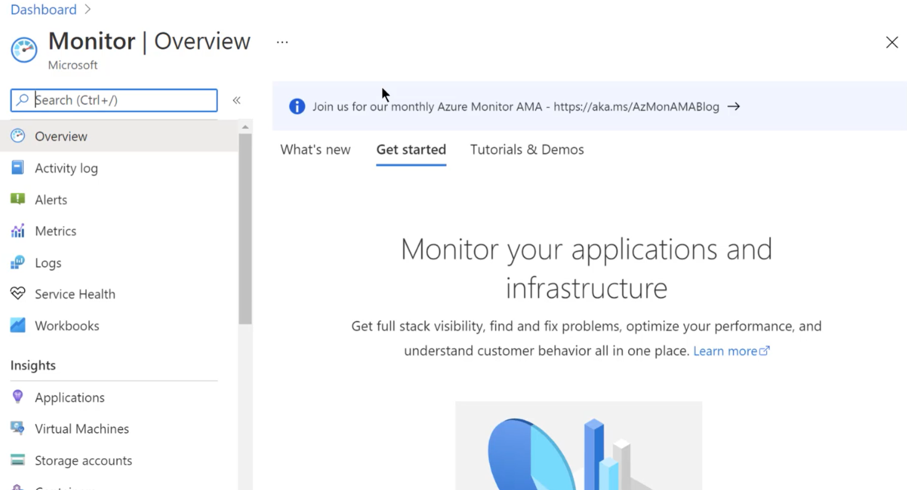

# #7 More on Azure Core Services - Part 2

## Monitoring in Azure

- Monitoring tab inside virtual machine
    - Azure monitoring service → Monitor

        

    - Monitor Metrics for different resources can be viewed → metrics can be added for multiple comparison → different charts can be added and can be pinned into dashboard

        

    - Monitor can also be used to view logs → Activity logs
    - Alerts can be used to place different alert rules based on different criteria/action
        - Add scope → which machine/target to be used
        - Alert can be based on metrics

            

        - Alert can also be based on Activity log

            

        - Set alert logic → define conditions → define corresponding action based on the alert
        - Action → require an action group
            - Notifications can be used to get alerts

                

        - Alert rule will have some monthly cost
        - Alerts which are fired → can be seen on the alert dashboard

            

---

## Log Analytics workspace

- environment can be used to store log data
- collect log data from various data sources
- can also be collected from on-premise systems
- or can be collected from diagnostics or log data from Azure storage
- LAB → connect VM to log analytics workspace
    - Create workspace

        

    - Workspace doesn't need to be in the same region as your machine/resource
    - Go to workspace data sources to connect different sources
        - Connect data source to workspace → only connect to 1 at a time

            

        - Once connected → workspace will install log daemon on the VM for logging data
        - You can download windows/linux agent and install on the machines which are on-premise

            

        - Can choose what data to be collected

            

        - Now after collection → logs can be queried

            

---

## Azure Kubernetes Service (AKS)

- Kubernetes
    - open-source platform → managing containerized workloads
    - provide a DNS name to your container
    - kubernetes → can load balance and distribute network traffic
    - can restart containers that fail
    - can replace or kill containers
    - helps to store and manage passwords/OAuths
- AKS → fully managed kubernetes service on Azure
    - Makes it easy to deploy and manage containerized applications
    - helps to remove the burden of managing the underlying infrastructure for the kube deployment
- **LAB - Azure Container Instance Service**
    - Create Container Instance Resource

        

    - Image can be selected from the registry/Docker hub

        

    - Public IP address can be used to use nginx image → Azure resource downloads the image and run the container for us
        - No need to manage infrastructure
        - Platform can be used to host containers easily
- **LAB - Azure Kubernetes Service**
    - Create new resource → Kubernetes Service

        

    - This resource will spin up a kubernetes cluster (master node) which can be used for orchestration.
    - Once cluster is in place, containers can be deployed inside the cluster

        

    - To deploy a `nginx`container inside `kube` cluster
        - use YAML deployment file
            - app.yaml

                ```yaml
                apiVersion: apps/v1
                    kind: Deployment
                    metadata:
                      name: app-deployment
                    spec:
                      replicas: 1
                      selector:
                        matchLabels:
                          app: my-app
                      template:
                        metadata:
                          labels:
                            app: my-app
                        spec:
                          containers:
                          - name: my-image
                            image: nginx
                            ports:
                            - containerPort: 80
                ```

            - Workloads → can be used for deploying containers using YAML file

                

        - use YAML service file → exposing the port using LoadBalancer → accessing via public IP
            - service.yml

                ```yaml
                apiVersion: v1
                    kind: Service
                    metadata:
                      name: my-service
                    spec:
                      type: LoadBalancer
                      ports:
                      - port: 80
                      selector:
                        app: my-app
                ```

            - Services and ingresses → can be used to deploy any `kube` service using YAML

                

---

## Azure Content Delivery Network (CDN)

- Used to solve latency problems for accessing static data
- ACDN provide cost effective solution
- Point of presence → have edge servers → located globally
- Users can call to Azure CDN to get static data
- It will take the request from User → direct the call to the closest point of presence based on the user's region → which is then directed to the respective edge server
- Edge servers → cache the static files with respect to request → faster response time
- Edge servers → connect to the origin → hosting web app/storage account/own custom origin
    - If user makes a request that is not present in the edge server → make the request to the origin and send response back to user → also cache it for faster use later
    - You can specify the time to live in the cache (edge servers)

    

- ACDN → improves the content delivery by using caching → reduces latency between requests
- **LAB → Implement Azure CDN**
    - Architecture

        

        - User requesting resource will go to CDN endpoint that will fetch the resource from Storage account (origin)
    - First, create a storage account → region Central US + LRS (replication)
        - Go to resource → create a container in the blob service → choose anonymous read access
        - Upload some images → to the container
    - Now, create a CDN profile

        

        - CDN endpoint can also be created during the creation of profile
        - Choose origin also → storage account can be selected here as the origin

            

    - Now CDN profile resource will be created → take endpoint from there
        - Image can be easily fetched via CDN

            

        - Request is now flowing through CDN endpoint → connected with the CDN profile
        - Faster access to the resources now → lower latency
        - CDN endpoint will first check whether img1.jpg is present in the point of presence server
            - If img1.jpg is not found → CDN will go to the origin to fetch the data
            - Then it will cache that image for faster access later on
            - TTL can be set for the cache so that stale data is not provided

---

## Azure Advisor

- Tool → gives you recommendations based on the resources deployed in the Azure account

    

- Cost → recommendations can help us to save cost
- Security recommendations
- High Availability recommendations

    

---

## Application Insights

- application performance management service for web developers
- tool to monitor your applications
- detect anomalies
- diagnose issues
- understand how users use your application
- improve performance and usability of your application
- You can install SDK → view application stats in VS or Azure portal
- different aspects?
    - request rates, response rates, failure rates
    - Exception
    - Page views + load performance
    - User + session counts
    - performance counters
    - diagnostic trace logs
    - any custom events/metrics
- Funnels → create a funnel from one stage to another stage of your application
- User flows → helps to visualize how users navigate the application
    - If user navigate away from a page
    - users click on page
    - places where users churn most on your site
    - places where user repeat the same action over and over
- Impact → helps decide if a page is having an impact on your application
- Retention → helps to understand how many users return to your application + users able to perform certain tasks
- **LAB - Application Insights Demo**
    - Create Application Insight Resource
    - Other application can also connect to application insight
    - Connect Azure Web Apps → Enable Application insights

        

    - This will create a new application insight resource → connected to azure web apps
    - Live metric stream → connect to application and gives live stream for different aspects of the application

        

---

## Azure DevOps

- DevOps is used to make different teams - work together to build reliable products
- DevOps Services
    - Azure Boards → helps in planning, tracking and working with work items across teams
        - Project management tool for following AGILE methodology
    - Azure Pipelines → helps to work with CI/CD
    - Azure Repos → managing source code repository
    - Azure Test Plans → manual and exploratory testing
    - Azure Artifacts → managing your packages
- Another URL to enabling Azure DevOps → different account → same Azure AD for both (there is no resource thing for this in Azure Portal)

    

- AZ-400 → entire course based on Azure DevOps

### Azure DevOps Boards

- Create new project → set visibility also

    

- Different work items supported

    

- User story can be created → part of the AGILE process
- Boards → visual representation of the user story → can be moved to different states (Kanban board)

    

### Azure DevOps Repos

- Used by developers for source code version management
- Git-based repositories can be used
- Can be easily pushed from Visual Studio → using git integration
- Set origin repository URL → push to remove repository → pointing to a default repo in Azure DevOps

    

- Once committed locally → sync changes with the server + push the changes
- Changes can be seen online

    

- History can also be viewed

    

### Azure DevOps Pipelines

- Create pipeline → build pipeline
- Connect your code → building + publishing

    

- Choose correct framework
- Pipeline is created using YAML configuration

    

- Job: Spin up a VM → take your code from the repo → run the tests → discard the machine once done

    

### Azure DevOps - Release Pipelines

- Azure portal → create Web App resource (.NET Core 3.1 LTS)
- Go to releases section → take the code and deploy into Azure web app
- Release pipeline → can take the built code and deploy somewhere else
- In build pipeline → add publish artifacts task

    

- Go to releases section to create new pipeline → choose template

    

- Add artifact → choose build pipeline

    

- Configure Azure App Service Pipeline

    

- To trigger → make a change in the repository and commit

    

    - It will also trigger release pipeline

        

---

## Azure DevTest Labs

- Create Sandboxes inside Azure
- Allows developers to efficiently self-manage virtual machines and PaaS resources → without the need to wait for approvals
- Create labs consisting of pre-configured bases or Azure Resource Manager templates
- Quickly provision Windows or Linux based environment → using reusable templates and artifacts
- Create load testing environments and create environments for training and demos
- Helps in optimizing costs through the following features
- Set an auto-shutdown and auto-start schedules → VMs
- Set policies → number of VMs users can create
- Set policies → size of VM
- Track costs
- Azure portal → Add new resource → DevTest Lab

    

    - Choose a base → for machine image

        

    - Configure VM size, OS disk types and Add artifacts on VM
    - Once VM is in place → allow user from Azure AD → go to configuration and policies → Add DevTest Lab User

        

    - As a user → you can login to Azure portal and claim that machine

---

## Azure Machine Learning Service

- Create new resource → Machine learning → create ML workspace

    

- It will also need a Azure container registry
- Go to resource → Launch ML Studio

    

    - Create ML pipeline

        

        - Drag-drop artifacts

            

        - Algorithms and artifacts can be searched and dropped for building pipeline

---

## Azure Cognitive Services

- Comprehensive family of AI services and cognitive APIs
- Services → Decision, Language, Speech, Vision
- Image service → Object detection

    

- Saves the development and deployment time for the same service
- Face service → detection/perceived emotion detection


---

## Azure Bot Service

- NLP based bot → bot SDK


- Azure → Web App Bot Resource

    

- Bot templates available


- Test in Web Chat

    

---

## Azure IoT Hub

- managed service → central message hub for bi-directional communication between managed devices and an IoT application
- IoT hub supports communication both from the device to the cloud and from the cloud to the service
- IoT hub also gives a secure communication channel for devices to send data
- How it works?


- IoT DevKit Example → IoT device sending temperature, humidity, messageId

    

- Dumped data in SQL database

    

---

## Important Points (Udemy)

**Monitoring in Azure**

For all monitoring aspects you can head over to Azure Monitor.

1. You can use the Metrics section to view the entire metrics for your Azure resources


2. You can use the Activity Log feature to look at all the control plane 
activities. So if someone has shutdown a virtual machine, you would be 
able to see who shutdown the virtual machine in the Activity Logs.


3. You can also view any service related issues in the Service health module of Azure Monitor


4. You can also create a service health alert in Azure Service Health


5.
 You can also direct logs from various resources such as Azure virtual 
machines onto the Logs section. Here you have to create a Log Analytics 
workspace to store the logs


### **Azure Kubernetes**

**What is Kubernetes?**

- This is an open-source platform that is used to managing containerized workloads.
- Kubernetes is able to provide a DNS name to your container.
- If there is a high load on your containers , Kubernetes can load balance and distribute network traffic.
- Kubernetes can also restart containers that fail.
- It can be used to replace or kill containers.
- It also helps to store and manage sensitive information such as passwords, OAuth tokens and ssh keys

**What is Azure Kubernetes?**

- Fully managed Kubernetes service on Azure.
- Makes it easy to deploy and manage containerized applications.
- It helps to remove the burden of managing the underlying infrastructure for the Kubernetes deployment.

### **Azure Content Delivery Network**

This is an ideal service to use for your web applications. If you need 
content to be distributed to users across the world for your web sites ,
 then its ideal to use the Azure Content Delivery Network Service


- Here the users are directed on various Edge servers by the Content Delivery Network service.
- The Edge servers will get the content from your web site and also cache frequently accessed content.
- The Edge servers are located across the world , so it gives all users a
seamless experience when it comes to accessing your web site.

### **Azure Advisor**

Use this tool to get various recommendations on aspects such as Cost, Security and High Availability.


### **Application Insights**

**Points on this service**

- Application Performance Management service for web developers.
- You can use this tool to monitor your applications.
- It can help developers detect anomalies in the application.
- It can help diagnose issues.
- It can also help understand how users use your application.
- It also helps you improve performance and usability of your application.

**How does it work**

- You install a small instrumentation package within your application.
- You can see the statistics of your application locally in Visual Studio as you run your application.
- You can also use the Application Insights resource in Azure to monitor your application.

**What are the different aspects monitored by Application Insights**

- Request rates, the response times and failure rates – This is done at the page level.
- Exception recorded by your application.
- Page views and their load performance as reported from the user’s browser.
- User and session counts.
- Performance counters of the underlying Windows or Linux Machines.
- Diagnostic trace logs from your application.
- Any custom events or metrics that the developer writes themselves in the code.

### **Azure Cognitive services**

Azure Cognitive Services are API’s , SDK’s and services available for helping developers building intelligent applications.

Here the developer does not need to have any AI or data science skills.

There are many services available for developers to make use of

**Computer Vision** –
 This helps developers process images and return information. You just 
supply the image, and the service can help identify the image.

- This service can detect objects, help provide categories for the image.
- It can also detect color , faces , help describe an image.
- It can also extract text from images.
- It can also help moderate content in images.

**Face API** – This can be used to detect, recognize and analyze human faces in images.

- It can also help find similar faces from a set of images.
- It can also help identify a detected face against a database of people.

**Speech services**

- You can use the Speech-to-Text service to translate speech to text.
- You can also generate synthesized speech from text using Text-to-Speech.

### **Azure Machine Learning**

- Machine learning is the process that enables computers to use existing data to forecast future behaviors , outcomes and trends.
- Here the computers don’t need to be programmed on how to learn.
- Azure Machine Learning gives you a cloud-based environment for preparing
data, train the data, testing, deploying and managing machine learning
models.
- You get a visual interface which can be used to drag and drop modules to build experiments and deploy models.
- **Machine Learning Studio** – This is a drag-and-drop visual workspace which you can use to build,
test and deploy machine learning solutions without the need of writing
any sort of code.
- This tool has prebuilt and preconfigured machine learning algorithms.

### **Azure HDInsight**

- This is a cloud distribution of Hadoop based components.
- Azure HDInsight allows you to process large amounts of data.
- You can use HDInsight for a variety of big data processing scenarios such
as Data warehousing , Batch processing and for Data science as well.
- You can create different types of clusters – Apache Hadoop, Apache Spark, Apache Hbase.
- HDInsight also supports a host of programming languages such as Java, Python, .Net and Go.

### **Azure DevOps**

- This is a complete set of tools that can be used to help teams to plan work, collaborate on code development and build and deploy applications.
- Azure DevOps have the following services in place
- **Azure Repos** – This allows you to host Git repositories or use Team Foundation Version Control.
- **Azure Pipelines** – This provides build and release services for continuous integration and release.
- **Azure Boards** – This helps to plan and track work items.
- **Azure Test Plans** – This provides tools for testing of applications.
- **Azure Artifacts** – This allows teams to share Maven, npm and NuGet packages from public and private sources.

### **Azure DevTest Labs**

- This service allows developers to efficiently self-manage virtual machines
and PaaS resources without the need to wait for approvals.
- The DevTest Labs can be used to create labs consisting of pre-configured bases or Azure Resource Manager templates.
- With DevTest Labs, you can quickly provision Windows and Linux based
environment through the use of reusable templates and artifacts.
- You can easily create load testing environments and create environments for training and demos.
- This service also helps in optimizing costs through the following features
- Here you can set an auto-shutdown and auto-start schedules for virtual machines.
- You can set policies on the number of virtual machines users can create.
- You can set policies on the size of the virtual machine.
- You can track costs.