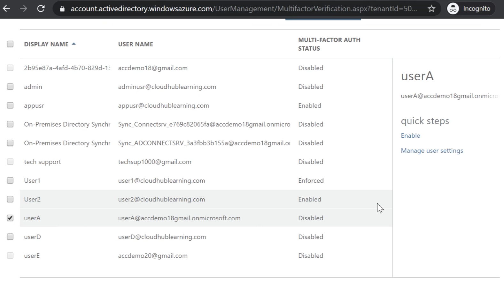

# #8 Understanding security, privacy, compliance, and trust

## Table of Contents
- [Azure Active Directory](#azure-active-directory)
- [Conditional Access Policies](#conditional-access-policies)
- [Role Based Access Control (RBAC)](#role-based-access-control-rbac)
- [Azure Key Vault Service](#azure-key-vault-service)
- [Azure Policies](#azure-policies)
- [Management Groups](#management-groups)
- [Azure Resource Locks](#azure-resource-locks)
- [Azure Security Center Service](#azure-security-center-service)
- [Azure Sentinel](#azure-sentinel)
- [Azure Blueprints](#azure-blueprints)
- [Other Security Tools](#other-security-tools)
  - [Azure Firewall](#azure-firewall)
  - [Azure DDoS protection](#azure-ddos-protection)
  - [Azure Information Protection](#azure-information-protection)
  - [Azure Advanced threat protection](#azure-advanced-threat-protection)
- [Other security aspects](#other-security-aspects)
- [Important points (Udemy Provided)](#important-points-udemy-provided)

## Azure Active Directory

- Identity provider with User, Group and Service Principal
- Helps to provide access to user → authenticate and authorize
- Account → Azure AD created → where Azure subscription trusts the directory
- More drill down authorization using RBAC (Role-based access control)
- More secure access → using MFA
- Applications can use **Service principal** to gain access to Azure Resources
- LAB - MFA
    - Azure AD → you can create additional users
    - Enable MFA for users

        

---

## Conditional Access Policies

- This can be used to applying settings to a group of user → based on different conditions
- This is set in Azure AD
- Licence → Azure AD Premium P2 required (additional licence required)

    

- Security → Conditional Access → Create new policy

    

    - Users and groups → can be selected and granted/denied specific cloud apps or actions

---

## Role Based Access Control (RBAC)

[Azure built-in roles - Azure RBAC](https://docs.microsoft.com/en-us/azure/role-based-access-control/built-in-roles)

- Allows to give more finer control over resources
- You may want users to have access to view VM, but not to stop VM or delete VM → RBAC can help here
- Access control IAM → Add role assignment → at the resource level
- Access control IAM → also available at the resource group level
- Also apply Access control IAM → at the subscription level
- LAB → Implementing RBAC
    - Built-in roles → Azure Resources
        - Owner
        - Contributor → except access to resources
        - Reader → but not make any resources
        - Storage account contributor

            

        - Storage blob account contributor
        - Can give access to VM → Access control IAM → Add role assignment

            

            - Role can be assigned to that specific user

                

        - With reader access → User will see the details of VM
            - Can't see public/private IP addresses

            

            - Network information → VPC separate resource → not allowed

                

        - For giving access to the entire resource → add IAM access to the resource group level for that user
            - Reader role → can't stop the VM

                

---

## Azure Key Vault Service

- Helps you perform secrets management → securely store your tokens, passwords, certificates, API keys and other secrets
- This service → create encryption keys
- Easily provision, manage, and deploy public and private SSL/TLS certificates
- All secrets and keys → safe gaurded by Azure
- All key vault activity can be monitored → logging
- Add new resource → key vault

    

    - Soft delete → allow you to recover deleted secrets
    - Access policies can be set to users → Read, update, delete, etc

        

    - Keys → create a new key
    - Secrets → create a new secret

        

---

## Azure Policies

- Helps to add some governance on resources
- Azure policies → can limit deployment of VMs based on their size

    

- Policy → can mark resource non-complaint

    

- Even VM creation will not be allowed if policy fails

    

---

## Management Groups

- Different subscriptions → different billings
- Staging and production environment might have different subscriptions
- Subscriptions can be combined together → Management groups

- Roles/Permissions → can be applied at the top level and below level will inherit from it
- By default → tenant root group

    

    - You can add management group → Human Resources

        

    - Add existing subscription → Management group

        

---

## Azure Resource Locks

- You can lock resources → prevent accidental modification or deletion of the resources
- Apply → resource, resource group, or subscription level
- 2 types of lock
    - CanNotDelete → access to modify or read → but cannot delete
    - ReadOnly → can only read a resource
- LAB → VM → locks section

    

    - Once ReadOnly lock is in place → you can change anything

        

- Locks can also be placed on resource groups

    

---

## Azure Security Center Service

- Security Center can be directly searched in the portal → no need to place/create new resource

    

- Same as AWS Security recommendations
- Score can be increased by completing recommendations

    

- It also checks compliance standards

    

- Azure defender → security with respect to resources → provides extra security features (increases pricing)

    

    - Can be turned on/off for specific resources

        

---

## Azure Sentinel

- Cloud service → provides a solution for SIEM (Security Information Event Management) and SOAR (Security Orchestration Automated Response)
    - Collection of data → collect data across all users, devices, application, your infra
    - detect undetected threats
    - hunt for suspicious activities at scale
    - helps to respond to incident rapidly
- Once you start using this → you can start collecting data using a variety of connectors
    - connectors for a variety of products
    - can use in-built workbooks and get more insights → on collected data
- Differences → Azure Sentinel vs Azure Security Center
    - Azure Security Center

        

    - Azure Sentinel

        

- LAB → More detailed for Azure Security course → AZ-500
    - Connect workspace → all data gets collected in Log Analytics workspace
    - Then you can choose log workspace → to add in Azure sentinel to see the dashboard

        

    - Collect data → from various Azure services + external services
    - Once data is collected → you can use threat management space for hunting and exploration

        

---

## Azure Blueprints

- Orchestrate the deployment of artifacts to Azure
- You can orchestrate → ARM templates, Azure policies, Resource groups, RBACs

    

- Helpful for organisations → with multiple management groups with multiple subscriptions → can be automated using Azure blueprint
- Blueprint can be assigned to some subscription
- Different from ARM templates → it is more at an architecture level
- Different stages:
    - Definition → Define the blueprint
    - Link it with management group or some subscription (either one) → can't be defined at the resource group level
    - Publish the blueprint → multiple versions are allowed → changes are tracked
- Helps an organisation → define a repeatable set of processes → that can stick to some standards
- To save the blueprint definition → you need to have contributor access to either management group or subscription
- Blueprint → allow resource locks
- Even with Owner role → user will not be able to remove the lock
- LAB
    - Search for blueprints
    - Create a blueprint definition
        - Example

            

            - if subscription is assigned → allow/assign these artifacts
                - automatically resources will be deployed → based on ARM template
                - user will be assigned an owner role
                - backup will be enabled

---

## Other Security Tools

### Azure Firewall

- managed, cloud-based network security service
- features → threat intelligence → can filter incoming requests and alert or deny traffic
- built-in high availability
- can scale automatically based on network traffic flows
- Example
    - User can be forced to first go through the firewall service hosted on VPC before going to the real VMs

        

### Azure DDoS protection

- helps protect against DDoS
- 2 plans
    - Basic → automatically enabled → continuously monitors traffic
    - Standard → paid plan → expert support available here

### Azure Information Protection

- solution → help an organisation → classify and protect its documents and email by applying labels
- labels → can be applied automatically by admins → use of rules and conditions
- labels → can use visual markers on documents

### Azure Advanced threat protection

- cloud-based security tool → can be used to identify, detect and investigate advanced threats, compromised identities
- protect identities and credentials stored in Azure AD
- monitoring Azure AD domain controllers → install Azure ATP sensor on domain controllers
- used to identify suspicious attacks

---

## Other security aspects

- GDPR → General Data Protection Regulation
    - EU citizens → have more control over their personal data
    - Organisations → ensure → personal data is gathered legally and under strict conditions
- ISO → International Organization for Standardization
    - responsible for setting international standards
    - independent non-government organization
- NIST → National Institute of Standards and Technology
    - organization → looks at U.S. innovation
    - looks at measurement of science, standards and technology
- Audit Reports

    [Service Trust Portal](https://servicetrust.microsoft.com/)

    - Audit Assessment reports available here
- Azure government

    [Azure Government Overview - Azure Government](https://docs.microsoft.com/en-us/azure/azure-government/documentation-government-welcome)

    - Available for US government agencies
    - Or other government customers

---

## Important points (Udemy Provided)

### **Azure Active Directory**

This is your identity system in Azure. Here you can define users and groups and provide them permissions to your resources.

Here you can also define external users who can have access to resources in Azure.

**Multi-Factor Authentication**

You
 can also enable Multi-Factor authentication for users. Here users need 
to use an additional mechanism in addition to the user name and password
 to log into Azure.

You can also make use of **Conditional Access policies** to create conditions to allow or deny users to log into Azure.

### **Other security related aspects**

**GDPR (General Data Protection Regulation)**

- This is a set of rules that helps EU citizens have more control over their personal data
- Under this compliance schema, organizations have to ensure that personal data is gathered legally and under strict conditions.
- Also organizations have to manage the data in such a way that it is protected from misuse or exploitation.

**ISO (International Organization for Standardization)**

- This is an international body that is responsible for setting international standards.
- This is an independent, non-government organization.
- It consists of members from around 160+ member countries.

**NIST (National Institute of Standards and Technology)**

- This is an organization which looks at U.S. innovation.
- They do this by looking at measurement of science, standards and technology.

### **Azure Blueprints**

- This is a service that allows you to define a repeatable set of Azure resources.
- The definition of the Azure resources can adhere to an organization’s standards, patterns and requirements.
- Using blueprints , you can orchestrate the deployment of resources such as
role assignments, policy assignments, Azure resource manager templates
and resource groups.
- Some differences between Azure blueprints and resource manager templates
- You can use blueprints to upgrade several subscriptions at once .
- The relationship between the blueprint definition and the blueprint assignment is reserved.

### **Azure Security Center**

- This is an infrastructure security management system.
- You can use this tool to improve the security of your Azure based resources and on-premise resources as well.
- Azure Security Center has in-built support for services such as Azure virtual machines , Function Apps, Azure SQL Server databases.
- You can also allow Azure Security Center to give recommendations on what to do for on-premise Windows and Linux servers.
- On these servers, you need to ensure you install the Microsoft Monitoring agent.
- This service also helps detect and prevent threats at an Infrastructure layer

### **Azure AD Identity Protection**

- This is a service that can help detect suspicious actions related to user identities
- This helps add more security to the sign-ins to your Azure AD Account.
- This service can help detect the following
1. Users with leaked credentials
2. Sign-ins from anonymous IP addresses
3. Sign-ins from infected devices
4. Sign-ins from IP addresses with suspicious activity
5. Sign-ins from unfamiliar locations
6. Impossible travel to atypical locations

### **Azure AD Privileged Identity Management**

- This is a service that can help manage, control and monitor access to important resources in your organization.
- With this service, you can provide just-in-time privileged access to Azure AD and Azure resources.
- Provide time-bound access to resources using start and end dates.
- Enforce multi-factor authentication to activate any role.
- Get notifications when privileged roles are activated.
- Conduct access reviews to ensure users still require the roles.

### **Azure Firewall**

- This is a managed, cloud-based network security service that can be used to protect your network resources.
- It has features such as Threat intelligence – This can filter incoming
requests and alert or deny traffic from/to malicious IP addresses and
domains.
- The firewall itself has built-in high availability.
- It can scale automatically based on network traffic flows.

Here you can ensure that all traffic from machines in an Azure virtual network flows via the Azure Firewall service.

### **Azure DDoS protection**

- This service helps protect against Distributed denial of service attacks.
- This is probably the biggest security concern for companies when they expose their applications to the Internet.
- You have 2 plans for Azure DDoS protection.

**Basic**
 – This is automatically enabled. This continuously monitors traffic in 
real time and looks at mitigation of common network-level attacks.

**Standard** – This is a paid plan. But you get many benefits

–Here you can get real time attack metrics and diagnostic logs via Azure Monitor

–You can get help from DDoS Experts during a live attack

### **Azure Information protection**

- This is a solution that can help an organization classify and protect its documents and email by applying labels.
- The labels can be applied automatically by administrators through the use of rules and conditions.
- The labels can use visual markers on documents to tell the user the classification of the document

### **Azure Advanced Threat Protection**

- This is a cloud-based security tool that can be used to identify, detect and investigate advanced threats, compromised identities.
- This service can be used to protect identities and credentials stored in Active Directory.
- When monitoring your on-premise Active Directory domain controllers, you
need to install an Azure ATP sensor on the domain controller.
- It can be used to identify and investigate suspicious user activities and advanced attacks.

### **Azure Key Vault**

- Helps you perform Secrets management – Here you can securely store your
tokens, passwords , certificates , API keys and other secrets
- You can use this service to create encryption keys. You can then use these encryptions keys to encrypt your data.
- You can also easily provision, manage, and deploy public and private Secure Sockets Layer/Transport Layer Security (SSL/TLS) certificates
- All of the secrets and keys are safeguarded by Azure, using
industry-standard algorithms, key lengths, and hardware security modules (HSMs).
- You can also monitor all the key vault activity
by enabling logging. The logs can be sent to an Azure storage account,
to an event hub or to Azure Monitor logs.

### **Azure Policies**

- This service can be used to create, assign and manage policies.
- You can use these policies to ensure that resources in your Azure account
remain compliant with corporate standards and service level agreements.
- You can use in-built policies or even define your own policies

### **Role-based access control**

- This can be used to assign access to resources in Azure.
- For example if you wanted to give access to a user to manage virtual
machines in your subscription, you can use role based access control

Roles can be accessed at different scopes - Subscription, Resource groups and resources

Reference - [https://docs.microsoft.com/en-us/azure/role-based-access-control/overview](https://docs.microsoft.com/en-us/azure/role-based-access-control/overview)

### **Microsoft Privacy statement**

To
 understand the data that gets collected from Microsoft when you use 
their products, you can refer to the Microsoft Privacy statement

[https://privacy.microsoft.com/en-us/privacystatement](https://privacy.microsoft.com/en-us/privacystatement)