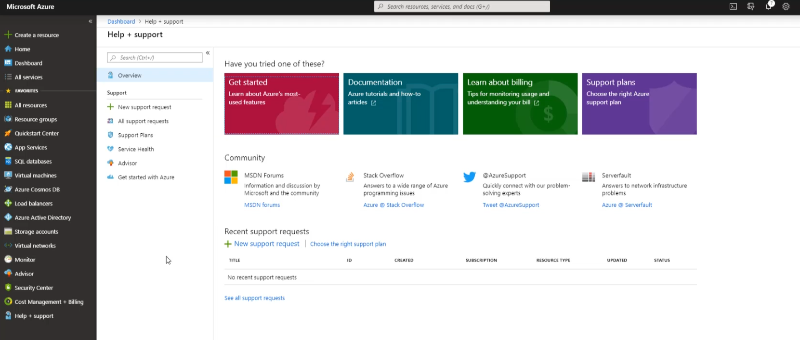

# #9 Understand Azure Pricing and Support

## Table of contents
- [Service lifecycle in Azure](#service-lifecycle-in-azure)
- [Support options in Azure](#support-options-in-azure)
- [Factors that affect the cost](#factors-that-affect-the-cost)
- [Cloud Adoption Framework](#cloud-adoption-framework)
- [Azure Service Level Agreements (SLA)](#azure-service-level-agreements-sla)     
- [Azure Support Plans](#azure-support-plans)
- [Total cost of Ownership](#total-cost-of-ownership)
- [Creating budgets in Azure](#creating-budgets-in-azure)
- [Resource Tags](#resource-tags)
- [Reserved Instances](#reserved-instances)
- [Spot VMs](#spot-vms)
- [Example Invoice](#example-invoice)
- [Sample Architecture](#sample-architecture)
- [Important Points (Udemy Provided)](#important-points-udemy-provided)

## Service lifecycle in Azure

- Azure updates can be seen online → features which are released and which are in preview
    - [https://azure.microsoft.com/en-us/updates/](https://azure.microsoft.com/en-us/updates/)
- Services in preview mode → beta services
    - No guarantee on the SLA
    - Not a good practice to use products which are in preview

---

## Support options in Azure

- Can be searched using Azure portal

    

- Support request can be created using Azure portal
- Active events → service issues, planned maintenance → can be viewed
- Health alert rules can be also be created
    - If service is down in some particular region → you want to be notified

        

---

## Factors that affect the cost

- Each service → different factors that affect the cost
- Azure Storage accounts → Cost depends on
    - Volume of data stored per month
    - Quality and types of operations performed → along with any data transfer costs
    - Data redundancy
- Data transfer costs
    - You can transfer data in and out of Azure
        - Inbound data transfers → data transfer going into Azure data centers → free
        - Outbound data transfers → data going out of Azure data centers → price fee → depends on how much you transfer
        - **price fee/GB for both inbound and outbound data transfer for VMs deployed in an availability zone → only for data transfer within the Virtual network itself**
    - Data transfers between Azure services → located in the same region → free
    - Inbound data transfer between Azure Services → located in different regions → free
    - Outbound data transfer between Azure services → located in different regions → comes at a price fee

---

## Cloud Adoption Framework

- Collection of documentation → for helping customers to proceed through cloud adoption journey
    - [https://docs.microsoft.com/en-us/azure/cloud-adoption-framework/overview#:~:text= What is the Microsoft Cloud Adoption Framework,culture of enterprises. The affected roles... More](https://docs.microsoft.com/en-us/azure/cloud-adoption-framework/overview#:~:text=%20What%20is%20the%20Microsoft%20Cloud%20Adoption%20Framework,culture%20of%20enterprises.%20The%20affected%20roles...%20More%20)

    

- Assessment also available → for understanding the requirements

    

---

## Azure Service Level Agreements (SLA)

- [https://azure.microsoft.com/en-us/support/legal/sla/summary/](https://azure.microsoft.com/en-us/support/legal/sla/summary/)
- Microsoft gives guarantee that service will run for the defined time
- Azure AD → 99.9% SLA

    

- SLA for VMs
    - [https://azure.microsoft.com/en-us/support/legal/sla/virtual-machines/v1_9/](https://azure.microsoft.com/en-us/support/legal/sla/virtual-machines/v1_9/)
        - For all Virtual Machines that have two or more instances deployed **across two or more Availability Zones in the same Azure region**, we guarantee you will have Virtual Machine Connectivity to at least one instance **at least 99.99% of the time**.
        - For all Virtual Machines that have two or more instances deployed in the **same Availability Set or in the same Dedicated Host Group**, we guarantee you will have Virtual Machine Connectivity to at least one instance **at least 99.95% of the time**.
        - For any Single Instance Virtual Machine **using Premium SSD or Ultra Disk for all Operating System Disks and Data Disks**, we guarantee you will have Virtual Machine Connectivity of **at least 99.9%**.
        - For any Single Instance Virtual Machine **using Standard SSD Managed Disks for Operating System Disk and Data Disks**, we guarantee you will have Virtual Machine Connectivity of at least 99.5%.
        - For any Single Instance Virtual Machine **using Standard HDD Managed Disks for Operating System Disks and Data Disks**, we guarantee you will have Virtual Machine Connectivity of **at least 95%**.
    - What happens Microsoft is not able to adhere to SLA?
        - They provide service credit for later usage

            

---

## Azure Support Plans

- [https://azure.microsoft.com/en-us/support/plans/](https://azure.microsoft.com/en-us/support/plans/)
- 4 types
    - Basic - Included
    - Developer - $29/mo
    - Standard - $100/mo
    - Professional Direct - $1000/mo
- Comparison
    - 24x7 support major criteria
    - Case severity + response time

    

---

## Total cost of Ownership

- TCO calculator
- [https://azure.microsoft.com/en-us/pricing/tco/calculator/](https://azure.microsoft.com/en-us/pricing/tco/calculator/)
- Enter the details of your on-premises workloads. This information will be used to understand your current TCO and recommended services in Azure.
- Estimate the cost savings you can realize by migrating your workloads to Azure
    - You can define your workloads

        

    - Adjust assumptions → so that report is as accurate as possible
    - Entire cost breakdown can be seen

        

---

## Creating budgets in Azure

- Cost management and billing → budgets
- Add subscription for the budget

    

- Alert conditions can be added → if budget goes above 80% → send email alert
- Once budget is in place → you can see current spend and amount of money left

    

---

## Resource Tags

- Tags can be used to logically organize resources
- Apply tags → you can retrieve resources based on tags
- You can also create billing reports → based on tags
- LAB
    - Add tag on the VM resource

        

    - All resources → filtered can be based on tags

---

## Reserved Instances

- Saving cost → in terms of compute in Azure
- You can purchase → Azure Reserved VM instances

    

- Reserved instances → can also be purchased for Azure SQL databased & SQL managed instances
- Create a new resource → reserved VM instances

    

    - This is like purchasing VM for buying it for a particular term → 1 year, 3 years, 5 years
    - Billing frequency → Monthly/Upfront
    - B2ms → 2 vCPU, 8 GB
        - Pay-as-you-go → $60/month
        - Reserved for 3 years → $26.38/month

---

## Spot VMs

- save on costs → when compared to Pay-as-you-go pricing for VMs
- You are allocated a VM based on the unused capacity available in Azure
    - **But here if Azure needs the capacity back → Spot VM will be taken back**
- Spot VM → ideal for workloads that can handle interruptions → batch processing jobs and dev/test environments
- 30 seconds notice → before spot VM → evicted
- Add VM → Azure Portal → scroll down

    

    - Choose spot instance
    - Price pay/hour can be provided manually

        

---

## Example Invoice

- Invoices section

    

- Usage charges

    

---

## Sample Architecture

---

## Important Points (Udemy Provided)

### **Azure services lifecycle**

- Remember that Azure keeps on updating their services from time to time. They
will add new features of even deploy newer services from time to time.

Refer to the link for all updates to Azure services - [https://azure.microsoft.com/en-us/updates/](https://azure.microsoft.com/en-us/updates/)

- For services in public preview , you can actually view them from the Azure
portal itself. These services are available for review for all
customers.

- Note that it is not advisable to deploy resources based on these services to your production environment because there would be no SLA attached to
these services.
- You can view services in private preview - Here you need to request Microsoft to preview these services.
- Also keep a note that any services that go out of support , Microsoft will give you at least 12 months of prior notification

You can view these terms via the following link

[https://support.microsoft.com/en-us/help/30881](https://support.microsoft.com/en-us/help/30881)

### **Azure support plans**

This is very important from the exam perspective

This is very important from an exam perspective.

Please refer to the following link to see all of the support plan options

[https://azure.microsoft.com/en-us/support/plans/](https://azure.microsoft.com/en-us/support/plans/)

### **Azure Service Level Agreement**

Azure normally gives around 99.9% SLA for most of their services

An example for the SLA for Active Directory is given below

Please go to the following link to view the SLA for the various Azure services

[https://azure.microsoft.com/en-us/support/legal/sla/summary/](https://azure.microsoft.com/en-us/support/legal/sla/summary/)

### **Azure Total Cost of Ownership**

To get an idea of the possible total expenses for moving your resources to Azure, you can make use of the Azure Total Cost of

Ownership calculator

Use the following link to work with the TCO calculator - [https://azure.microsoft.com/en-us/pricing/tco/calculator/](https://azure.microsoft.com/en-us/pricing/tco/calculator/)