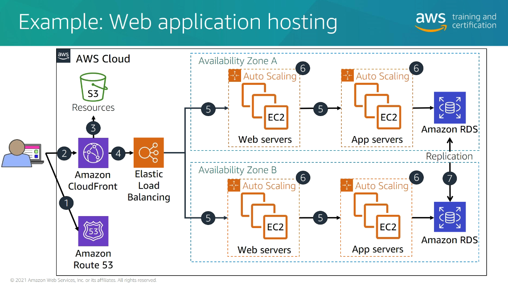

# AWS - Cloud Practitioner Partner Training

## Table of Contents
  - [Goals](#goals)
  - [**Course Modules**](#course-modules)
  - [Module 1: Introduction to the AWS cloud](#module-1-introduction-to-the-aws-cloud)
  - [Module 2: Getting started with the cloud](#module-2-getting-started-with-the-cloud)
  - [Module 3: Building in the Cloud](#module-3-building-in-the-cloud)
  - [Module 4: Secure your cloud application and data](#module-4-secure-your-cloud-application-and-data)
  - [Module 5: AWS Pricing and Support Models](#module-5-aws-pricing-and-support-models)
  - [Module 6: Architecture and Outcome](#module-6-architecture-and-outcome)
  - [Conclusion](#conclusion)

## Goals

- Prepare for the cloud practitioner certification examination
- Be able to talk confidently → customer executives
- Web application hosting example

    

    - Understanding what each component does

## **Course Modules**

## Module 1: Introduction to the AWS cloud

- **Cloud deployment models**

Hybrid

- Applicable for customers → need to move to cloud + have on-premise also

- **What are the benefits of moving to the cloud?**
- Trade capital expense for variable expense

    

- Increase speed and agility

    

- Streamline and enhance infrastructure decisions

    

- Reduce expenses

    

    

- Scale globally - data center in 25 different regions → 200 countries globally

    

- Increase innovation - pre-built ML/AI platforms

    

    - 200+ services
    - Computer, database, Networking, Storage, Security → today's target

- AWS Global Infrastructure
    - Infrastructure Map

        

        - yellow → upcoming regions
    - Selecting a region

        

        - Put data as close to the customer as possible
    - Availability Zones
        - Isolated self containers of data centers

            

        - Provided within each regions
        - Important for mission critical workloads
        - Why?

            

        - Edge locations

            

    - Amazon CloudFront Service
        - Uses edge location infrastructure
        - delivers content to users globally (Same as Azure CDN)
        - Edge location → caching services

            

        - Checks if the content is available or not → if not take it from the origin and cache it → faster access + decrease latency

- AWS Management Infrastructure
    - 3 ways to interact with AWS

        

    - AWS management console

        

- Key Takeaways

## Module 2: Getting started with the cloud

- Component terms

    

    - Lambda → Developer → not caring about the infrastructure
- Benefits of Amazon EC2
    - Elasticity

        

    - Pay only as you go

        

    - Control

        

    - Flexibility

        

    - Integrated

        

    - Reliable
    - Secure
    - Inexpensive
    - Easy

        

- Creating a new EC2 compute instance
    - Region?
    - Software platform?
        - OS?
        - AMI - Amazon Machine Image?
    - Instance type?
        - Memory, vCPU's, network bandwidth, hardware accelerators
    - Tweak security needs
    - Launch
- Modernising instances

    

    - Modernising Linux → AWS Graviton

        

- Object vs Block Storage
    - Amazon S3 Object Store

        

        - Good for storing documents
    - Amazon EBS Block Store

        

- Storage

    

- Amazon Elastic Block Store (EBS)
    - Persistent block storage for instances
    - Protected through replication
    - Different drive types - SSD/HDD
    - Scale up in minutes
    - Snapshot functionality

        

    - Encryption available
- Amazon S3

    

    - Backup and storage
    - Application hosting
    - Media hosting
    - Software delivery

    

    - Amazon S3 glacier → Archiving data

        

        - Use-cases

        

    - Cost analysis

        

    ### Design a simple web server

    - Requirements

        

    - Architecture

        

    - Secure a web app

        

    - Amazon VPC (Virtual Private Cloud)

        

        - Security groups

            

            - 10.0.1.0/24 → [10.0.1.0 - 10.0.1.255] access allowed

            

    - Security Group implementation

        

        - Only web servers → can talk to app tier on the port 6455
        - DB servers can only access by the app servers → port 3306
        - Corp → 10.0.16.0/24 can access all tiers using SSH (port 22)
    - Demo: AWS EC2 Dashboard

        

    - Access can be restricted as per the regions
    - Service health

        

        - Availability zones → 3 zones
    - Create EC2 instances
        - Step 1: Choose AMI

            

            - Multiple AMI supported like Deep Learning AMI → it will spin up with pytorch, tensorflow and other stuff
            - AWS Marketplace can also be selected for EC2 spin-up

                

                - Custom images → for preinstalling tools
        - Step 2: Choose Instance type

            

            - Can be launched here also
        - Step 3: Configure instance

            

            - Network + subnet can be controlled here
            - Enable termination protection
            - Enable monitoring → Enable CloudWatch detailed monitoring
            - Amazon CloudWatch → service that capture events and log everything (Kind of same as Application Insights)
        - Step 4: Add Storage

            

            - SSD IOPS and throughput can be controlled here
        - Step 5: Add tags

            

            - Tags can be used to automate how things are running
            - Pull out reports and stuff based on filtering using tags
        - Step 6: Configure Security Group
        - Step 7: Configure SSH keys
        - Launch
    - Monitoring

        

    - Change instance type → stop instance and then change it

        

    - Provisioned server → connected with a VPC + attached HDD

## Module 3: Building in the Cloud

- Agenda

    

- **Amazon CloudWatch**
    - Monitor AWS resources
    - How CloudWatch works?

        

        - Collect metrics → from different sources
        - Raise alerts

- **Manage demand efficiently**

    

    - When/Where should we provision more servers?
    - Auto-scaling → spin-up more instances and then distribute load using load balancer

        

        - **DNS service** (like Azure traffic manager) → direct traffic across regions
    - **Amazon EC2 Auto Scaling**

        

        - Uses CloudWatch Alarms → to add more/less instances
        - For Sunday

            

        - For Monday

            

        - For wednesday

            

            - Putting a cap makes sense → what if load unnecessary increases leading to crazy amount of EC2 scaling
    - **Elastic load balancing**

        

        - Load Balancer Example

            

            - Load balancer can direct traffic based on the APIs → can also use API gateway

- **Deploy database services**

    

    - Both IaaS and PaaS service available
    - **Amazon RDS (Relational Database Services)**

        

        - Amazon Aurora

            

        - Relational vs key-value databases

            

        - Amazon DynamoDB

            

            - Use-cases

            

        - Other databases

            

        - AWS database migration service

            

    - **Automate Deployment**

        

        - AWS CloudFormation

            

            - Example

                

            - Almost like Ansible → automating cloud infrastructure deployment process

    - **Putting it all together**
        - 1/4

            

        - 2/4

            

        - 3/4

            

        - 4/4

            

    - **Connect and share data**
        - Challenge: hybrid cloud

            

        - AWS Direct Connect → Same as Azure ExpressRoute

            

            - Example

                

        - Amazon Route 53 → DNS web service

            

            - Knows how to route traffic → can load balance across regions
            - Routing traffic example

                

                - Route traffic to one of the load balancers/nearest edge locations
        - Amazon Elastic File System (EFS)
            - It is a block store → which can be shared across VMs
            - EBS volume connects mostly to 1 instance
            - S3 can be shared across VMs → but not high performance

            

        - Putting it all together

            

    - **Deliver content faster**
        - **AWS Elastic Beanstalk**

            

            - Only .NET
            - Just write the code and upload it
            - Abstracts whole platform from the developer
            - Features

                

        - **AWS Lambda**

            

            - Run code without servers
            - Lambda functions can be connected to CloudWatch events
            - Supports all other languages
            - Benefits

                

            - Example → create thumbnails

                

        - *Does AWS lambda also supports .NET? If so, why do you need beanstalk?*
        - **Amazon Simple Notification Service (Amazon SNS)**

            

            - Probably same as Azure Service Bus/Azure Queue Storage
            - Overview

                

        - **Amazon ElastiCache**

            

            - In-memory data store → Redis/Memcached
            - Challenge: 2 billion interactions every day → tinder example

                

- Key Takeaways

## Module 4: Secure your cloud application and data

- Security of the cloud

    

- Security in the cloud

    

- Shared responsibility model

    

- Who's responsible for what?

    

- Security, identity and compliance products/services

    

    - AWS IAM
    - AWS Inspector
    - AWS Shield
- AWS IAM
    - Basic security system

    

    - Manages → Authentication + Authorization
    - Authentication

        

    - Authorization

        

    - IAM roles + policies

        

    - AWS account root user

        

        - Never use root account → day to day activities
        - Always recommend → use root account to create other IAM roles and accounts
    - Best practices

        

    - **Security assessment and compliance**
        - **Amazon Inspector**

            

            - Findings

                

            - Remediation recommendation

                

    - **Protect cloud from DDoS**

        

        - If Auto-scaling is turned on → you may start spinning up EC2 instances leading to huge cost
        - Challenges

            

        - **AWS Shield**

            

            - Always-on
            - Can deflect most of the attacks
            - If auto-scaling turned on and you haven't put max → then it might still blow up
            - Offerings

                

    - AWS security compliance

        

        - Security of the cloud → compliance
    - Achieve compliance?

        

    - Customer responsibility

        

    - Knowledge Check

        

    - Key takeaways

        

    - Amazon Inspector Demo
        - Dashboard

            

        - Findings

            

        - Recommendation

            

    - Security Hub

        

## Module 5: AWS Pricing and Support Models

- Fundamentals of Pricing

    

- Use more, pay less

    

- Pricing concepts

    

- Amazon EC2 - 4 purchase types

    

- Well-optimised compute model → customer example

    

- Amazon EC2 data transfer

    

- Amazon EBS pricing model

    

- AWS services → no additional charge → only resource it uses

    

- AWS Calculator

    

- AWS Cost Explorer

    

- Trusted Advisor

    

- Cost Explorer Demo

    

    - Filtered based on services

        

- AWS Support Plans

    

- Support documentation

    

- Key takeaways

    

## Module 6: Architecture and Outcome

- Operational excellence

    

- Security

    

- Reliability

    

- Cost optimization

    

- Reference architectures

    

- Example: Web Application hosting
    - Amazon CloudFront → content delivery caching service
        - Static workload → fetch
        - Dynamic workload → probably use elastic load balancing

    

- AWS quick starts → for more complex understanding
- Key takeaways

    

## Conclusion

https://bit.ly/CPEassess

