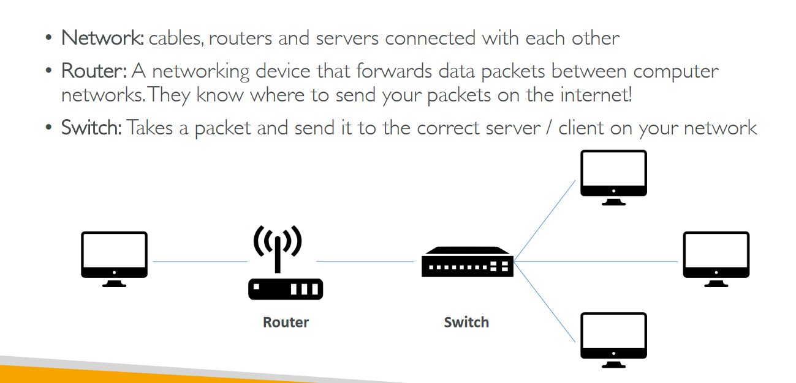

# Section 3: What is Cloud Computing?

## Table of Contents
  - [Traditional IT Overview](#traditional-it-overview)
  - [What is Cloud Computing?](#what-is-cloud-computing)
  - [Different types of Cloud Computing](#different-types-of-cloud-computing)
  - [AWS Cloud Overview](#aws-cloud-overview)

## Traditional IT Overview

- IT Terminology

    

- Problems with traditional IT approach

    

## What is Cloud Computing?

- What is cloud computing?

    

- Deployment models of the cloud

    

- Five characteristics of Cloud Computing

    

- 6 advantages of Cloud Computing

    

- Problems solved by the cloud

    

## Different types of Cloud Computing

- Types of Cloud Computing

    

    - Diagram Comparison

        

    - Examples of Cloud Computing

        

    - Pricing Overview

        

## AWS Cloud Overview

- AWS cloud history

    

- AWS cloud use cases

    

- **AWS global infrastructure**

    

    - AWS Regions

        

        - How to choose AWS regions?

            

    - AWS Availability Zones

        

    - **AWS Points of presence (Edge Locations)**

        

- AWS Console Tour → Some services overview

    

- Shared responsibility model
    - Security in the cloud vs Security of the cloud

        

- AWS Acceptable Use Policy

    