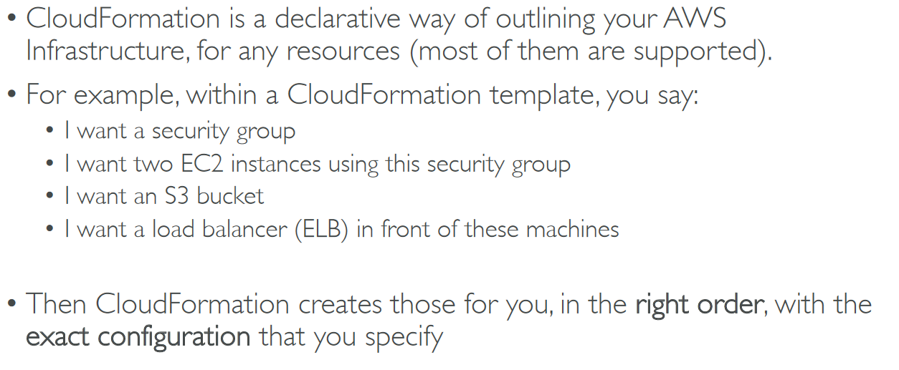

# Section 11: Deployments & Managing Infrastructure at Scale

## Table of contents
  - [AWS CloudFormation](#aws-cloudformation)
  - [AWS Beanstalk](#aws-beanstalk)
  - [AWS CodeDeploy](#aws-codedeploy)
  - [AWS CodeCommit](#aws-codecommit)
  - [AWS CodeBuild](#aws-codebuild)
  - [AWS CodePipeline](#aws-codepipeline)
  - [AWS CodeArtifact](#aws-codeartifact)
  - [AWS CodeStar](#aws-codestar)
  - [AWS Cloud9](#aws-cloud9)
  - [Demo - CodeStar](#demo---codestar)
  - [AWS Systems Manager (SSM)](#aws-systems-manager-ssm)
  - [AWS OpsWorks](#aws-opsworks)
  - [Deployment Summary](#deployment-summary)
  - [Developer Services Summary](#developer-services-summary)

## AWS CloudFormation

- Benefits of AWS CloudFormation

    

    

- CloudFormation Stack Designer

    

- AWS CloudFormation → Create Stack

    

    - Example template → View in Designer

        

        

## AWS Beanstalk

- Typical architecture

    

- Developer problems on AWS

    

- AWS Elastic Beanstalk

    

    - Elastic Beanstalk

        

        

    - Beanstalk - Health Monitoring

        

    - Elastic Beanstalk → Choose Platform

        

        - Uses cloudformation as the backend to deploy the stack

        

## AWS CodeDeploy

## AWS CodeCommit

## AWS CodeBuild

## AWS CodePipeline

## AWS CodeArtifact

## AWS CodeStar

## AWS Cloud9

## Demo - CodeStar

- CodeCommit

    

- CodeStar

    

- Cloud9

    

## AWS Systems Manager (SSM)

- How Systems Manager works?

    

## AWS OpsWorks

- OpsWorks Architecture

    

## Deployment Summary

## Developer Services Summary

