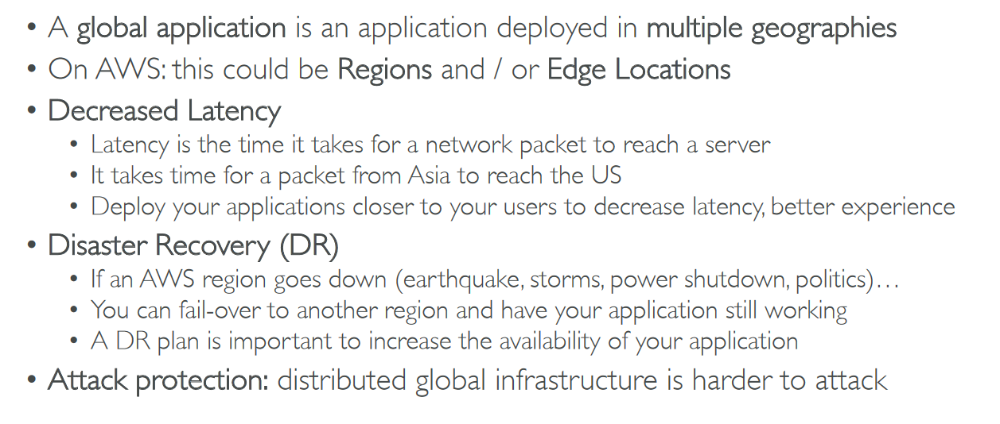

# Section 12: Leveraging the AWS Global Infrastructure

## Table of contents
  - [Why Global Applications?](#why-global-applications)
  - [Amazon Route 53](#amazon-route-53)
  - [AWS CloudFront](#aws-cloudfront)
  - [S3 Transfer Acceleration](#s3-transfer-acceleration)
  - [AWS Global Accelerator](#aws-global-accelerator)
  - [AWS Outposts](#aws-outposts)
  - [Global Applications in AWS - Summary](#global-applications-in-aws---summary)

## Why Global Applications?

- Global Applications in AWS

    

## Amazon Route 53

- Diagram for a record

    

    - Route 53 Routing Policies

        

        

- AWS console → Route 53

    

    - Domain registration → buy domain for your URLs
    - Set Routing Policy → Latency for the domain

        

## AWS CloudFront

- CloudFront - Origins

    

- CloudFront at a high level

    

- CloudFront - S3 as an Origin

    

- CloudFront vs S3 Cross Region Replication

    

- AWS Console → CloudFront Interface

    

## S3 Transfer Acceleration

## AWS Global Accelerator

- AWS Global Accelerator vs CloudFront

    

## AWS Outposts

## Global Applications in AWS - Summary

