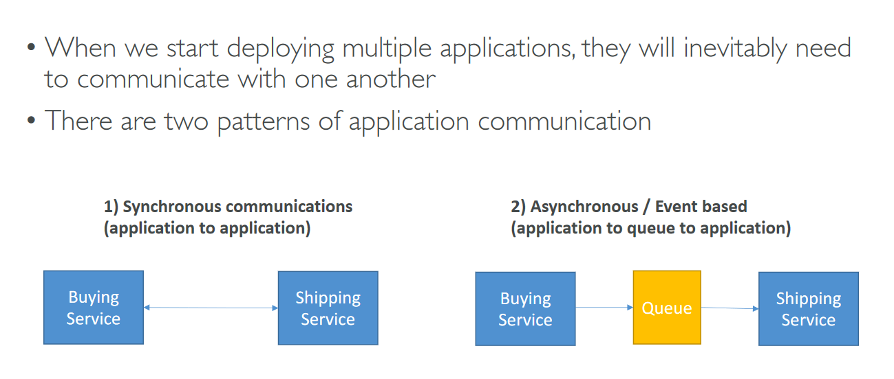

# Section 13: Cloud Integrations

## Table of contents
  - [Introduction](#introduction)
  - [Amazon SQS - Simple Queue Service](#amazon-sqs---simple-queue-service)
  - [Amazon SNS (Simple Notification Service)](#amazon-sns-simple-notification-service)
  - [Amazon Kinesis](#amazon-kinesis)
  - [Amazon MQ](#amazon-mq)
  - [Integration Summary](#integration-summary)

## Introduction

## Amazon SQS - Simple Queue Service

- Standard Queue

    

- SQS to decouple between application tiers

    

- Amazon SQS - > Create Queue

    

## Amazon SNS (Simple Notification Service)

- What if you want to send one message to many receivers?

    

    

- AWS Console → SNS
    - Create topic

    

## Amazon Kinesis

- High-level view

    

## Amazon MQ

## Integration Summary

