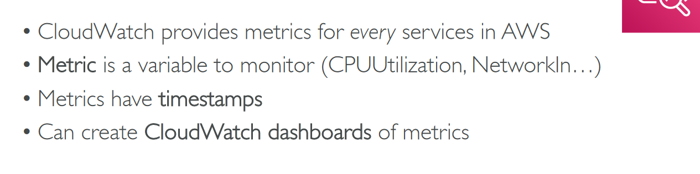

# Section 14: Cloud Monitoring

## Table of contents
  - [Amazon CloudWatch Metrics](#amazon-cloudwatch-metrics)
  - [CloudWatch Logs](#cloudwatch-logs)
  - [Amazon CloudWatch Events](#amazon-cloudwatch-events)
  - [AWS CloudTrail](#aws-cloudtrail)
  - [AWS X-Ray](#aws-x-ray)
  - [AWS Status - Service Health Dashboard](#aws-status---service-health-dashboard)
  - [AWS Personal Health Dashboard](#aws-personal-health-dashboard)
  - [Monitoring Summary](#monitoring-summary)

## Amazon CloudWatch Metrics

- Example → CloudWatch Billing Metric

- Important metrics

    

- Amazon CloudWatch Alarms

    

- AWS Console → CloudWatch

    

    - Create CloudWatch Alarm

        

## CloudWatch Logs

- CloudWatch Logs for EC2

    

- CloudWatch Log Stream

    

## Amazon CloudWatch Events

- Amazon EventBridge

    

- Create CloudWatch Event

    

    - Now called EventBridge

        

## AWS CloudTrail

- Diagram

    

- CloudTrail Events

    

    - CloudTrail Insights

        

    - CloudTrail Events Retention

        

    - CloudTrail Console

        

        - Create Trail for auditing

            

            - S3 Logs example

                

                - Use Athena to query S3

                    

## AWS X-Ray

- Visual analysis of our applications

    

- AWS X-Ray Advantages

    

## AWS Status - Service Health Dashboard

## AWS Personal Health Dashboard

- PHD

    

## Monitoring Summary

