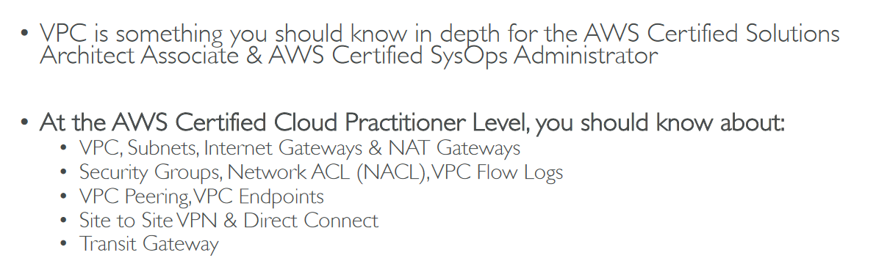

# Section 15: VPC & Networking

## Table of contents
  - [VPC Overview](#vpc-overview)
  - [VPC & Subnets Primer](#vpc--subnets-primer)
  - [Network ACL & Security Groups](#network-acl--security-groups)
  - [VPC Flow Logs & VPC Peering](#vpc-flow-logs--vpc-peering)
  - [VPC Endpoints](#vpc-endpoints)
  - [Site to Site VPN & Direct Connect](#site-to-site-vpn--direct-connect)
  - [Transit Gateway Overview](#transit-gateway-overview)
  - [VPC & Networking Summary](#vpc--networking-summary)

## VPC Overview

## VPC & Subnets Primer

- VPC Diagram

    

- Internet Gateway & NAT Gateways

    

- VPC Dashboard

    

    - Route Tables

        

## Network ACL & Security Groups

- Network ACL vs Security Groups

    

- Security Groups

    

- Network ACL

    

## VPC Flow Logs & VPC Peering

- VPC Flow Logs

    

- VPC Peering

    

- Flow logs

    

- Peering connections

    

## VPC Endpoints

- Create Endpoints

    

## Site to Site VPN & Direct Connect

- Site to Site VPN

    

## Transit Gateway Overview

- Network topologies can become complicated

    

- Transit Gateway

    

## VPC & Networking Summary

