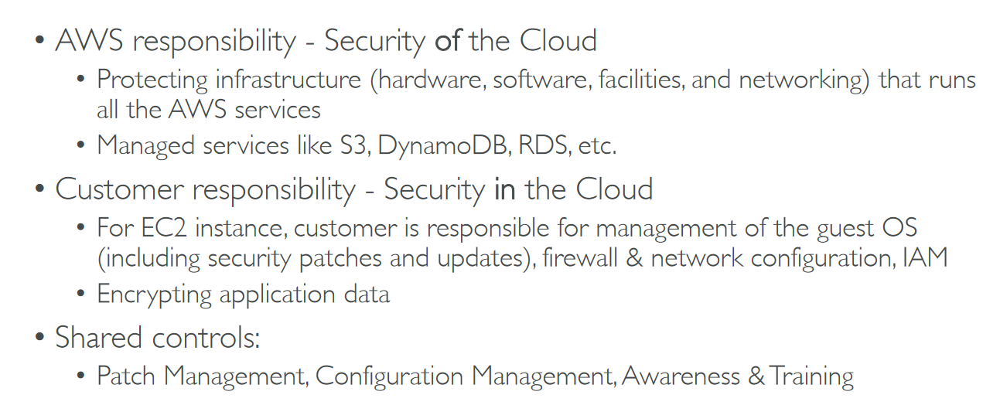

# Section 16: Security & Compliance

## Table of contents
  - [AWS Shared Responsibility Model](#aws-shared-responsibility-model)
  - [DDoS Protection: WAF & Shield](#ddos-protection-waf--shield)
  - [Penetration Testing on AWS Cloud](#penetration-testing-on-aws-cloud)
  - [Encryption with KMS & CloudHSM](#encryption-with-kms--cloudhsm)
  - [AWS Secrets Manager](#aws-secrets-manager)
  - [AWS Artifact](#aws-artifact)
  - [Amazon GuardDuty](#amazon-guardduty)
  - [Amazon Inspector](#amazon-inspector)
  - [AWS Config](#aws-config)
  - [Amazon Macie](#amazon-macie)
  - [AWS Security Hub](#aws-security-hub)
  - [Amazon Detective](#amazon-detective)
  - [AWS Abuse](#aws-abuse)
  - [Root User Privileges](#root-user-privileges)
  - [Security and Compliance Summary](#security-and-compliance-summary)

## AWS Shared Responsibility Model

- Example for RDS

    

- Example for S3

    

- Diagram

    

## DDoS Protection: WAF & Shield

- DDoS Protection on AWS

    

- Sample Reference Architecture for DDoS Protection

    

- AWS Shield

    

- AWS WAF - Web Application Firewall

    

## Penetration Testing on AWS Cloud

## Encryption with KMS & CloudHSM

- Data at rest vs Data in transit

    

- AWS KMS (Key Management Service)

    

- CloudHSM

    

    - Diagram

        

- Types of Customer Master Keys: CMK

    

- KMS Console

    

## AWS Secrets Manager

- Secrets Manager Console → Store a new secret

    

## AWS Artifact

## Amazon GuardDuty

## Amazon Inspector

## AWS Config

- AWS Config Resource

    

- AWS Config Console

    

    

## Amazon Macie

## AWS Security Hub

## Amazon Detective

## AWS Abuse

## Root User Privileges

## Security and Compliance Summary

