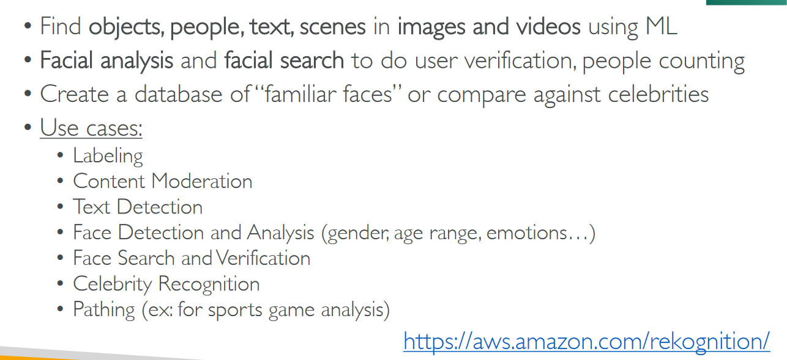

# Section 17: Machine Learning

## Table of contents
  - [Amazon Rekognition](#amazon-rekognition)
  - [Amazon Transcribe](#amazon-transcribe)
  - [Amazon Polly](#amazon-polly)
  - [Amazon Translate](#amazon-translate)
  - [Amazon Lex & Connect](#amazon-lex--connect)
  - [Amazon Comprehend](#amazon-comprehend)
  - [Amazon SageMaker](#amazon-sagemaker)
  - [Machine Learning Summary](#machine-learning-summary)

## Amazon Rekognition

## Amazon Transcribe

- Amazon Transcribe Console

    

## Amazon Polly

- Amazon Polly Console

    

## Amazon Translate

## Amazon Lex & Connect

## Amazon Comprehend

## Amazon SageMaker

## Machine Learning Summary

