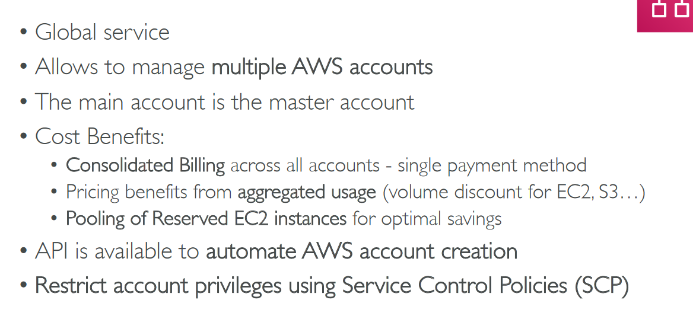

# Section 18: Account Management, Billing & Support

## Table of contents
  - [AWS Organizations](#aws-organizations)
  - [AWS Control Tower](#aws-control-tower)
  - [AWS Pricing Models](#aws-pricing-models)
  - [Billing & Costing Tools](#billing--costing-tools)
  - [AWS Total Cost of Ownership (TCO) Calculators](#aws-total-cost-of-ownership-tco-calculators)
  - [Simple Monthly Calculator/Pricing Calculator](#simple-monthly-calculatorpricing-calculator)
  - [Tracking Costs in the Cloud](#tracking-costs-in-the-cloud)
  - [Monitoring Costs in the cloud](#monitoring-costs-in-the-cloud)
  - [AWS Trusted Advisor](#aws-trusted-advisor)
  - [AWS Support Plans Pricing](#aws-support-plans-pricing)
  - [Account Best Practices Summary](#account-best-practices-summary)
  - [Billing Summary](#billing-summary)

## AWS Organizations

- Multi Account Strategies

    

- Example - Organizational Units (OU)

    

    

- Service Control Policies (SCP)

    

    - SCP Hierarchy

        

    - SCP Examples - Blacklist and whitelist strategies

        

- AWS Organization - Console

    

    - Organize Accounts

        

## AWS Control Tower

- AWS Control Tower - Landing Zone

    

## AWS Pricing Models

- Free services & free tier in AWS

    

- Compute Pricing - EC2

    

    - Different Models

        

- Compute Pricing - Lambda & ECS

    

- Storage Pricing - S3

    

- Storage Pricing - EBS

    

- Database Pricing - RDS

    

    

- Content Delivery - CloudFront

    

- Networking Costs in AWS per GB

    

    ## Savings Plan Overview

## Billing & Costing Tools

## AWS Total Cost of Ownership (TCO) Calculators

- Points of comparison of On-Premises vs AWS

    

- TCO Example + Results

    

    

## Simple Monthly Calculator/Pricing Calculator

## Tracking Costs in the Cloud

- AWS Billing Dashboard

- AWS Free Tier Dashboard

    

- Cost Allocation Tags

    

- Tagging & Resource Groups

    

    

- Cost & Usage Report

    

    

- Cost Explorer

    

    

    - Hourly & Resource level

        

    - Savings Plan

        

    - Forecast Usage

        

    

## Monitoring Costs in the cloud

- Billing Alarms in CloudWatch

    

- AWS budgets

    

    

## AWS Trusted Advisor

- Trusted Advisor Checks Example

    

    

## AWS Support Plans Pricing

- AWS Basic Support Plan

    

- AWS Developer Support Plan

    

- AWS Business Support Plan

    

- AWS Enterprise Support Plan

    

## Account Best Practices Summary

## Billing Summary

