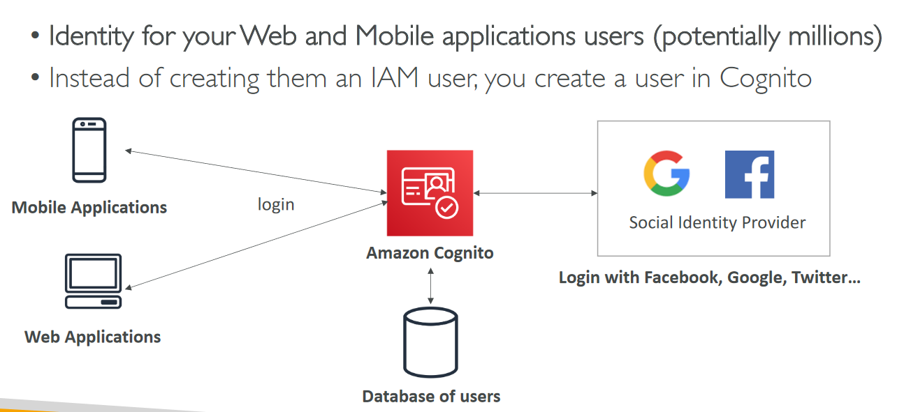

# Section 19: Advanced Identity

## Table of contents
  - [Amazon Cognito](#amazon-cognito)
  - [Directory Services Overview](#directory-services-overview)
  - [AWS Single Sign-On (SSO)](#aws-single-sign-on-sso)
  - [Advanced Identity Summary](#advanced-identity-summary)

## Amazon Cognito

## Directory Services Overview

- Microsoft Active Directory (AD)

    

- AWS Directory Services

    

## AWS Single Sign-On (SSO)

- SSO with AD

    

## Advanced Identity Summary

