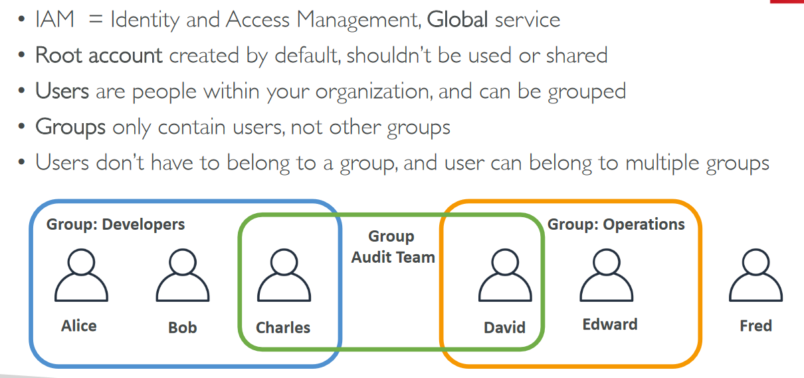

# Section 4: IAM - Identity and Access Management

## Table of Contents
  - [IAM Introduction](#iam-introduction)
  - [**IAM demo**](#iam-demo)
  - [IAM MFA Overview](#iam-mfa-overview)
  - [Access AWS](#access-aws)
    - [AWS CLI](#aws-cli)
    - [AWS CloudShell](#aws-cloudshell)
  - [IAM Roles](#iam-roles)
  - [IAM Security Tools](#iam-security-tools)
  - [IAM Guidelines & Best Practices](#iam-guidelines--best-practices)
  - [Shared Responsibility Model for IAM](#shared-responsibility-model-for-iam)
  - [IAM Summary](#iam-summary)

## IAM Introduction

- Users & groups

    

- Permissions → Policies

    

## **IAM demo**

- Dashboard → root user will create users, groups and policies

    

    - Users → Add User

        

        - Set permissions

            

            - Groups will add/attach policy to all the users in the group
        - Add tags (optional)

            

    - IAM users sign-in link can be customized

        

    - Direct login page → Choose IAM user

        

- @ sign → IAM user and no @ sign → root user

    

- If you don't have valid permissions/policy for the user

    

- Policies

    

    - Administrator access → JSON

        

- Create your own custom policy

    

## IAM MFA Overview

- Password policy → can be assigned to a group of users

    

- Second defense mechanism → MFA

    

    - MFA device option

        

        

        - IAM screen

            

## Access AWS

- How can users access AWS?

    

- Example Access keys

    

### AWS CLI

- Download and install AWS CLI → python-based

    

- Create access keys → IAM dashboard

    

- Configure aws cli

    

- Now run commands → `aws iam list-users`

### AWS CloudShell

- CLI in the cloud

    

- Run commands

    

## IAM Roles

- IAM roles for services

    

    - Example → Role → attach permissions/policies

        

## IAM Security Tools

- Generate credentials report

    

- Access Advisor → user-specific

    

## IAM Guidelines & Best Practices

## Shared Responsibility Model for IAM

## IAM Summary

