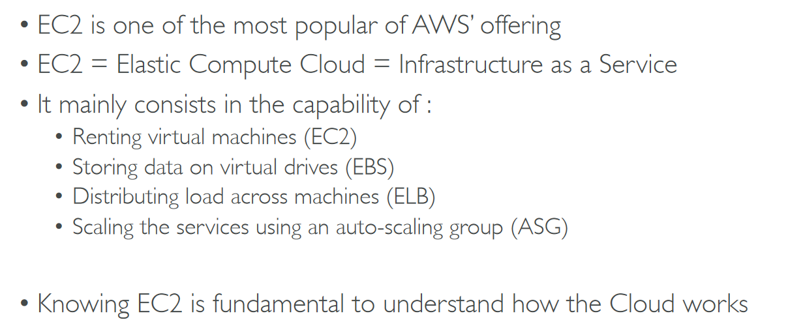

# Section 5: EC2 - Elastic Compute Cloud

## Table of contents
  - [Amazon EC2](#amazon-ec2)
  - [Amazon EC2 Instance Types](#amazon-ec2-instance-types)
  - [Security Groups & Classic Ports](#security-groups--classic-ports)
  - [SSH Summary](#ssh-summary)
  - [EC2 Instance Launch Types](#ec2-instance-launch-types)
  - [Shared Responsibility Model for EC2](#shared-responsibility-model-for-ec2)
  - [EC2 Summary](#ec2-summary)

## Amazon EC2

- EC2 sizing & configuration options

    

- EC2 instance types → Examples

    

## Amazon EC2 Instance Types

- General Purpose

    

- Compute Optimized

    

- Memory Optimized

    

- Storage Optimized

    

## Security Groups & Classic Ports

- Security Groups

    

    - Work as a firewall on EC2

        

    - Diagram

        

    - Classic ports to know

        

    - Network & security → Security Groups

        

        - CIDR → 0.0.0.0/0 → Anywhere
        - Security groups → can be attached to multiple instances

## SSH Summary

- Linux or Mac
    - pem key needed → with chmod

        

- Windows 10 → ssh
    - Key → owner → set → Disable inheritance → only you should be able to full control

        

        

    - And it will work → no unauthorized key problem

        

    - **Attach roles → EC2 instance**

        

        

        - Now aws cli commands inside EC2 instance can work → never do aws configure inside EC2 instance

            

## EC2 Instance Launch Types

- Purchasing options

    

    - EC2 on demand

        

    - EC2 Reserved Instances

        

    - EC2 Spot Instances

        

    - EC2 Dedicated Hosts

        

    - EC2 Dedicated Instances

        

- Which purchasing option right for me?

    

- Price Comparison

    

## Shared Responsibility Model for EC2

## EC2 Summary

