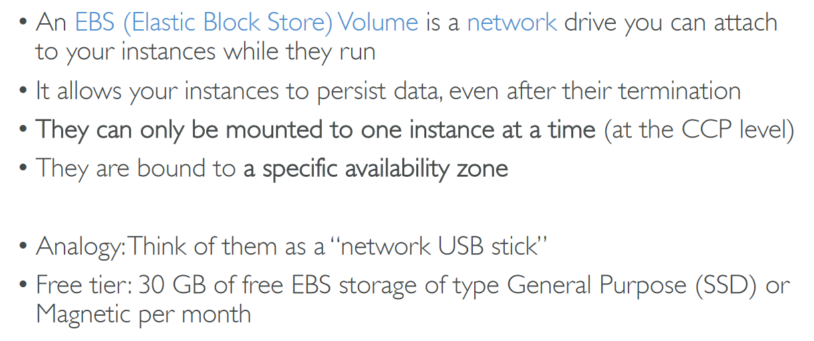

# Section 6: EC2 Instance Storage

## Table of Contents
  - [Elastic Block Storage (EBS)](#elastic-block-storage-ebs)
  - [EBS Snapshots](#ebs-snapshots)
  - [AMI Overview](#ami-overview)
  - [EC2 Image Builder](#ec2-image-builder)
  - [EC2 Instance Store](#ec2-instance-store)
  - [EFS - Elastic File System](#efs---elastic-file-system)
  - [EBS vs EFS](#ebs-vs-efs)
  - [Shared Responsibility Model for EC2 Storage](#shared-responsibility-model-for-ec2-storage)
  - [EC2 Storage Summary](#ec2-storage-summary)

## Elastic Block Storage (EBS)

- EBS Volume

    

    - If we have a snapshot, then we can move drives across AZ
- EBS Volume Example

    

    - 1 EBS Volume → attached to only 1 instance
- EC2 instance → attached to EBS

    

    - EC2 → Volumes → Create Volume → then attach it to EC2

        

- EC2 terminate → may or may not terminate/delete EBS

    

## EBS Snapshots

- Actions → Create snapshot

    

- Snapshot provide multiple actions → Create volume to restore into another AZ or region

    

## AMI Overview

- AMI Process (from an EC2 instance)

    

    - Instance → right-click → options → create image for creating AMI

        

        - Now custom AMI available to launch new instance

            

## EC2 Image Builder

- EC2 Image builder → process

    

    - After pipeline completed → Run → Build instance created

        

        - It will then terminate build instance → then testing will happen → and it will be terminated once done

            

        - Then image will be available

            

## EC2 Instance Store

- Local EC2 Instance Store

    

## EFS - Elastic File System

## EBS vs EFS

## Shared Responsibility Model for EC2 Storage

## EC2 Storage Summary

