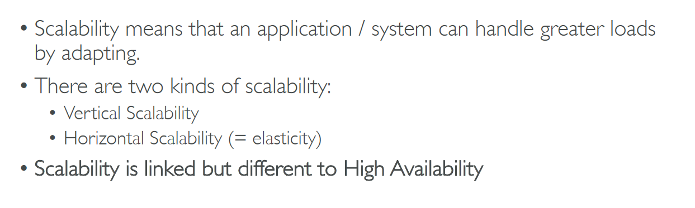

# Section 7: Elastic Load Balancing & Auto Scaling Groups

## Table of contents
  - [Scalability & High Availability](#scalability--high-availability)
  - [Elastic Load Balance (ELB)](#elastic-load-balance-elb)
  - [Auto Scaling Groups (ASG)](#auto-scaling-groups-asg)
  - [ELB & ASG Summary](#elb--asg-summary)

## Scalability & High Availability

- High Availability

    

- For EC2

    

- Scalability vs Elasticity (vs Agility)

    

## Elastic Load Balance (ELB)

- What is load balancing?

    

    - Why use a load balancer?

        

    - Why use an ELB?

        

- Load Balancer → Choose while creating

    

    - Then configure it
    - Create target groups → register EC2 instances

        

## Auto Scaling Groups (ASG)

- In AWS → minimum size, desired capacity, maximum size

    

- With ALB

    

- Create auto-scaling group → process

    

    - How it scales?

        

## ELB & ASG Summary

