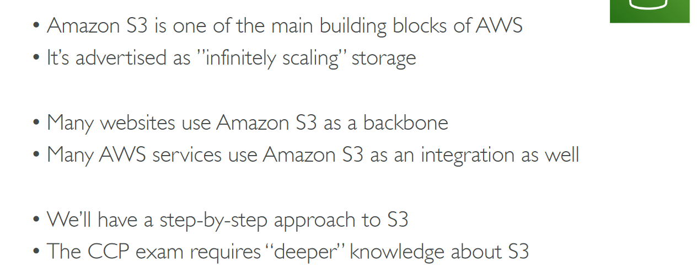

# Section 8: S3

## Table of contents
  - [Introduction](#introduction)
  - [S3 Security](#s3-security)
  - [S3 Websites](#s3-websites)
  - [S3 Versioning](#s3-versioning)
  - [S3 Access Logs](#s3-access-logs)
  - [S3 Replication (CRR & SRR)](#s3-replication-crr--srr)
  - [S3 Storage Classes](#s3-storage-classes)
  - [Shared Responsibility Model for S3](#shared-responsibility-model-for-s3)
  - [AWS Snow Family](#aws-snow-family)
  - [AWS Storage Gateway](#aws-storage-gateway)
  - [S3 Summary](#s3-summary)

## Introduction

- Use cases

    

- Buckets

    

- Objects

    

    

- Bucket example

    

- Object metadata view

    

## S3 Security

- Use Bucket Policy → Public Access

    

- User Access to S3 - IAM permissions

    

- EC2 instance access - use IAM roles

    

- Cross Account Access - Use Bucket Policy

    

- S3 Bucket Policies

    

- Bucket Settings for Block Public Access

    

## S3 Websites

- Enable via S3

    

## S3 Versioning

- Files deleted from bucket → can be recovered

    

    - Delete the delete marker → will restore the object

## S3 Access Logs

- You can enable this setting → all logs be logged into new another bucket

    

    - Log example

        

## S3 Replication (CRR & SRR)

- Management → Create replication rule

    

    - Objects before replication are not replicated

## S3 Storage Classes

- S3 Durability and Availability

    

- S3 Standard - General Purpose

    

- S3 Standard - Infrequent Access (IA)

    

- S3 Intelligent-Tiering

    

- S3 One Zone - Infrequent Access (IA)

    

- Amazon Glacier & Glacier Deep Archive

    

- S3 Storage Classes Comparison

    

- S3 - Moving between storage classes

    

- Additional upload options → for object → Storage Classes

    

    - Storage class can be edited and changed whenever required
- Lifecycle rules → help to optimize cost

    

- S3 Glacier Vault lock & S3 Object lock

    

## Shared Responsibility Model for S3

## AWS Snow Family

- Data Migrations with AWS Snow Family

    

- Diagrams

    

- Snowball Edge (for data transfers)

    

- AWS Snowcone

    

- AWS SnowMobile

    

- Comparison

    

- Usage Process

    

- What is Edge Computing?

    

- Snow Family - Edge Computing

    

- AWS OpsHub

    

- Snow Family → Create new job

    

## AWS Storage Gateway

- Hybrid Cloud for Storage

    

- AWS Storage Cloud Native Options

    

- AWS Storage Gateway

    

## S3 Summary

