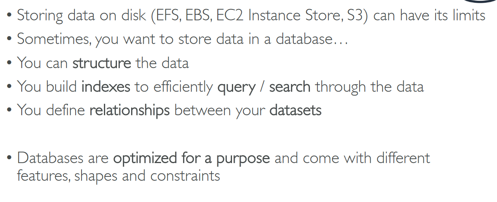

# Section 9: Databases & Analytics

## Table of contents
  - [Introduction](#introduction)
  - [AWS RDS & Aurora Overview](#aws-rds--aurora-overview)
  - [RDS Deployments](#rds-deployments)
  - [Amazon ElasticCache Overview](#amazon-elasticcache-overview)
  - [Amazon DynamoDB](#amazon-dynamodb)
  - [AWS Redshift](#aws-redshift)
  - [Amazon EMR (Elastic MapReduce)](#amazon-emr-elastic-mapreduce)
  - [AWS Athena](#aws-athena)
  - [Amazon QuickSight](#amazon-quicksight)
  - [DocumentDB](#documentdb)
  - [Amazon Neptune](#amazon-neptune)
  - [Amazon QLDB](#amazon-qldb)
  - [Amazon Managed Blockchain](#amazon-managed-blockchain)
  - [DMS - Database Migration Service](#dms---database-migration-service)
  - [AWS Glue](#aws-glue)
  - [Databases & Analytics Summary in AWS](#databases--analytics-summary-in-aws)

## Introduction

- Relational Databases

    

- NoSQL databases

    

    - Example

        

    - Databases & Shared Responsibility on AWS

        

## AWS RDS & Aurora Overview

- Advantage over using RDS vs deploying DB on EC2

    

- RDS Solution Architecture

    

- Amazon Aurora

    

- Create database → AWS console → managed service

    

- RDS AWS Console

    

## RDS Deployments

- Read Replicas, Multi-AZ

    

- Multi-region (Read Replicas)

    

## Amazon ElasticCache Overview

- Solution Architecture - Cache

    

## Amazon DynamoDB

- Type of data

    

- DynamoDB Accelerator - DAX

    

- Create DynamoDB Table

    

    - No question of what server → serverless
    - Create data

        

    - Sample data

        

## AWS Redshift

## Amazon EMR (Elastic MapReduce)

## AWS Athena

## Amazon QuickSight

## DocumentDB

## Amazon Neptune

## Amazon QLDB

## Amazon Managed Blockchain

## DMS - Database Migration Service

## AWS Glue

## Databases & Analytics Summary in AWS

